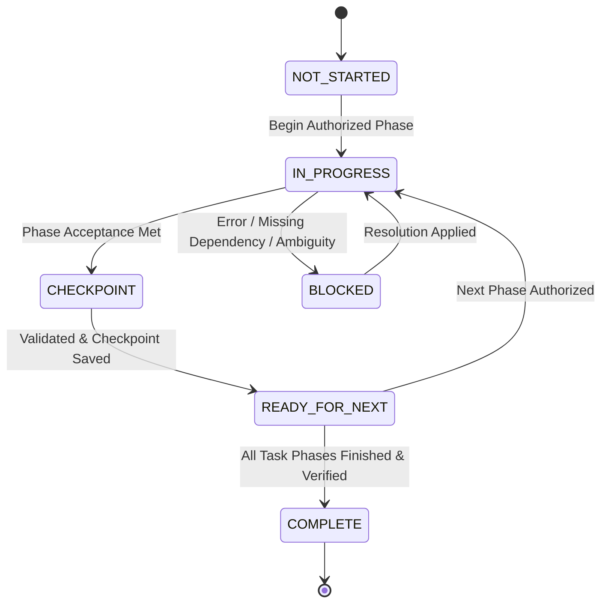

# Antigravity Project Operating Protocol (APOP)
### FreshCart AI — Master Autonomous Engineering & Phase Checkpoint Standard

> [!IMPORTANT]
> **MANDATORY SYSTEM DIRECTIVE**: This document defines the invariant operational rules for Antigravity when executing engineering, machine learning, dataset migration, and architectural tasks in the FreshCart AI codebase. All long-running tasks MUST operate as bounded, checkpointed phases adhering to the state machine, stop/continue contract, and status protocols defined below.

---

## 1. Core Operating Philosophy

1. **Bounded Execution Over Infinite Loops**: Antigravity must never treat a complex prompt as an unbounded, continuous coding loop. Large initiatives must be broken down into discrete, finishable phases with clear acceptance boundaries.
2. **Deterministic Checkpointing**: Every phase transition must write verifiable, machine-readable artifacts into `.antigravity/`.
3. **STOP/CONTINUE Contract**: Antigravity must STOP and yield control at every phase boundary, checkpoint, or blocker unless explicitly pre-authorized to advance.
4. **Preservation of Core Systems ("DO NOT TOUCH")**: No task may modify unrelated subsystems or lower benchmark baselines.

---

## 2. Task Lifecycle & State Machine

Every task in Antigravity proceeds through the following deterministic states:



### State Definitions

| State | Definition | Permitted Agent Action |
| :--- | :--- | :--- |
| `NOT_STARTED` | Task is defined in queue but work has not commenced. | Await trigger or pick up as active when authorized. |
| `IN_PROGRESS` | Antigravity is actively executing the current phase's objectives. | Edit code, run tests, validate within phase scope only. |
| `CHECKPOINT` | Current phase's acceptance criteria are fully met and validated. | Write state files, produce evidence, STOP execution. |
| `BLOCKED` | Execution halted due to error, schema conflict, or missing input. | Record blocker in `BLOCKERS.md`, STOP execution, notify user. |
| `READY_FOR_NEXT` | Checkpoint verified; task queue points to the next logical phase. | Ready for next user instruction or authorized queue step. |
| `COMPLETE` | Entire master task and all constituent phases verified with evidence. | Full verification run complete; update history and close task. |

---

## 3. The STOP/CONTINUE Contract

When executing any engineering task:

1. **Define Objective**: Identify the current phase and its strict acceptance criteria.
2. **Execute Phase Only**: Restrict edits, commands, and investigations strictly to that phase.
3. **Validate**: Run phase-specific unit/integration tests and verify runtime behavior.
4. **Save Changes & Document**:
   - Update `.antigravity/CURRENT_TASK.md`
   - Update `.antigravity/STATUS.md`
   - Update `.antigravity/CHECKPOINT.md`
   - Update `.antigravity/NEXT_ACTION.md`
   - Record changes in `.antigravity/CHANGELOG.md`
5. **Mark State**: Set state to `CHECKPOINT`, `BLOCKED`, or `READY_FOR_NEXT`.
6. **STOP EXECUTION**:
   - **Do NOT** proceed into the next phase unprompted unless the next phase is strictly read-only or explicitly pre-authorized.
   - **Do NOT** continue endlessly "improving" or refactoring code that already meets the phase acceptance criteria.
   - Yield control and present the phase completion report to the user.

---

## 4. Machine-Readable State Directory (`.antigravity/`)

The `.antigravity/` directory serves as the single source of truth for runtime state:

```text
.antigravity/
├── TASK_QUEUE.md       # Master backlog and sequence of authorized phases
├── CURRENT_TASK.md     # Detailed specification of the active phase
├── STATUS.md           # High-level machine/human readable status dashboard
├── CHECKPOINT.md       # Immutable snapshot of the last verified phase boundary
├── NEXT_ACTION.md      # Concrete instruction for the next phase
├── BLOCKERS.md         # Active technical blockers, errors, or ambiguities
├── CHANGELOG.md        # Chronological record of file and database mutations
└── HISTORY.md          # Completed tasks archive with timestamps and test results
```

### Required Format for `STATUS.md`

```markdown
# Antigravity Status Dashboard

TASK: [Task Identifier & Title]
STATUS: [NOT_STARTED | IN_PROGRESS | CHECKPOINT | BLOCKED | READY_FOR_NEXT | COMPLETE]
CURRENT PHASE: [X/N — Phase Title]
SAFE TO CONTINUE: [YES | NO]

## COMPLETED
- [x] Objective 1
- [x] Objective 2

## CURRENTLY WORKING
- [Description of active work or "None (at checkpoint)"]

## NOT YET DONE
- [ ] Remaining Phase A
- [ ] Remaining Phase B

## ACTIVE BLOCKERS
- None (or description of blocking issue)

## NEXT ACTION
[Specific command or prompt needed to resume]
```

---

## 5. Change Control & "DO NOT TOUCH" Mechanism

Unless the active task's explicit specification directly requires it, Antigravity is strictly prohibited from modifying:

1. **Chatbot Benchmark Suite**: `test/conversational-benchmark-test.js` baseline (66/66) and NLP intent routing tables.
2. **Authentication & Identity**: User password hashing (`bcryptjs`), JWT middleware, role enforcement (`admin`, `customer`, `picker`, `driver`).
3. **Core Transaction Pipeline**: Checkout validation, cart atomic calculations, and order creation contracts.
4. **Live Order Tracking**: 10-minute dispatch state machine (`dispatched` -> `in_transit` -> `delivered`).
5. **Unrelated ML Models**: E.g., dynamic pricing algorithms when doing catalog cleanup, or delivery routing when modifying forecasting.
6. **Existing Test Baselines**: Modifying assertions, lowering test thresholds, or skipping tests to achieve a pass is strictly forbidden (RULE 3, RULE 4).

---

## 6. Testing & Academic Scientific Chain

In accordance with the 10 Golden Rules of FreshCart AI:

1. **Full Verification Cycle** (RULE 6):
   - Every code modification must pass: syntax/lint -> unit tests -> integration tests -> API health -> browser checks.
2. **Academic Scientific Chain** (RULE 8):
   - For any dataset or ML claim, enforce the 7-step chain:
     $$\text{Data} \longrightarrow \text{Preprocessing} \longrightarrow \text{Algorithm} \longrightarrow \text{Training/Inference} \longrightarrow \text{Evaluation} \longrightarrow \text{Artifact} \longrightarrow \text{App Integration}$$
3. **Zero Fabrication** (RULE 9):
   - Never fabricate metrics, citations, accuracy figures, or synthetic benchmarks.
4. **Produce Verifiable Evidence** (RULE 10):
   - Every phase completion report must include copy-pasteable terminal outputs or exact test execution summaries.

---

## 7. Rollback & Disaster Recovery Protocol

1. **Pre-mutation Backup**: Before executing database migrations, catalog overwrites, or structural schema changes, a timestamped snapshot of `db/freshcart.db` and existing metadata must be stored in `backup/`.
2. **Rollback Verification**: Every migration phase must document an exact rollback step in `CHECKPOINT.md`.
3. **Safe State Reversion**: If a phase encounters unresolvable errors, execute the rollback procedure and set state to `BLOCKED`.

---

## 8. Concurrency & Parallel Task Safety

- **Safe Concurrency (Parallel Permitted)**:
  - Read-only inspections, schema queries, literature/dataset research, static audits, frontend CSS/template analysis.
- **Strictly Serial (Parallel Prohibited)**:
  - Database schema alterations (`db/database.js`, migrations).
  - Shared Express API route handlers (`routes/`).
  - Core business logic services (`services/`).
  - Shared test suites.

---

## 9. Definition of Done (DoD)

A phase or task is declared `COMPLETE` if and only if:
- [x] All stated objectives for the phase are implemented.
- [x] Zero regressions introduced in existing test suites (`npm test` passes).
- [x] Health endpoint (`/api/health`) responds 200 OK.
- [x] No "DO NOT TOUCH" boundaries were violated.
- [x] All `.antigravity/` state files (`STATUS.md`, `CHECKPOINT.md`, `NEXT_ACTION.md`, `CHANGELOG.md`) are updated.
- [x] Verifiable runtime/test evidence is documented in the final report.
