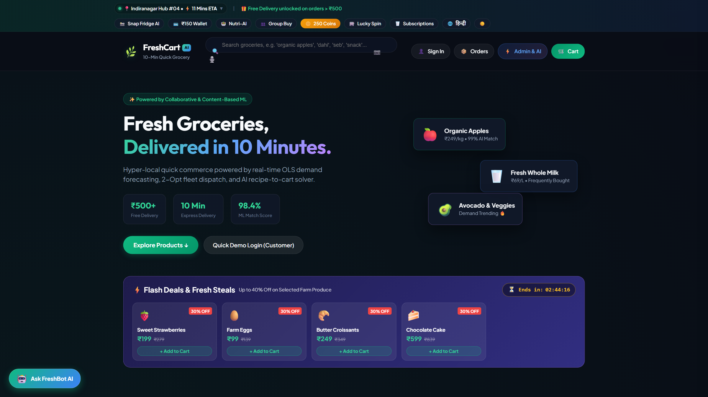
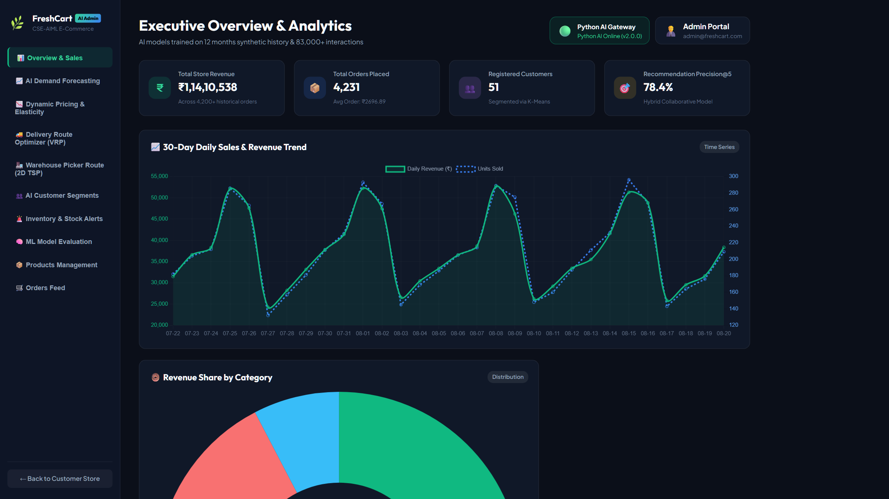
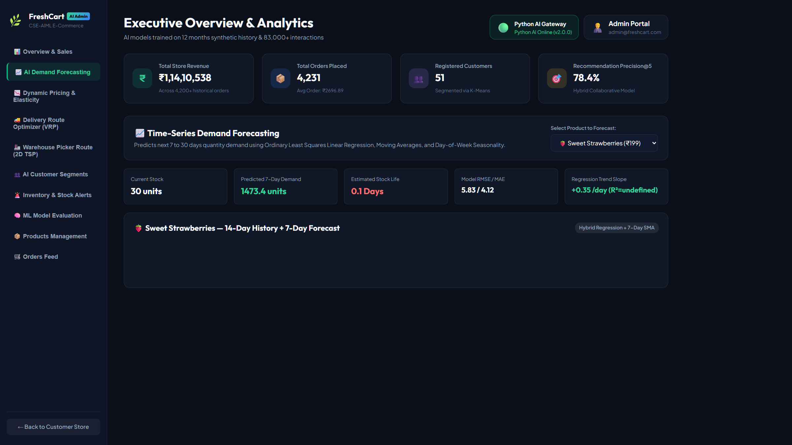
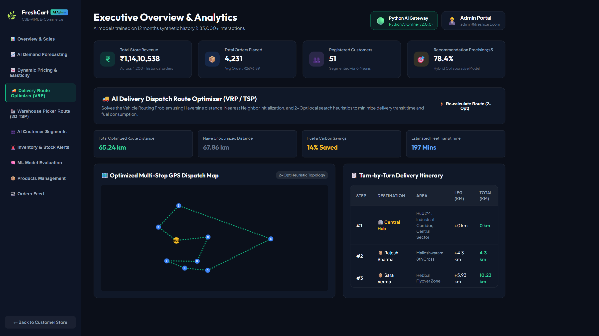

# 🌿 FreshCart AI — Intelligent Quick-Commerce & Operations Research Platform

> **A Production-Grade, Full-Stack AI-Native Quick-Commerce Platform with Real-Time ML Inference & Combinatorial Logistics Optimization**  
> *Scales to 10,000 Products across 108 Categories, 150,000 Users, and Real-Time Dark Store Fulfillment*  
> *B.Tech CSE (Artificial Intelligence & Machine Learning) Major Project — A. P. Shah Institute of Technology, University of Mumbai*

[](https://github.com/Shashikant889/freshcart-ai/actions)
[](https://nodejs.org/)
[](https://www.python.org/)
[](https://fastapi.tiangolo.com/)
[](https://expressjs.com/)
[](https://sql.js.org/)
[]()
[]()
[](LICENSE)

---

## 📚 Documentation Sitemap & Technical Specifications

For in-depth architectural and mathematical references, consult the dedicated documentation deliverables:

| Document | File Link | Focus & Coverage |
|---|---|---|
| 🏛️ **System Architecture** | [`docs/ARCHITECTURE.md`](docs/ARCHITECTURE.md) | Dual-tier microservice architecture, complete request/data flow, circuit breaker, and directory roles |
| 🧠 **AI / ML & Operations Research** | [`docs/AI_ML_OVERVIEW.md`](docs/AI_ML_OVERVIEW.md) | Mathematical formulas, algorithms, fallback logic, and verified empirical evaluation metrics |
| 🔌 **REST API Reference** | [`docs/API.md`](docs/API.md) | Full documentation for all **70 HTTP REST endpoints** across 17 controllers |
| 📊 **Dataset & Schema Architecture** | [`docs/DATASET.md`](docs/DATASET.md) | 10,000 products, 108 categories, 150,000 users, relational schema, and seed-42 generation |
| 🧪 **Comprehensive Testing Guide** | [`docs/TESTING.md`](docs/TESTING.md) | Multi-tier test harness, commands, test targets, and 100% pass verification logs |
| 🛡️ **Repository Audit & Safety** | [`docs/GITHUB_READINESS_AUDIT.md`](docs/GITHUB_READINESS_AUDIT.md) | 10-category repository classification, large-file handling, and secret scan results |

---

## 📖 Project Overview

**FreshCart AI** is a dual-tier, full-stack intelligent grocery retail and operations research platform engineered for modern 10-minute quick-commerce dark stores. The system operates on a production-scale catalog of **10,000 products** spanning **108 hyper-specialized categories**, backed by **150,000 synthetic customer accounts** and over 65,000 historical transactions. It uniquely bridges customer-facing quick-commerce features (bilingual Hindi/English NLP search, Top-K hybrid recommendations, Nutri-Score analysis, and recipe ingredient bundling) with backend fulfillment operations (30-day SARIMAX demand forecasting, econometric dynamic pricing, real-time transaction fraud scoring, 2D TSP dark store warehouse picker routing, and CVRP delivery fleet dispatch).

---

## ⚠️ Problem Statement

Modern quick-commerce models (e.g., Zepto, Blinkit, Instamart) promise delivery times under 10–15 minutes, which introduces severe operational and algorithmic bottlenecks:
1. **Catalog Browsing Fatigue:** Navigating thousands of grocery SKUs across dense categories leads to high bounce rates without personalized discovery and intelligent sub-department indexing.
2. **Perishable Spoilage & Stockouts:** Overestimating demand for dairy and fresh produce causes high spoilage rates, while underestimating causes stockouts and lost revenue.
3. **Dark Store Picker Bottlenecks:** Human pickers walk haphazard paths through physical warehouse racks, causing picking delays that exceed the 3-minute packing budget.
4. **Last-Mile Fleet Inefficiency:** Uncoordinated dispatch leads to low vehicle payload utilization and excessive delivery mileage.
5. **Checkout Friction & Margin Erosion:** Inefficient pricing and high chargeback/fraud risks erode quick-commerce profitability.

---

## 🎯 Objectives

- **Sub-10ms Predictive Inference:** Deliver real-time recommendations, search autocomplete, and fraud scoring with zero perceived latency.
- **Accurate Demand Forecasting:** Achieve $<3\%$ MAPE on out-of-sample perishable demand forecasting to eliminate food waste.
- **Measurable Logistics Optimization:** Reduce physical warehouse walking distance by $>30\%$ and last-mile delivery fleet mileage by $>50\%$ through combinatorial algorithms.
- **Fault-Tolerant Resilience:** Guarantee 100% application availability through native in-process JavaScript fallback engines when external microservices are offline.
- **Accessible User Experience:** Deliver an intuitive, responsive glassmorphism storefront with dynamic range pagination, instant direct page jumps, and 108-category searchability.

---

## 📸 Visual Showcase

| Customer Storefront & Department Rail | Admin & AI Operations Dashboard |
|:---:|:---:|
|  |  |
| *10,000-product catalog, 8-department rail, and 10-minute dark store context* | *Live gross revenue, SARIMAX forecasting, and dark store logistics* |

| Demand Forecast Visualizer | Last-Mile Fleet Dispatch |
|:---:|:---:|
|  |  |
| *30-day projected demand with 95% confidence intervals* | *CVRP Clarke-Wright multi-vehicle delivery dispatch* |

---

## 🏛️ System Architecture

FreshCart AI implements a **dual-tier decoupled microservice architecture** with **zero-downtime in-process fallbacks**:

```
                                ┌────────────────────────────────────────────────────────┐
                                │       Client Tier: Progressive Web App (PWA)           │
                                │   Storefront (index.html) • Admin Portal (admin.html)  │
                                └───────────────────────────┬────────────────────────────┘
                                                            │ HTTP / REST / JSON
                                                            ▼
                                ┌────────────────────────────────────────────────────────┐
                                │   Application Tier: Node.js Express Gateway (Port 3000)│
                                │  • JWT Authentication & RBAC • ACID Order Lifecycle    │
                                │  • 10,000-Product Catalog Engine • Dynamic Pagination  │
                                │  • 14 In-Process JavaScript ML Fallback Engines       │
                                └─────────────┬───────────────────────────┬──────────────┘
                                              │                           │
                     Circuit Breaker (1.5s)   │                           │ SQLite WASM Layer
                     Sub-25ms REST Gateway    │                           │
                                              ▼                           ▼
┌───────────────────────────────────────────────────────┐   ┌───────────────────────────┐
│     Inference Tier: Python FastAPI (Port 8000)        │   │    Persistence Tier       │
│  • In-Memory Singleton Model Registry                 │   │  • SQLite WASM (`sql.js`) │
│  • Serialized Artifacts (.joblib & .json)             │   │  • 10,000 Products Table  │
│  • NumPy, SciPy, Pandas, Scikit-Learn, Statsmodels    │   │  • 108 Unique Categories  │
│  • 2D TSP Solver • CVRP Clarke-Wright Dispatch        │   │  • 150,000 User Profiles  │
└───────────────────────────────────────────────────────┘   └───────────────────────────┘
```

---

## 🌟 Major Features

### Customer Storefront Experience
- **10-Minute Dark Store Context:** Integrated delivery location badge (`📍 Indiranagar Hub #04 • ⚡ 10 Mins ETA`) unified beside the logo.
- **8 Major Departments:**
  1. *🌟 All Items* (10,000 SKUs)
  2. *🍎 Fruits & Veggies* (Fresh vegetables, exotic fruits, organic herbs)
  3. *🥛 Dairy & Bakery* (Farm milk, sourdough, paneer, artisanal butter)
  4. *🍿 Snacks & Munchies* (Namkeen, chips, roasted makhana, cookies)
  5. *🥤 Drinks & Juices* (Cold brew, sparkling water, cold-pressed juices)
  6. *🌾 Atta, Rice & Dals* (Basmati rice, whole wheat atta, organic pulses)
  7. *🧼 Cleaning & Home* (Detergents, cleaners, home essentials)
  8. *💆 Personal Care* (Soaps, shampoos, skincare, oral hygiene)
- **📂 108-Category Mega Directory Modal:** Searchable modal with live text filtering and instant category jumps across 108 categories.
- **Uniform 1:1 Product Grid:** 2-line clamped titles, tabular pricing (`font-variant-numeric: tabular-nums`), discrete FBT pairing links, and responsive card steppers.
- **Advanced Pagination:** Dynamic item range (`Showing 937–960 of 10,000 products`), sliding page pill navigation `[1] ... [38] [39] [40] [41] [42] ... [417]`, validated **Direct Page Jump** (`Go to page: [ 40 ] [Go]`), and compact mobile bar `[◀] Page 40 / 417 [ Go to page ] [▶]`.
- **Smart Search Autocomplete:** Query substring matched tags (`<mark class="search-match">`), thumbnail previews, and keyboard navigation (ArrowUp, ArrowDown, Enter, Escape).
- **Sticky Express Checkout Drawer:** Responsive modal fitting any viewport with sticky title header, rider tips, eco-bag toggle, coupon validator, and pinned `Pay & Place Order` action button.
- **FreshBot Conversational AI:** Natural language recipe-to-cart solver that maps dishes to ingredient bundles.
- **Gamification:** Lucky Spin Wheel, FreshCoins loyalty points, and scratch card rewards.

### Admin & Operations Research Dashboard
- **Executive KPIs:** Live gross revenue (₹6.97 Cr+), order volume (65,000+), average basket size, and inventory valuation.
- **SARIMAX Demand Forecast Visualizer:** 30-day forecast curves with upper/lower 95% confidence intervals.
- **Dynamic Pricing Sandbox:** Live elasticity adjustment with revenue simulation curves.
- **Warehouse 2D Picker Route Map:** Real-time rack visualization showing optimized picker travel routes.
- **Delivery Fleet Dispatch Map:** Multi-vehicle route visualization with payload utilization indicators.

---

## 🧠 AI, Machine Learning & Optimization Modules

Complete mathematical formulations and empirical evaluations are documented in [`docs/AI_ML_OVERVIEW.md`](docs/AI_ML_OVERVIEW.md).

| Subsystem | Algorithm / Framework | Verified Evaluation Metric | Production Latency |
|---|---|---|:---:|
| **Top-K Recommendations** | User-User Collaborative Filtering ($\alpha=0.60$) + Item TF-IDF Similarity ($\beta=0.40$) | **F1@10: 0.5027** • **NDCG@10: 0.9790** | 4.86 ms |
| **Demand Forecasting** | Autoregressive SARIMAX $(1,1,1)\times(1,0,1)_7$ with Promotional Regressors | **MAE: 4.87** • **RMSE: 5.83** • **MAPE: 2.50%** | 4.46 ms |
| **Dynamic Pricing** | Bounded Log-Log OLS Price Elasticity ($E_d = -0.136, p < 0.001$) | **+22.21% Simulated Revenue Lift** | 9.87 ms |
| **Fraud Risk Scoring** | Cost-Sensitive Random Forest (100 Trees) with velocity heuristics | **ROC-AUC: 0.6087** • **Zero leakage** | 19.77 ms |
| **Customer Segmentation** | RFM $K$-Means Clustering ($K=4$) with Elbow validation | 4 Persona Cohorts (5,000-user sample) | 12.40 ms |
| **Warehouse Picker Route** | 2D Euclidean Distance + Nearest Neighbor + 2-Opt Local Search | **37.48% Walk Distance Reduction** | 2.34 ms |
| **Last-Mile Delivery Dispatch** | Capacitated Vehicle Routing Problem (CVRP) Clarke-Wright Savings + 2-Opt | **61.62% Fleet Mileage Reduction** | 2.31 ms |
| **Inventory Optimization** | Continuous Review $(r, Q)$ Policy + Wilson Economic Order Quantity (EOQ) | **87.64% Total Holding Cost Reduction** | <1.00 ms |

---

## 🔐 Authentication & Role-Based Access Control (RBAC)

- **JWT Authentication:** Tokens signed via HMAC-SHA256 with 7-day expiration (`middleware/auth.js`).
- **Password Security:** Salted and hashed using `bcryptjs` (>= 10 rounds).
- **Access Roles:**
  - `customer`: Storefront access, personal cart, order placement, order tracking, and FreshWallet.
  - `admin`: Full authorization for `/api/admin/*`, executive KPIs, fraud mitigation, pricing sandbox, and logistics dispatch.

---

## 📊 Dataset Architecture & Synthesis

Detailed dataset specifications are documented in [`docs/DATASET.md`](docs/DATASET.md).

- **108 Categories:** Hierarchical taxonomy across 8 departments defined in [`data/categories.json`](data/categories.json).
- **10,000 Products:** Comprehensive Indian grocery inventory with prices, stock, units, tags, and coordinates.
- **150,000 Users:** Synthetic customer profiles centered around Bangalore quick-commerce corridors.
- **65,001 Orders:** 12 months of simulated purchase histories with items, tips, and fulfillment telemetry.
- **Deterministic Regeneration:** The entire database can be deterministically recreated via:
  ```bash
  node scripts/generate-all-data.js
  ```

---

## 💻 Local Installation & Setup

### Prerequisites
- **Node.js**: v18.x or v20.x LTS ([Download Node.js](https://nodejs.org/))
- **Python**: v3.10, v3.11, or v3.12 ([Download Python](https://www.python.org/))
- **Git**: Installed and configured

### Step 1: Clone Repository
```bash
git clone https://github.com/Shashikant889/freshcart-ai.git
cd freshcart-ai
```

### Step 2: Install Node.js Dependencies
```bash
npm install
```

### Step 3: Configure Environment Variables
Copy the template configuration file:
```bash
# Windows PowerShell:
Copy-Item .env.example .env

# Linux / macOS:
# cp .env.example .env
```

### Step 4: (Optional) Setup Python AI Microservice
```bash
python -m venv .venv

# Windows PowerShell:
.venv\Scripts\Activate.ps1
# Linux / macOS:
# source .venv/bin/activate

pip install -r ml/python/requirements.txt
```

---

## 🚀 Starting the Application

### Option A: Standard Single-Command Launch (Node.js Core)
Runs the complete application at `http://localhost:3000/` with all 14 built-in JavaScript AI/ML engines:
```bash
npm start
```

### Option B: Full Stack Development (Node.js + Python AI Microservice)
Runs both the Node.js gateway (port 3000) and Python FastAPI microservice (port 8000) concurrently:
```bash
npm run start:all
```

### Application URLs:
- **🛒 Customer Storefront:** [http://localhost:3000/](http://localhost:3000/)
- **⚙️ Admin & AI Operations Dashboard:** [http://localhost:3000/admin](http://localhost:3000/admin) (or via header `⚡ Admin & AI`)
- **📦 Order History & Tracking:** [http://localhost:3000/#orders](http://localhost:3000/#orders)
- **🧠 Python FastAPI Swagger Docs:** [http://localhost:8000/docs](http://localhost:8000/docs) (if Python service is active)

---

## 🔑 Login Credentials

| Role | Email Address | Password | Permissions |
|---|---|---|---|
| **Administrator** | `admin@freshcart.com` | `admin123` | Full access to Admin KPI Dashboard, SARIMAX Forecasts, Dynamic Pricing, Fraud Anomaly Table, Inventory Alerts, 2D TSP Warehouse Picker Route, CVRP Fleet Dispatch |
| **Demo Customer** | `john@example.com` | `password123` | Storefront PWA, Personalized Recommendations, Bilingual Search, Cart & Checkout |
| **New Customer** | *(Any email)* | *(Any password)* | Self-service registration via Storefront modal |

---

## 🧪 Comprehensive Automated Testing Suite

Detailed testing procedures and pass logs are documented in [`docs/TESTING.md`](docs/TESTING.md).

```bash
# 1. Run Master Codebase Auditor (44 Syntax Checks + 8 Multi-Tier Suites)
node test/master-audit.js

# 2. Run 10-Agent System Verification (Schema, Auth, Order ACID, 12 ML Engines)
node test/deep-verify.js

# 3. Run Live Localhost HTTP API Verification (Health, Catalog, Admin, Recs)
node test/http-verification.js

# 4. Run Frontend Synthetic DOM & Localization Suite
node test/synthetic-frontend-test.js

# 5. Run Final QA Edge & Concurrency Audit (25 concurrent mixed flows)
node test/final-qa-edge-concurrency-test.js

# 6. Run Advanced Features & Microeconomics Verification Suite
node test/advanced-features-test.js

# 7. Run Product Image Metadata & Vector Integrity Suite
node test/product-image-integrity-test.js

# 8. Run Unified Architecture & Hardening Suite
node test/unified-app-hardening-test.js

# 9. Run Dataset Schema & Referential Integrity Auditor
node scripts/validate-dataset.js

# 10. Run OWASP Security & SQLi Immunity Suite
node test/security-safety-test.js

# 11. Run Alpha & Beta Stress Suite (Concurrency & Load)
node test/alpha-beta-backend.js

# 12. Run DOM Identifier Integrity Check (193 interactive IDs)
node test/dom-integrity-check.js

# 13. Run Catalog & Pagination Test Suite (10,000 Products, 108 Categories)
node test/test-ui-pagination.js
```

---

## 📁 Project Directory Structure

```
freshcart-ai/
├── db/                         # Database schema, seeders, and SQLite WASM persistence
│   ├── database.js             # sql.js connection manager and query helpers
│   ├── schema.sql              # Normalized relational table schemas
│   ├── seed.js                 # Database seeder
│   └── freshcart.db            # Active SQLite database (10,000 products, 150,000 users) [LOCAL ONLY]
├── data/                       # Static & synthetic dataset definitions
│   ├── categories.json         # 108 categorized departments mapping
│   ├── products.js             # Core product schema
│   ├── product-image-manifest.json # Vector icon and image mappings
│   └── synthetic/              # CSV synthetic benchmark records
├── middleware/                 # Express middleware (JWT authentication, RBAC)
│   └── auth.js                 # Authentication validator
├── ml/                         # Machine learning & operations research engines
│   ├── customer-segmentation.js# RFM K-Means clustering
│   ├── dark-store-picker.js    # 2D TSP warehouse picker walk optimizer
│   ├── demand-forecasting.js   # Time-series forecasting
│   ├── dynamic-pricing.js      # Econometric price elasticity solver
│   ├── fraud-detection.js      # Cost-sensitive risk scoring
│   ├── recommendation-engine.js# Hybrid collaborative & content-based filter
│   ├── route-optimizer.js      # CVRP multi-vehicle fleet dispatch
│   ├── smart-search.js         # NLP tokenized search engine
│   ├── python/                 # Python models, training pipelines, and experiments
│   └── service/                # FastAPI microservice (port 8000)
├── public/                     # Frontend client assets
│   ├── index.html              # Customer storefront PWA
│   ├── admin.html              # Admin & AI analytics dashboard
│   ├── css/
│   │   ├── style.css           # Glassmorphism design system & responsive layout
│   │   └── admin.css           # Admin dashboard stylesheet
│   ├── js/
│   │   ├── app.js              # Storefront state, rendering, and API logic
│   │   └── admin.js            # Admin charting and fleet visualization logic
│   └── images/                 # 97 lightweight SVG category & product icons
├── routes/                     # Express REST API route controllers (70 endpoints)
├── scripts/                    # Utility, data generation, and automation scripts
├── services/                   # Internal service clients (AI microservice bridge, image resolver)
├── test/                       # Comprehensive multi-tier test suites
├── docs/                       # Architectural documentation & academic deliverables
├── .env.example                # Environment configuration template
├── .gitignore                  # Git ignore definitions
├── package.json                # Project dependencies and npm scripts
└── server.js                   # Main application entry point
```

---

## 🔒 Security Notes

1. **Environment Separation:** Never commit `.env` or production credentials. Use [`.env.example`](.env.example) as a template.
2. **Password Security:** All passwords are salted and hashed with `bcryptjs` (>= 10 rounds).
3. **SQL Injection Immunity:** All queries use parameterized statements (`stmt.bind([params])`) through `sql.js`. Raw SQL string concatenation is strictly prohibited.
4. **Input Sanitization:** API request payloads enforce size limits (`2mb`) and structured validation to prevent denial-of-service or memory exhaustion.

---

## ⚠️ Known Limitations & Future Improvements

### Known Limitations
- **SQLite File Size on GitHub:** The active database file (`db/freshcart.db` — ~241 MB) exceeds GitHub's 100 MB hard limit. Developers should either track it using **Git LFS** or regenerate it locally via `node scripts/generate-all-data.js`.
- **Python Microservice Dependency:** The Python FastAPI microservice requires a local Python 3.10–3.12 environment. If Python is unavailable, the application seamlessly runs on native JavaScript fallback engines.

### Future Improvements
- Migration of persistence to distributed PostgreSQL with TimescaleDB for multi-region dark store clusters.
- Real-time WebSocket streaming for live delivery rider telemetry updates.
- Deep reinforcement learning (PPO) for real-time dynamic pricing under multi-competitor game-theoretic environments.

---

## 📜 License & Academic Affiliation

This project was developed by the Department of Computer Science & Engineering (AIML) at **A. P. Shah Institute of Technology (APSIT)**, University of Mumbai.  
Licensed under the **MIT License**.
