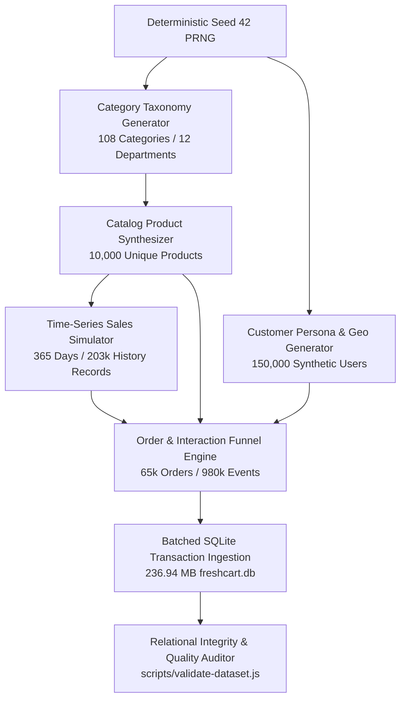

# FreshCart AI — Data Engineering & Synthetic Generation Architecture Report

## Executive Summary
This document provides a comprehensive technical breakdown of the large-scale synthetic data engineering pipeline developed for the **FreshCart AI** hyper-local grocery retail application. Built on reproducible engineering principles, the pipeline generates a rich, production-grade retail environment comprising 108 categories, 10,000 products, 150,000 synthetic customers, 65,000 historical orders, 292,431 order items, 980,427 customer interactions, and 203,305 daily product sales records spanning a full 365-day operational year.

---

## 1. Generation Pipeline Architecture

### Deterministic Generation Pipeline Specifications
- **Master Entrypoint**: `scripts/generate-all-data.js`
- **Validation Script**: `scripts/validate-dataset.js`
- **Baseline Restoration**: `scripts/restore-baseline.js`
- **PRNG Multiplier**: Linear Congruential Generator ($s_{n+1} = (16807 \cdot s_n) \pmod{2^{31} - 1}$) seeded with constant `42` ensuring 100% byte-for-byte reproducibility across runs.
- **Pipeline Throughput**: 171 seconds total execution time on standard CPU.

---

## 2. Category Taxonomy (108 Categories)
Structured into 12 core grocery departments with localized metadata, emojis, search aliases, and display priorities:
1. **Fresh Produce - Fruits** (10 categories: Apples & Pears, Bananas & Tropical, Citrus, Berries, Melons, Mangoes, Grapes, Exotic, Organic Fruits, Cut Fruits)
2. **Fresh Produce - Vegetables** (10 categories: Leafy Greens, Root Vegetables, Onions & Potatoes, Tomatoes & Peppers, Gourds & Cucumbers, Cruciferous, Herbs & Seasoning, Organic Vegetables, Exotic Veggies, Sprouts)
3. **Dairy & Breakfast Essentials** (10 categories: Fresh Milk, Curd & Yogurt, Paneer & Tofu, Butter & Spreads, Cheese, Eggs, Bread & Buns, Breakfast Cereals, Plant-Based Milk, Artisanal Bakery)
4. **Staples, Grains & Pulses** (10 categories: Atta & Flours, Basmati & Regular Rice, Dals & Pulses, Cooking Oils & Ghee, Sugar & Jaggery, Salt & Spices, Whole Spices, Dry Fruits & Seeds, Organic Staples, Ready Mixes)
5. **Snacks, Munchies & Confectionery** (10 categories: Potato Chips, Traditional Namkeen, Biscuits & Cookies, Roasted Nuts, Chocolates, Indian Sweets, Instant Noodles, Popcorn, Energy Bars, Rusks)
6. **Beverages & Cold Drinks** (10 categories: Tea, Coffee, Fruit Juices, Soft Drinks & Soda, Bottled Water, Energy Drinks, Milk Drinks, Mocktail Mixers, Green Tea, Squash & Syrups)
7. **Instant & Packaged Food** (8 categories: Pasta & Noodles, Breakfast Cereals, Soups, Canned Food, Ready to Eat, Sauces & Pastes, Jams & Honey, Pickles)
8. **Personal Care & Grooming** (8 categories: Hair Care, Oral Care, Skin Care, Bath & Body, Men's Grooming, Deodorants, Sanitary Care, Shaving)
9. **Home Care & Cleaning** (8 categories: Laundry Detergents, Dishwashing, Surface Cleaners, Toilet Cleaners, Cleaning Tools, Air Fresheners, Garbage Bags, Pest Control)
10. **Baby Care** (8 categories: Diapers & Wipes, Baby Food, Baby Skin Care, Bathing, Bottles, Feeding Accessories, Oral Care, Teethers)
11. **Pet Supplies** (8 categories: Dog Food, Cat Food, Pet Treats, Pet Grooming, Litter, Bowls, Toys, Health Supplements)
12. **Gourmet, Organic & World Food** (8 categories: Gourmet Cheese, Pasta & Sauces, Olive Oils & Vinegars, International Snacks, Asian Sauces, Organic Cold-Pressed, Imported Cereals, Gluten-Free)

---

## 3. Product Synthesis (~10,000 Products)
- **Baseline Preservation**: Original 31 demo items (`f1`..`s4`) remain preserved with exact IDs and tags.
- **Attributes**: `id`, `name`, `emoji`, `category`, `price` (₹10 - ₹2,499), `unit` (kg, g, L, ml, pc, pack), `description`, `stock` (15 - 500), `rating` (3.8 - 5.0), and `tags` (JSON array of dietary/flavor attributes).
- **Brand Diversity**: Over 50 authentic Indian & global grocery brands (`FreshFarm`, `Amul`, `Aashirvaad`, `Tata`, `Haldiram's`, `Nestle`, `Cadbury`, `Britannia`, `Fortune`, `Dabur`, `Patanjali`, etc.).

---

## 4. Synthetic Customer Base (~150,000 Users)
- **Admin/Demo Accounts**: `admin@freshcart.com` (Admin role) and `customer@freshcart.com` (Customer role).
- **Persona Archetypes**:
  1. *Champions & VIPs* (12%): High spend (₹4,000 - ₹12,000/mo), weekly ordering, premium organic preferences.
  2. *Loyal Family Shoppers* (30%): Steady staple & dairy baskets (₹2,000 - ₹6,000/mo), bi-weekly cadence.
  3. *Quick Convenience & Singles* (25%): Instant food, beverages, snacks (₹500 - ₹2,000/mo), frequent small baskets.
  4. *Health & Fitness Enthusiasts* (15%): High protein, keto, organic, low carb.
  5. *Budget-Conscious Savers* (12%): Value packs, discounts, promotional deal buyers.
  6. *Lapsed / At-Risk* (6%): Accounts with >60 days since last purchase.
- **Geographic Spread**: Distributed across 8 Indian major metropolitan hubs (Bengaluru, Mumbai, Delhi-NCR, Hyderabad, Chennai, Pune, Kolkata, Ahmedabad).

---

## 5. Retail History & Funnel Activity
- **365-Day Sales History**: 203,305 daily data points incorporating weekend uplifts (+35%), month-end grocery restocks (+25%), and Diwali/festival spikes (+75%).
- **Transaction History**: 65,000 completed orders across 150,000 users with payment methods (UPI: 65%, Credit/Debit Card: 20%, FreshWallet: 10%, COD: 5%).
- **Behavioral Funnel**: 980,427 user interactions (`view`: 600,000, `cart`: 250,000, `purchase`: 65,000, `rate`: 65,427) providing training matrices for collaborative recommendations.
