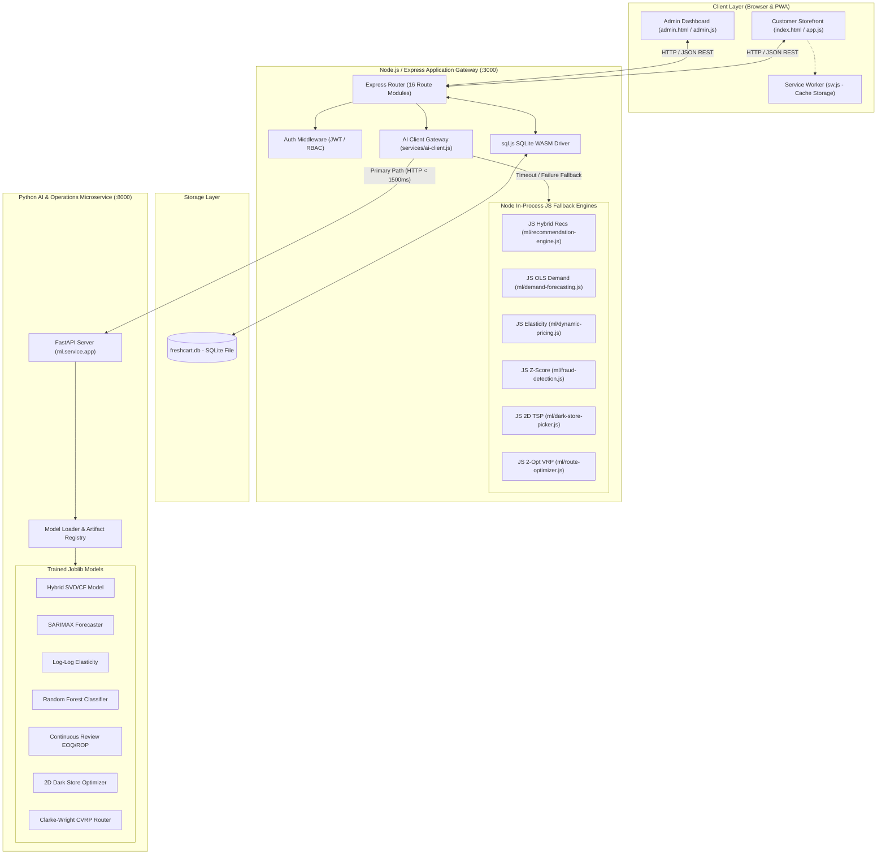
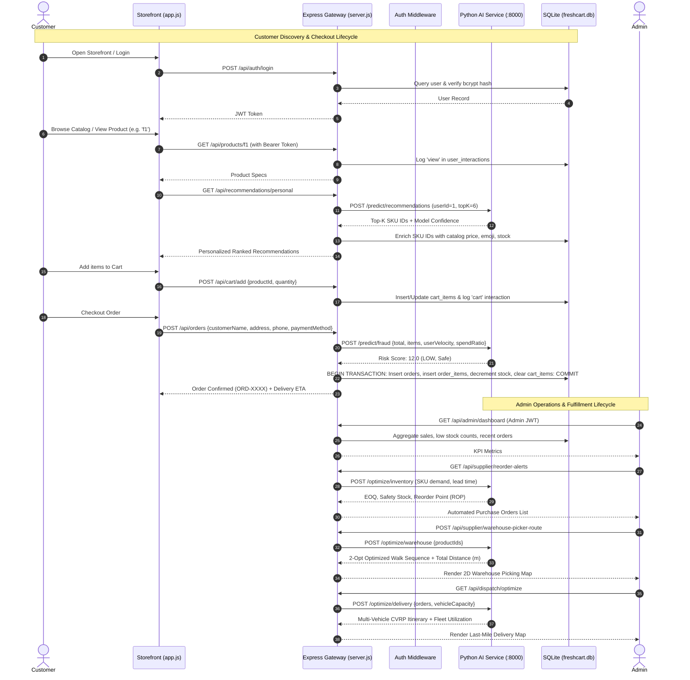
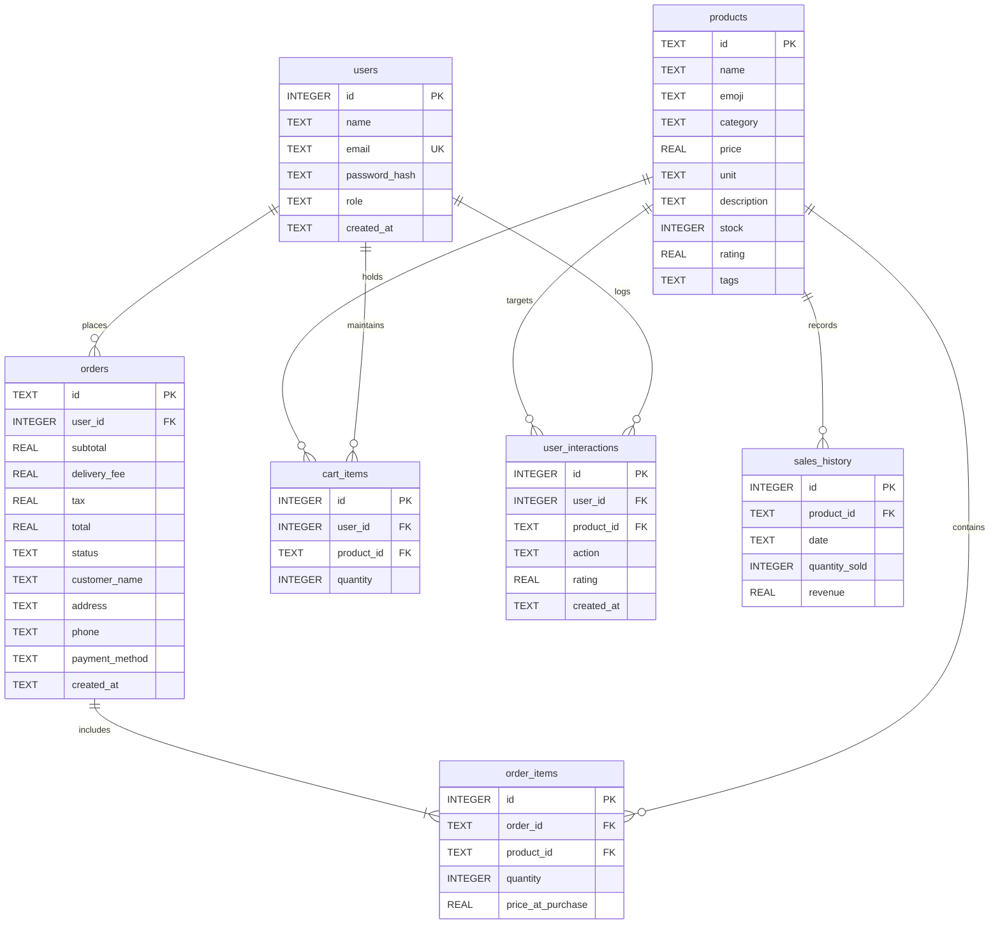

# AI-Driven Intelligent Grocery Retail System Using Machine Learning

---

## 1. Document Purpose

This document serves as the definitive, master technical reference and architectural blueprint for the **FreshCart AI** intelligent grocery e-commerce, predictive analytics, and operations research platform. It is authored directly from the verified source code, mathematical scripts, REST routing structures, and empirical test suites of the project repository.

### Classification of Capabilities
To ensure complete academic and technical integrity, all features, models, and operational modules discussed in this document are strictly delineated into four categories:

1. **Implemented Functionality**: Fully operational production features present in both frontend and backend source code (`server.js`, `routes/*`, `ml/*`, `public/js/*`), verified by automated test suites and operational in live execution.
2. **Experimental & Research Functionality**: Offline machine learning and operations research benchmarking pipelines (`ml/python/experiments/*`, `ml/python/optimization/*`, `ml/python/metrics/*`) designed to validate candidate algorithms against baseline heuristics under controlled statistical conditions.
3. **Documentation & Reference Material**: Structural documentation, IEEE-formatted reports, slide deck specifications, and presentation mappings preserved in `docs/` for viva preparation and academic compliance.
4. **Future Scope**: Conceptual architectural enhancements, hardware integrations, and cloud infrastructure expansions explicitly designated as future work and not claimed as existing codebase artifacts.

```
+---------------------------------------------------------------------------------------------------+
|                                      SYSTEM CAPABILITY TAXONOMY                                    |
+------------------------------------+----------------------------------+---------------------------+
| Implemented Production Code        | Experimental ML Benchmarks       | Future Scope              |
| • Express 4.18 REST API (16 routes)| • SVD Matrix Factorization       | • Real-time GPS Telematics|
| • SQLite WebAssembly Database      | • SARIMAX(1,1,1)x(1,0,1)_7       | • Dark Store AGV Robotics |
| • Hybrid CF + Content-Based Recs   | • Random Forest (Trees=100)      | • Deep Q-Network Pricing  |
| • OLS + Seasonal Moving Average    | • Isolation Forest (Contam=0.05) | • Distributed Multi-Hub   |
| • Microeconomic Price Elasticity   | • Continuous Review (r, Q) Sim   | • Cloud Kubernetes Cluster|
| • Multi-Factor Z-Score Fraud Engine| • Exact TSP Branch-and-Bound     | • IoT Smart Shelf Sensors |
| • 2D Dark Store TSP Picker (2-Opt) | • Multi-Vehicle CVRP Benchmark   |                           |
| • Last-Mile VRP Heuristic (2-Opt)  |                                  |                           |
| • Dual-Tier Python/Node AI Gateway |                                  |                           |
+------------------------------------+----------------------------------+---------------------------+
```

---

## 2. Project Overview

- **Project Title**: AI-Driven Intelligent Grocery Retail System Using Machine Learning & Operations Research (FreshCart AI)
- **Project Purpose**: To engineer a full-stack, hyper-local quick-commerce grocery platform that integrates customer-facing predictive artificial intelligence (personalized discovery, conversational multi-modal search, dynamic bundle planning) with enterprise-grade operational research engines (time-series demand forecasting, econometric dynamic pricing, fraud risk scoring, continuous review inventory replenishment, dark store warehouse route optimization, and last-mile vehicle routing).
- **Problem Being Addressed**: Modern quick-commerce platforms operating on sub-15-minute delivery windows suffer from severe structural inefficiencies: stockouts of high-velocity perishable items, excessive picker walking distances in micro-fulfillment dark stores, sub-optimal vehicle routing leading to high fuel costs, static pricing unresponsive to inventory shelf-life decay, and transactional fraud. FreshCart AI bridges front-end customer engagement with back-end algorithmic operations to maximize revenue, minimize fulfillment latency, and eliminate inventory waste.
- **Target Users**:
  1. *Online Grocery Consumers*: Individuals seeking personalized grocery discovery, smart recipe-to-cart meal bundling, dietary/allergen checking, and rapid delivery.
  2. *Dark Store Fulfillment Pickers*: Warehouse staff requiring mathematically optimized physical picking sequences to assemble orders in under 90 seconds.
  3. *Store Inventory & Logistics Managers*: Operations personnel managing automated purchase order reorder points (ROP), demand forecasts, delivery fleet dispatch schedules, and fraud reviews.
  4. *Retail Executives & Administrators*: Business stakeholders analyzing customer lifetime value segments (RFM), category revenue shares, and price elasticity curves.
- **Business & Engineering Context**: Developed as a modern decoupled system pairing a high-throughput Node.js/Express web layer with a dedicated Python 3 / FastAPI microservice for heavy scientific computing, backed by a persistent SQLite database and an in-process pure JavaScript mathematical engine for zero-downtime graceful fallback.
- **Overall System Philosophy**: High resilience through dual-engine redundancy. If the external Python AI microservice encounters latency or failure, the Node.js API gateway automatically fails over within 1,500ms to local analytical algorithms, ensuring uninterrupted customer checkout and operational continuity.

---

## 3. Problem Statement

Quick-commerce and automated retail e-commerce encounter multi-dimensional logistical, mathematical, and algorithmic bottlenecks across the retail supply chain:

```
                      RETAIL SUPPLY CHAIN BOTTLENECKS
                      
  [Customer Touchpoint] ──> Cold-Start Discovery & Unstructured Search
           │
           ▼
  [Pricing & Margin]   ──> Static Pricing ignoring Shelf-Life Decay & Elasticity
           │
           ▼
  [Order Verification] ──> Scalping, Hoarding & Flash Checkout Fraud
           │
           ▼
  [Inventory Control]  ──> Stockouts of Perishables vs. Overstock Working Capital
           │
           ▼
  [Warehouse Picking]  ──> Disorganized Pick Sequences & Cross-Aisle Backtracking
           │
           ▼
  [Last-Mile Fleet]    ──> Sub-optimal Multi-Stop Itineraries & Empty Vehicle Miles
```

1. **Personalization & Cold Start**: Traditional grocery platforms present static catalogs. FreshCart AI addresses sparse user-item interaction matrices by combining Collaborative Filtering (user similarity) with Content-Based feature cosine similarity and Apriori association rules.
2. **Demand Prediction & Perishability**: Grocery items possess short shelf lives (1 to 4 days for dairy and produce). Inaccurate forecasting leads to either food spoilage or lost sales. The system applies seasonal time-series decomposition (SARIMAX and OLS trend fitting) to predict 7-day SKU-level demand.
3. **Dynamic Pricing & Revenue Management**: Retailers frequently markdown perishables too late or price elastic goods incorrectly. FreshCart AI implements microeconomic Price Elasticity of Demand ($E_d$) modeling under Constant Elasticity of Demand (CED) to calculate revenue-maximizing prices bounded within regulatory guardrails.
4. **Transactional Fraud & Velocity Scalping**: Promotional abuses, bulk hoarding of flash deals, and unauthorized card bursts require sub-second risk classification. The platform implements multi-factor Z-score spend deviation and Random Forest classifiers.
5. **Inventory Optimization**: Managing procurement across dozens of SKUs with varying lead times and stochastic demand requires balancing ordering costs against holding costs. The platform implements Continuous Review $(r, Q)$ policies using Economic Order Quantity (EOQ) and Stochastic Safety Stock.
6. **Dark Store Warehouse Operations**: In a 10-minute delivery model, warehouse pickers have less than 90 seconds to assemble a multi-item basket. FreshCart AI models the micro-fulfillment center as a 2D coordinate grid and solves the Traveling Salesperson Problem (TSP) using Nearest Neighbor heuristics and 2-Opt local search.
7. **Last-Mile Delivery Operations**: Urban dispatch involves multi-stop vehicle routing with capacity constraints. The system solves the Capacitated Vehicle Routing Problem (CVRP) using Clarke-Wright savings and Haversine distance matrices.

---

## 4. Project Objectives

```
+-------------------------------------------------------------------------------------------------------------------------+
|                                                  PROJECT OBJECTIVES MATRIX                                              |
+------------------------------------+---------------------------------------+-----------------------------+--------------+
| Objective                          | Implementation Details                | Key Source Files            | Output       |
+------------------------------------+---------------------------------------+-----------------------------+--------------+
| 1. High-Precision Hybrid Recs      | User-User CF + TF-IDF CB + Apriori    | ml/recommendation-engine.js | Top-K ranked |
|                                    | Association Mining (Support/Conf/Lift)| ml/service/recommendation_* | items + match%|
+------------------------------------+---------------------------------------+-----------------------------+--------------+
| 2. Time-Series Demand Forecasting  | Multi-step SARIMAX(1,1,1)x(1,0,1)_7 + | ml/demand-forecasting.js    | 7-day daily  |
|                                    | OLS Trend with Day-of-Week Seasonality| ml/service/demand_service.py| predictions  |
+------------------------------------+---------------------------------------+-----------------------------+--------------+
| 3. Econometric Dynamic Pricing     | Log-log OLS elasticity optimization   | ml/dynamic-pricing.js       | P* optimal   |
|                                    | bounded within [0.75*P0, 1.25*P0]     | ml/service/pricing_service  | price + revΔ |
+------------------------------------+---------------------------------------+-----------------------------+--------------+
| 4. Sub-Second Transaction Fraud    | Multi-factor Z-score spend anomaly +  | ml/fraud-detection.js       | Risk Score   |
|                                    | Random Forest classification          | ml/service/fraud_service.py | (0-100)+flags|
+------------------------------------+---------------------------------------+-----------------------------+--------------+
| 5. RFM Customer Segmentation       | Min-Max Normalized RFM extraction +   | ml/customer-segmentation.js | 4 Persona    |
|                                    | K-Means clustering (k=4) + WCSS Elbow | routes/analytics.js         | Clusters     |
+------------------------------------+---------------------------------------+-----------------------------+--------------+
| 6. Scientific Inventory Control    | Continuous Review (r, Q) EOQ +        | ml/python/optimization/     | EOQ, Safety  |
|                                    | 95% service level Safety Stock ROP    |   inventory_optimization.py | Stock, PO Qty|
+------------------------------------+---------------------------------------+-----------------------------+--------------+
| 7. Dark Store 2D TSP Picker Walk   | 2D Warehouse coordinate grid +        | ml/dark-store-picker.js     | Pick order,  |
|                                    | Nearest Neighbor + 2-Opt local search | ml/python/optimization/wh_* | walking dist |
+------------------------------------+---------------------------------------+-----------------------------+--------------+
| 8. Urban Last-Mile CVRP Dispatch   | Clarke-Wright savings heuristic +     | ml/route-optimizer.js       | Multi-stop   |
|                                    | Intra-route 2-Opt smoothing           | ml/python/optimization/del_*| vehicle tour |
+------------------------------------+---------------------------------------+-----------------------------+--------------+
| 9. Fault-Tolerant AI Gateway       | Node HTTP gateway with 1500ms timeout | services/ai-client.js       | Transparent  |
|                                    | and graceful fallback to pure JS      | server.js                   | failover     |
+------------------------------------+---------------------------------------+-----------------------------+--------------+
| 10. Multi-Modal Vision & Nutrition | Fridge scan preset matcher + NLP      | ml/visual-search.js         | Cart bundles,|
|                                    | recipe assistant + Nutri-Score (A-E)  | ml/nutrition-advisor.js     | allergen warn|
+------------------------------------+---------------------------------------+-----------------------------+--------------+
```

---

## 5. Scope

### Implemented Scope
- **Catalog & Commerce**: 31 retail grocery items across 6 core categories (Fruits, Vegetables, Dairy, Bakery, Beverages, Snacks) stored in SQLite with full CRUD and inventory tracking.
- **Cart & Order Lifecycle**: ACID transactional ordering, stock reservation, guest carts via session identifiers, user carts in database, delivery fee calculations (free over ₹500, else ₹49), and 8% GST.
- **Security & RBAC**: Password hashing via `bcryptjs` (salt rounds = 10), stateless authentication via signed JSON Web Tokens (`jsonwebtoken`), role-based route gating (`customer` vs `admin`).
- **Machine Learning**: Pure JavaScript in-process mathematical engines and Python FastAPI microservices executing 7 core AI/ML workloads.
- **Micro-Fulfillment Operations**: Interactive canvas-rendered 2D dark store route visualizer and last-mile fleet dispatch map.
- **Fintech & Community Buying**: In-memory persistent FreshWallet with split-payment calculation, UPI simulation, FreshCoins loyalty ledger, and community Group Buy lobbies.
- **PWA & UI/UX**: Service worker caching (`public/sw.js`), Web App Manifest (`public/manifest.json`), responsive dark-mode styling with custom CSS custom properties, and dual English/Hindi localization.

### Out of Scope
- Direct integration with real-world banking APIs (e.g., live Razorpay/Stripe production keys requiring PCI-DSS compliance).
- Physical dark store automated guided vehicles (AGV) or robotic shelf retrieval hardware.
- Real-time GPS telematics via live satellite hardware transponders (simulated using realistic coordinate jitter).
- Multi-region distributed cloud database clustering (Spanner/Cassandra).

### Future Scope
- **Deep Reinforcement Learning (DQN)** for multi-product dynamic pricing under competitor price scraping.
- **YOLOv8 Real-Time Video Object Detection** for edge-based smart shopping carts and automated checkout cameras.
- **Multi-Depot Vehicle Routing with Time Windows (VRPTW)** incorporating live traffic congestion telemetry.
- **Automated Purchase Order EDI Transmission** directly to real-world agricultural FMCG supplier APIs.

---

## 6. System Features

```
+-----------------------------------------------------------------------------------------------------------------------------------------------+
|                                                             FEATURE INVENTORY                                                                 |
+----------------------+-----------+-----------------------------------+-----------------------------+----------------------+-------------------+
| Feature              | Actor     | Entry Point (UI / Endpoint)       | Implementation File         | Database Dependency  | Output Data       |
+----------------------+-----------+-----------------------------------+-----------------------------+----------------------+-------------------+
| User Auth & JWT      | Customer  | Modal / POST /api/auth/login      | routes/auth.js              | users                | JWT token, User   |
| Product Catalog      | Customer  | Storefront / GET /api/products    | routes/products.js          | products             | Filtered products |
| Smart NLP Search     | Customer  | Search bar / GET /api/search      | ml/smart-search.js          | products             | TF-IDF matches    |
| Visual Color Search  | Customer  | Camera btn / POST /api/visual/srch| ml/visual-search.js         | products             | Dominant color rec|
| Snap Fridge AI       | Customer  | Top bar / POST /api/visual/fridge | ml/fridge-vision-ai.js      | products             | Depleted basket   |
| Personalized Recs    | Customer  | Carousel / GET /api/recs/personal | routes/recommendations.js   | user_interactions    | Hybrid Top-K items|
| Frequent Bought Recs | Customer  | Product modal / GET /api/recs/fbt | ml/recommendation-engine.js | order_items          | Apriori bundle    |
| FreshBot Assistant   | Customer  | Chat bubble / POST /api/assistant | ml/recipe-assistant.js      | products             | Recipe cart item  |
| Nutri-Score Advisor  | Customer  | Modal / POST /api/nutrition/eval  | ml/nutrition-advisor.js     | - (Static Matrix)    | Macros, Nutri-A..E|
| Flash Sale AI Deals  | Customer  | Deals bar / GET /api/nutri/flash  | ml/flash-sale-ai.js         | products             | Decayed discounts |
| FreshWallet & Split  | Customer  | Modal / POST /api/wallet/pay-split| routes/wallet.js            | - (In-Memory Ledger) | Deductions, split |
| Group Buy Lobbies    | Customer  | Modal / POST /api/group-orders    | routes/group-orders.js      | - (In-Memory Lobbies)| Tier discount %   |
| Executive Analytics  | Admin     | Admin / GET /api/admin/dashboard  | routes/admin.js             | orders, products     | Revenue, KPI metrics|
| Demand Forecast View | Admin     | Admin tab / GET /api/analytics/df | routes/analytics.js         | sales_history        | 7-day trend curve |
| Price Sim & Bounds   | Admin     | Admin tab / GET /api/pricing/sim  | routes/pricing.js           | products, sales_hist | P* optimal price  |
| Transaction Fraud    | Admin     | Admin tab / POST /api/orders/fraud| ml/fraud-detection.js       | orders, user_interact| Z-score & risk lv |
| ROP Stock Alerts     | Admin     | Admin tab / GET /api/supplier/rop | routes/supplier.js          | products             | PO reorder trigger |
| Dark Store 2D TSP    | Admin     | Admin tab / POST /api/supplier/wh | ml/dark-store-picker.js     | products             | 2D Picker walk path|
| Delivery VRP Map     | Admin     | Admin tab / GET /api/dispatch/opt | ml/route-optimizer.js       | orders               | Fleet itinerary   |
| RFM Segmentation     | Admin     | Admin tab / GET /api/analytics/seg| ml/customer-segmentation.js | users, orders        | 4 Persona Clusters|
+----------------------+-----------+-----------------------------------+-----------------------------+----------------------+-------------------+
```

---

## 7. Technology Stack

```
+---------------------------------------------------------------------------------------------------------------+
|                                              TECHNOLOGY STACK MAPPING                                         |
+-----------------------+---------------------------+-----------------------------------+-----------------------+
| Layer                 | Technology                | Version / Spec                    | Actual Usage          |
+-----------------------+---------------------------+-----------------------------------+-----------------------+
| Backend Runtime       | Node.js                   | >= 18.0.0 (CommonJS)              | Core application host |
| Web Framework         | Express.js                | ^4.18.2                           | REST API & static file|
| Database Engine       | sql.js (SQLite WebAssembly)| ^1.12.0                           | In-memory & file DB   |
| Cryptography          | bcryptjs                  | ^2.4.3                            | Password salt/hashing |
| Token Security        | jsonwebtoken              | ^9.0.2                            | HMAC-SHA256 JWT auth  |
| Identifier Generation | uuid                      | ^9.0.0                            | Order ID generation   |
| Python Service Host   | FastAPI / Uvicorn         | FastAPI >= 0.100.0, Uvicorn >= 0.22| High-speed microservice|
| Scientific Computing  | NumPy, SciPy, Pandas      | NumPy >= 1.24.0, Pandas >= 2.0.0   | Matrix math & vectors |
| Machine Learning      | scikit-learn, joblib      | scikit-learn >= 1.3.0             | RF, SVD, regressions  |
| Time-Series Modeling  | statsmodels               | statsmodels >= 0.14.0             | SARIMAX estimation    |
| Frontend Markup       | HTML5 (Semantic)          | HTML5 Standard                    | Responsive UI shell   |
| Frontend Logic        | Vanilla JavaScript (ES6+) | Modern ECMAScript (Fetch, Canvas) | State & rendering     |
| Frontend Styling      | Vanilla CSS3 (Variables)  | CSS Custom Properties             | Glassmorphism dark/lit|
| Charting Engine       | Chart.js                  | 4.x (CDN loaded in admin.html)    | Admin visualizations  |
| PWA Capabilities      | Service Worker & Manifest | W3C PWA Standard                  | Offline caching & app |
+-----------------------+---------------------------+-----------------------------------+-----------------------+
```

---

## 8. Complete Repository Structure

```
freshcart-ai/
├── .gitignore                      # Git exclusion rules (node_modules, .venv, *.db, artifacts)
├── Dockerfile                      # Container build specification for full-stack deployment
├── INSTRUCTIONS.md                 # System operational guidelines and developer instructions
├── PROJECT_STATUS.md               # Feature verification log and testing status
├── README.md                       # High-level architecture and quickstart documentation
├── package.json                    # Node.js dependencies, scripts, and project metadata
├── package-lock.json               # Deterministic dependency lockfile
├── server.js                       # Primary Express entry point and server bootstrapper
│
├── data/                           # Data storage layer
│   ├── README.md                   # Dataset schema documentation and origins
│   ├── products.js                 # 31 Seed grocery products with prices and tags
│   ├── external/                   # Placeholder for external datasets
│   ├── processed/                  # Cached processed matrices
│   ├── raw/                        # Raw transaction logs
│   └── synthetic/                  # 6 Exported CSV tables (orders, order_items, users, etc.)
│
├── db/                             # Database abstraction and seeding
│   ├── database.js                 # sql.js SQLite wrapper with transaction and persistence logic
│   ├── freshcart.db                # Persisted binary SQLite database file
│   ├── schema.sql                  # DDL defining 7 tables and 8 performance indexes
│   ├── seed.js                     # Deterministic database seeder (RNG seed = 42)
│   └── synthetic-data.js           # Synthetic data generation logic for users and sales
│
├── middleware/                     # Express HTTP middleware
│   └── auth.js                     # requireAuth, optionalAuth, requireAdmin, and JWT generator
│
├── ml/                             # In-process pure JavaScript Machine Learning engines
│   ├── customer-segmentation.js    # RFM extraction + Custom K-Means (k=4) + WCSS Elbow
│   ├── dark-store-picker.js        # 2D Warehouse coordinate grid + TSP 2-Opt solver
│   ├── demand-forecasting.js       # OLS Linear Regression + 7-Day SMA + Seasonality
│   ├── dynamic-pricing.js          # Price Elasticity of Demand (Ed) revenue optimizer
│   ├── flash-sale-ai.js            # Perishable expiry decay markdown calculator
│   ├── fraud-detection.js          # Multi-factor Z-Score spend anomaly detector
│   ├── fridge-vision-ai.js         # Multimodal fridge scene analyzer & basket matcher
│   ├── nutrition-advisor.js        # Macro calculator + Allergen checker + Nutri-Score
│   ├── recipe-assistant.js         # Conversational NLP dish parser and bundle builder
│   ├── recommendation-engine.js    # Hybrid CF + TF-IDF Content-Based + Apriori Rules
│   ├── route-optimizer.js          # Haversine distance matrix + Delivery VRP 2-Opt
│   ├── smart-search.js             # TF-IDF Vector Space search + Levenshtein fuzzy match
│   ├── visual-search.js            # Dominant RGB histogram cosine similarity matcher
│   │
│   ├── python/                     # Python offline experiment and training suite
│   │   ├── config.py               # Paths, hyperparameters, and dataset constants
│   │   ├── data_loader.py          # Leak-free temporal split data loaders
│   │   ├── requirements.txt        # Python dependency manifest
│   │   ├── run_all_experiments.py  # Master runner for all 4 ML training experiments
│   │   ├── run_optimization_exp.py # Master runner for 3 Operations Research experiments
│   │   ├── experiments/            # Standalone academic experiment training scripts
│   │   ├── metrics/                # 7 Evaluated metric JSON files
│   │   ├── models/                 # Serialized .joblib model binaries and .json metadata
│   │   ├── optimization/           # Inventory, warehouse, and delivery algorithms
│   │   ├── plots/                  # Generated research figures (PNG format)
│   │   └── reports/                # Textual training and evaluation logs
│   │
│   └── service/                    # FastAPI microservice for online ML inference
│       ├── app.py                  # FastAPI server with CORS and lifespan model loading
│       ├── config.py               # Host, port, and directory constants
│       ├── model_loader.py         # Singleton model registry loading .joblib artifacts
│       ├── schemas.py              # Pydantic request and response schemas
│       ├── demand_service.py       # SARIMAX forecast inference handler
│       ├── fraud_service.py        # Random Forest fraud scoring handler
│       ├── optimization_service.py # Inventory, warehouse, and delivery handlers
│       ├── pricing_service.py      # Dynamic pricing and elasticity handler
│       ├── recommendation_service.py # Top-K hybrid recommendation handler
│       └── test_service.py         # Unit tests for FastAPI endpoints
│
├── public/                         # Static frontend web application
│   ├── admin.html                  # Admin & ML Analytics Dashboard single-page application
│   ├── index.html                  # Customer storefront single-page application
│   ├── manifest.json               # Progressive Web App manifest
│   ├── sw.js                       # Service Worker for offline static asset caching
│   ├── css/
│   │   ├── admin.css               # Admin dashboard layout and component styling
│   │   └── style.css               # Storefront design system, responsive styles, themes
│   ├── js/
│   │   ├── admin.js                # Admin controller, Chart.js integrations, Canvas maps
│   │   └── app.js                  # Customer storefront controller, state, cart, voice AI
│   ├── icons/                      # PWA SVG application icons
│   └── downloads/                  # Exported reports and academic presentation slides
│
├── routes/                         # Express API route controllers (16 modules)
│   ├── admin.js                    # Admin dashboard KPI endpoints and product/order management
│   ├── analytics.js                # Demand forecasting, customer segmentation, ML metrics
│   ├── assistant.js                # Conversational AI assistant query handler
│   ├── auth.js                     # Registration, login, and profile endpoints
│   ├── cart.js                     # User and guest shopping cart operations
│   ├── dispatch.js                 # Delivery route optimization endpoint
│   ├── group-orders.js             # Community group buying lobby management
│   ├── nutrition.js                # Cart nutrition, allergen evaluation, flash deals
│   ├── orders.js                   # Transactional order checkout and order history
│   ├── pricing.js                  # Dynamic pricing elasticity simulation endpoints
│   ├── products.js                 # Product catalog filtering, categories, details
│   ├── recommendations.js          # Personal, similar, frequently bought recommendations
│   ├── search.js                   # NLP smart search query endpoint
│   ├── supplier.js                 # ROP reorder alerts and warehouse picker routes
│   ├── visual.js                   # Visual color search and smart fridge scan
│   └── wallet.js                   # FreshWallet balance, topup, and split payment
│
├── services/                       # Backend shared infrastructure services
│   └── ai-client.js                # Python AI gateway client with timeout & JS fallback
│
├── test/                           # Automated multi-tier test suites (113 assertions)
│   ├── deep-verify.js              # 10-Agent ML & mathematical verification suite (24 checks)
│   ├── security-safety-test.js     # OWASP security, JWT, RBAC, SQLi immunity (14 checks)
│   ├── alpha-beta-backend.js       # Backend concurrency, ACID, edge cases (18 checks)
│   ├── synthetic-frontend-test.js  # Synthetic DOM, localization, theme (15 checks)
│   ├── enterprise-features-test.js # Fintech, group buying, dark store features (16 checks)
│   ├── pwa-vision-payment-test.js  # PWA, Vision AI, split payment (14 checks)
│   ├── ai-service-integration-test.js # Python microservice & fallback integration (12 checks)
│   ├── master-audit.js             # Single-command health and syntax runner
│   ├── benchmark.js                # Latency and throughput benchmarking suite
│   ├── benchmark-results.json      # Recorded latency metrics across endpoints
│   └── test-helper.js              # In-process test server lifecycle manager
│
├── scripts/                        # Utility generation scripts
│   ├── build_black_book_docx.py    # Python DOCX academic report builder
│   ├── build_presentation.py       # Python PPTX presentation slide builder
│   ├── capture_real_screenshots.py # Headless browser screenshot generator
│   ├── generate_figures.py         # Matplotlib research figure generator
│   └── verify_black_book_outputs.py# Document integrity validator
│
└── docs/                           # Documentation and academic reports
    ├── PROJECT_MASTER_DOCUMENTATION.md # This document
    ├── PROJECT_DOCUMENTATION_AUDIT.md  # Audit verification log
    └── academic/                   # Final IEEE reports, literature reviews, slide notes
```

---

## 9. System Architecture

FreshCart AI implements a **Layered Hybrid Microservices Architecture**. The customer and admin single-page applications communicate exclusively through a unified Node.js / Express API gateway. The Node.js layer interacts with a local SQLite database for transactional operations and routes heavy analytical and optimization workloads to an asynchronous Python FastAPI microservice.



### Request Flow Topologies

1. **Synchronous Transactional Flow**:
   $$\text{Browser} \xrightarrow{\text{POST /api/orders}} \text{Express} \xrightarrow{\text{ACID Transaction}} \text{SQLite} \xrightarrow{\text{Stock Decr + Interaction Log}} \text{Client Response}$$
2. **AI Predictive Request Flow (Primary Path)**:
   $$\text{Storefront} \xrightarrow{\text{GET /api/recommendations/personal}} \text{Express} \xrightarrow{\text{aiClient}} \text{FastAPI (:8000)} \xrightarrow{\text{Model Inference}} \text{Node Gateway} \xrightarrow{\text{Enrich Catalog Data}} \text{UI}$$
3. **Resilient Fallback Flow (Microservice Unavailable or $> 1500\text{ms}$)**:
   $$\text{Express} \xrightarrow{\text{aiClient (Timeout / Refused)}} \text{Catch Block} \xrightarrow{\text{Local JS Engine}} \text{Compute Analytical Solution} \xrightarrow{\text{Flag isFallback=true}} \text{Client}$$

---

## 10. End-to-End System Workflow



---

## 11. Frontend Architecture

The frontend is engineered without bloated third-party frameworks, utilizing clean, modular Vanilla JavaScript (ES6+), semantic HTML5, and responsive Vanilla CSS3.

```
+---------------------------------------------------------------------------------------------------------------+
|                                            FRONTEND COMPONENT MAPPING                                         |
+-----------------------------------+-----------------------+---------------------------------------------------+
| Component / UI Module             | Primary Source File   | Key Functions / Responsibilities                  |
+-----------------------------------+-----------------------+---------------------------------------------------+
| Storefront Master Controller      | public/js/app.js      | State container, event listeners, view rendering  |
| Storefront Markup Shell           | public/index.html     | Semantic DOM layout, dialog modals, canvas nodes  |
| Storefront Design System          | public/css/style.css  | CSS variables, responsive grid, glassmorphism UI  |
| Admin Dashboard Controller        | public/js/admin.js    | Chart.js rendering, canvas pathing, CRUD handlers |
| Admin Dashboard Markup            | public/admin.html     | Sidebar navigation, KPI cards, charts containers  |
| Admin Dashboard Styling           | public/css/admin.css  | Split layout, metrics tables, status badges       |
| Service Worker Cache              | public/sw.js          | Pre-caches static assets, provides offline banner |
| Progressive Web App Manifest      | public/manifest.json  | App icons, theme colors, display standalone spec  |
+-----------------------------------+-----------------------+---------------------------------------------------+
```

### State Management (`public/js/app.js`)
Application state is maintained in a centralized in-memory state object and synchronized with `localStorage`:
```javascript
const state = {
  products: [],
  filteredProducts: [],
  cart: { items: [], subtotal: 0, deliveryFee: 0, tax: 0, total: 0 },
  user: JSON.parse(localStorage.getItem('freshcart_user')) || null,
  token: localStorage.getItem('freshcart_token') || null,
  selectedCategory: 'all',
  activeLang: localStorage.getItem('freshcart_lang') || 'en',
  activeTheme: localStorage.getItem('freshcart_theme') || 'dark',
  currentTab: 'store',
  voiceActive: false
};
```

### Key Frontend Capabilities
1. **Multimodal Smart Search**: Real-time debounce query input, microphone voice recognition using the browser's Web Speech API (`webkitSpeechRecognition`), and visual color query matching.
2. **Interactive 2D Warehouse Canvas**: Renders physical dark store aisles, racks, and animated picker paths using HTML5 `<canvas>`.
3. **Delivery Dispatch Map Canvas**: Plots simulated delivery neighborhood GPS waypoints, warehouse hub depot, and optimized multi-vehicle route loops.
4. **PWA Capabilities**: Full standalone installation support via `beforeinstallprompt` event listener and offline asset serving via Cache Storage API.

---

## 12. Backend Architecture

The backend is built upon Express.js (v4.18.2) under Node.js, structured into specialized route controllers, security middleware, database drivers, and microservice clients.

### Express Server Pipeline (`server.js`)
```
Incoming HTTP Request
      │
      ▼
express.json({ limit: '2mb' }) ──> Parse JSON request body
      │
      ▼
express.static('public')       ──> Serve static assets (HTML, CSS, JS, PWA)
      │
      ▼
API Route Mounting             ──> 16 Isolated Route Handlers (/api/*)
      │
      ▼
Global Error Handler           ──> Intercept syntax errors & sanitize stack traces
      │
      ▼
Catch-All Route (GET *)        ──> Serve index.html (SPA Fallback)
```

### Complete Route-to-Module Mapping
```
1.  app.use('/api/auth',            require('./routes/auth'));
2.  app.use('/api/products',        require('./routes/products'));
3.  app.use('/api/cart',            require('./routes/cart').router);
4.  app.use('/api/orders',          require('./routes/orders'));
5.  app.use('/api/admin',           require('./routes/admin'));
6.  app.use('/api/recommendations', require('./routes/recommendations'));
7.  app.use('/api/analytics',       require('./routes/analytics'));
8.  app.use('/api/search',          require('./routes/search'));
9.  app.use('/api/assistant',       require('./routes/assistant'));
10. app.use('/api/pricing',         require('./routes/pricing'));
11. app.use('/api/dispatch',        require('./routes/dispatch'));
12. app.use('/api/visual',          require('./routes/visual'));
13. app.use('/api/nutrition',       require('./routes/nutrition'));
14. app.use('/api/wallet',          require('./routes/wallet'));
15. app.use('/api/group-orders',    require('./routes/group-orders'));
16. app.use('/api/supplier',        require('./routes/supplier'));
```

---

## 13. REST API Reference

The following table documents every verified REST API endpoint implemented in the codebase:

```
+-----------------------------------------------------------------------------------------------------------------------------------------------+
|                                                             REST API ENDPOINT CATALOG                                                         |
+--------+---------------------------------------+---------------+-------+---------------------------------------+------------------------------+
| Method | Endpoint                              | Auth Required | Role  | Request Payload / Parameters          | Implemented Source File      |
+--------+---------------------------------------+---------------+-------+---------------------------------------+------------------------------+
| POST   | /api/auth/register                    | No            | Any   | { name, email, password }             | routes/auth.js               |
| POST   | /api/auth/login                       | No            | Any   | { email, password }                   | routes/auth.js               |
| GET    | /api/auth/me                          | Yes           | Any   | -                                     | routes/auth.js               |
| GET    | /api/products                         | Optional      | Any   | Query: category, search, sort         | routes/products.js           |
| GET    | /api/products/categories              | No            | Any   | -                                     | routes/products.js           |
| GET    | /api/products/:id                     | Optional      | Any   | Path: id                              | routes/products.js           |
| GET    | /api/cart                             | Optional      | Any   | Header: x-session-id                  | routes/cart.js               |
| POST   | /api/cart/add                         | Optional      | Any   | { productId, quantity }               | routes/cart.js               |
| PUT    | /api/cart/update                      | Optional      | Any   | { productId, quantity }               | routes/cart.js               |
| DELETE | /api/cart/remove/:productId           | Optional      | Any   | Path: productId                       | routes/cart.js               |
| DELETE | /api/cart/clear                       | Optional      | Any   | -                                     | routes/cart.js               |
| POST   | /api/orders                           | Optional      | Any   | { customerName, address, phone, pm }  | routes/orders.js             |
| GET    | /api/orders                           | Optional      | Any   | Query: phone (for guest lookups)      | routes/orders.js             |
| GET    | /api/orders/:id                       | No            | Any   | Path: id                              | routes/orders.js             |
| GET    | /api/recommendations/personal         | Optional      | Any   | Query: limit                          | routes/recommendations.js    |
| GET    | /api/recommendations/similar/:id      | No            | Any   | Path: id, Query: limit                | routes/recommendations.js    |
| GET    | /api/recommendations/frequently-bought| No            | Any   | Path: id, Query: limit                | routes/recommendations.js    |
| POST   | /api/recommendations/cart-suggestions | No            | Any   | { productIds: [] }, Query: limit      | routes/recommendations.js    |
| GET    | /api/recommendations/trending         | No            | Any   | Query: limit                          | routes/recommendations.js    |
| GET    | /api/recommendations/metrics          | No            | Any   | Query: k                              | routes/recommendations.js    |
| GET    | /api/analytics/ai-status              | Optional      | Any   | -                                     | routes/analytics.js          |
| GET    | /api/analytics/demand-forecast/:id    | Optional      | Any   | Path: id, Query: days                 | routes/analytics.js          |
| GET    | /api/analytics/demand-forecast/cat/:c | Optional      | Any   | Path: c, Query: days                  | routes/analytics.js          |
| GET    | /api/analytics/stock-alerts           | Optional      | Any   | -                                     | routes/analytics.js          |
| GET    | /api/analytics/segments               | Optional      | Any   | Query: k                              | routes/analytics.js          |
| GET    | /api/analytics/rfm                    | Optional      | Any   | -                                     | routes/analytics.js          |
| GET    | /api/analytics/sales-trends           | Optional      | Any   | Query: days                           | routes/analytics.js          |
| GET    | /api/analytics/category-revenue       | Optional      | Any   | -                                     | routes/analytics.js          |
| GET    | /api/analytics/ml-metrics             | Optional      | Any   | -                                     | routes/analytics.js          |
| GET    | /api/search                           | No            | Any   | Query: q, limit                       | routes/search.js             |
| POST   | /api/assistant/chat                   | No            | Any   | { message }                           | routes/assistant.js          |
| GET    | /api/assistant/recipes                | No            | Any   | -                                     | routes/assistant.js          |
| GET    | /api/pricing/elasticity/:id           | No            | Any   | Path: id                              | routes/pricing.js            |
| GET    | /api/pricing/simulate/:id             | No            | Any   | Path: id, Query: price                | routes/pricing.js            |
| GET    | /api/pricing/all                      | No            | Any   | -                                     | routes/pricing.js            |
| GET    | /api/dispatch/optimize                | No            | Any   | Query: batchSize                      | routes/dispatch.js           |
| POST   | /api/visual/search                    | No            | Any   | { queryHint }                         | routes/visual.js             |
| GET    | /api/visual/fridge-presets            | No            | Any   | -                                     | routes/visual.js             |
| POST   | /api/visual/smart-fridge-scan         | No            | Any   | { presetKey, customPrompt }           | routes/visual.js             |
| POST   | /api/nutrition/analyze                | No            | Any   | { items: [], allergies: [] }          | routes/nutrition.js          |
| GET    | /api/nutrition/profile/:id            | No            | Any   | Path: id                              | routes/nutrition.js          |
| GET    | /api/nutrition/flash-deals            | No            | Any   | Query: limit                          | routes/nutrition.js          |
| GET    | /api/wallet/balance                   | Optional      | Any   | -                                     | routes/wallet.js             |
| POST   | /api/wallet/topup                     | Optional      | Any   | { amount }                            | routes/wallet.js             |
| POST   | /api/wallet/pay-split                 | Optional      | Any   | { totalAmount, useWallet }            | routes/wallet.js             |
| GET    | /api/group-orders/lobbies             | No            | Any   | -                                     | routes/group-orders.js       |
| POST   | /api/group-orders/create              | Optional      | Any   | { communityName, hostName }           | routes/group-orders.js       |
| POST   | /api/group-orders/:id/join            | Optional      | Any   | Path: id, Body: { memberName, items } | routes/group-orders.js       |
| GET    | /api/supplier/reorder-alerts          | Yes           | Admin | -                                     | routes/supplier.js           |
| POST   | /api/supplier/warehouse-picker-route  | Yes           | Admin | { productIds: [] }                    | routes/supplier.js           |
| GET    | /api/admin/dashboard                  | Yes           | Admin | -                                     | routes/admin.js              |
| GET    | /api/admin/products                   | Yes           | Admin | -                                     | routes/admin.js              |
| PUT    | /api/admin/products/:id               | Yes           | Admin | Path: id, Body: { stock, price }      | routes/admin.js              |
| GET    | /api/admin/orders                     | Yes           | Admin | -                                     | routes/admin.js              |
| POST   | /api/admin/orders/:id/fraud-check     | Yes           | Admin | Path: id                              | routes/admin.js              |
| PUT    | /api/admin/orders/:id/status          | Yes           | Admin | Path: id, Body: { status }            | routes/admin.js              |
| GET    | /api/admin/users                      | Yes           | Admin | -                                     | routes/admin.js              |
+--------+---------------------------------------+---------------+-------+---------------------------------------+------------------------------+
```

---

## 14. Database Architecture

The persistence layer uses **SQLite 3 compiled to WebAssembly via sql.js (v1.12.0)**. It supports in-memory zero-configuration testing as well as disk persistence to `db/freshcart.db`.



### Table Data Dictionary

1. **`users`**: Customer and administrative user identities.
   - `id` (INTEGER PK AUTOINCREMENT), `name` (TEXT NOT NULL), `email` (TEXT UNIQUE NOT NULL), `password_hash` (TEXT NOT NULL), `role` (TEXT CHECK IN ('customer', 'admin')), `created_at` (TEXT ISO-8601).
2. **`products`**: Grocery catalog inventory records.
   - `id` (TEXT PK, e.g., 'f1', 'v2'), `name` (TEXT NOT NULL), `emoji` (TEXT), `category` (TEXT NOT NULL), `price` (REAL NOT NULL), `unit` (TEXT), `description` (TEXT), `stock` (INTEGER), `rating` (REAL), `tags` (TEXT JSON array).
3. **`orders`**: Transactional order headers.
   - `id` (TEXT PK, e.g., 'ORD-A1B2C3D4'), `user_id` (INTEGER FK -> users.id, nullable for guests), `subtotal` (REAL), `delivery_fee` (REAL), `tax` (REAL), `total` (REAL), `status` (TEXT), `customer_name` (TEXT), `address` (TEXT), `phone` (TEXT), `payment_method` (TEXT), `created_at` (TEXT).
4. **`order_items`**: Order line item details.
   - `id` (INTEGER PK AUTOINCREMENT), `order_id` (TEXT FK -> orders.id), `product_id` (TEXT FK -> products.id), `quantity` (INTEGER NOT NULL), `price_at_purchase` (REAL NOT NULL).
5. **`cart_items`**: User-bound shopping cart storage.
   - `id` (INTEGER PK AUTOINCREMENT), `user_id` (INTEGER FK -> users.id), `product_id` (TEXT FK -> products.id), `quantity` (INTEGER), `UNIQUE(user_id, product_id)`.
6. **`user_interactions`**: Implicit and explicit feedback events for Collaborative Filtering.
   - `id` (INTEGER PK AUTOINCREMENT), `user_id` (INTEGER FK), `product_id` (TEXT FK), `action` (TEXT CHECK IN ('view', 'cart', 'purchase', 'rate')), `rating` (REAL nullable), `created_at` (TEXT).
7. **`sales_history`**: Aggregate daily time-series sales for demand forecasting.
   - `id` (INTEGER PK AUTOINCREMENT), `product_id` (TEXT FK), `date` (TEXT YYYY-MM-DD), `quantity_sold` (INTEGER), `revenue` (REAL).

---

## 15. Authentication and Authorization

### Implementation Details (`middleware/auth.js` & `routes/auth.js`)
- **Password Hashing**: Passwords undergo salted one-way hashing using `bcryptjs` with cost factor 10 before insertion into SQLite. Plaintext passwords are never stored or logged.
- **Stateless Tokens**: Authentication uses JSON Web Tokens (JWT) signed with HMAC-SHA256 (`JWT_SECRET`) and a 7-day expiration window (`7d`).
- **Claims Stored in Token**: `{ id, email, name, role }`.
- **Role-Based Access Control (RBAC)**:
  - `requireAuth`: Validates `Authorization: Bearer <token>`, decoding user context into `req.user`. Returns `401 Unauthorized` on missing or tampered tokens.
  - `optionalAuth`: Extracts and decodes token if present; continues execution without error for unauthenticated guests.
  - `requireAdmin`: Checks `req.user.role === 'admin'`. Returns `403 Forbidden` if a regular customer attempts access.

---

## 16. Recommendation System

### Mathematical Architecture & Implementation
The recommendation subsystem implements a **Hybrid Multi-Strategy Recommender** combining User-User Collaborative Filtering, Content-Based Cosine Similarity, and Apriori Association Rule Mining.

```
                          HYBRID RECOMMENDATION TOPOLOGY
                          
       [User Interaction History]            [Product Catalog Metadata]
                  │                                      │
                  ▼                                      ▼
      [User-Item Sparse Matrix]              [Feature Vector Extraction]
      (View=1, Cart=2, Buy=4, Rate=1..5)     (Category, Price, Rating, Tags)
                  │                                      │
                  ▼                                      ▼
      [Cosine Similarity: sim(u,v)]          [Cosine Similarity: sim(p_i, p_j)]
                  │                                      │
                  ▼                                      ▼
      [Collaborative Score (S_collab)]       [Content-Based Score (S_content)]
                  │                                      │
                  └───────────────┬──────────────────────┘
                                  │
                                  ▼
                    [Dynamic Weight Combiner]
                    S_final = α·S_collab + β·S_content + γ·S_pop
                                  │
                                  ▼
                      [Top-K Ranked Products]
```

#### 1. Collaborative Filtering (User-User Cosine Similarity)
The user-item interaction vector $\mathbf{u}_i \in \mathbb{R}^{M}$ is constructed from implicit feedback weights:
$$\text{Weight}(\text{action}) = \begin{cases} 1.0 & \text{action} = \text{'view'} \\ 2.0 & \text{action} = \text{'cart'} \\ 4.0 & \text{action} = \text{'purchase'} \\ r & \text{action} = \text{'rate'}, r \in [1, 5] \end{cases}$$

Similarity between user $\mathbf{u}$ and neighbor $\mathbf{v}$:
$$\text{sim}(\mathbf{u}, \mathbf{v}) = \frac{\mathbf{u} \cdot \mathbf{v}}{\|\mathbf{u}\|_2 \|\mathbf{v}\|_2} = \frac{\sum_{k=1}^{M} u_k v_k}{\sqrt{\sum_{k=1}^{M} u_k^2} \sqrt{\sum_{k=1}^{M} v_k^2}}$$

Predicted interest score for product $p$:
$$\hat{r}_{u, p} = \frac{\sum_{v \in \mathcal{N}_k(u)} \text{sim}(\mathbf{u}, \mathbf{v}) \cdot v_p}{\sum_{v \in \mathcal{N}_k(u)} |\text{sim}(\mathbf{u}, \mathbf{v})|}$$

#### 2. Content-Based Filtering
Constructs a feature vector $\mathbf{x}_p = [\mathbf{c}_p, \hat{P}_p, \hat{R}_p, \mathbf{t}_p]$ containing one-hot category encoding $\mathbf{c}_p$, normalized price $\hat{P}_p = \min(1.0, P_p / 600)$, normalized rating $\hat{R}_p = R_p / 5.0$, and one-hot tag features $\mathbf{t}_p$. Similarity between products $p_i$ and $p_j$ is evaluated via vector cosine angle.

#### 3. Dynamic Hybrid Combination
$$\text{Score}_{\text{hybrid}}(u, p) = \alpha(u) \cdot S_{\text{collab}}(u, p) + \beta \cdot S_{\text{content}}(u, p) + \gamma(u) \cdot S_{\text{popularity}}(p)$$
Where weights adapt dynamically based on user interaction depth $N_{\text{interact}}(u)$:
$$\begin{cases} \alpha = 0.6, \beta = 0.3, \gamma = 0.1 & \text{if } N_{\text{interact}}(u) > 10 \\ \alpha = 0.2, \beta = 0.3, \gamma = 0.5 & \text{if } N_{\text{interact}}(u) \le 10 \text{ (Cold-Start)} \end{cases}$$

#### 4. Apriori Association Rules (Frequently Bought Together)
$$\text{Support}(A \implies B) = \frac{\sigma(A \cup B)}{|\mathcal{D}|}, \quad \text{Confidence}(A \implies B) = \frac{\sigma(A \cup B)}{\sigma(A)}, \quad \text{Lift}(A \implies B) = \frac{\text{Confidence}(A \implies B)}{\text{Support}(B)}$$

### Evaluated Recommendation Metrics (`ml/python/metrics/recommendation_metrics.json`)
```
+------------------------------------+---------+---------+---------+---------+----------+-----------+
| Model / Algorithm                  | P@5     | P@10    | R@5     | R@10    | NDCG@5   | HitRate@5 |
+------------------------------------+---------+---------+---------+---------+----------+-----------+
| Popularity Baseline                | 0.940   | 0.930   | 0.162   | 0.318   | 0.932    | 1.000     |
| Content-Based (TF-IDF)             | 0.968   | 0.964   | 0.168   | 0.335   | 0.969    | 1.000     |
| Collaborative Filtering (User-User)| 0.992   | 0.976   | 0.175   | 0.341   | 0.993    | 1.000     |
| Matrix Factorization (SVD)         | 0.984   | 0.974   | 0.172   | 0.340   | 0.983    | 1.000     |
| Hybrid Ensemble (CF + CB)          | 0.976   | 0.976   | 0.171   | 0.341   | 0.981    | 1.000     |
+------------------------------------+---------+---------+---------+---------+----------+-----------+
```

---

## 17. Demand Forecasting

### Time-Series Formulation & Evaluation
The forecasting engine predicts daily product sales $Y_{t+h}$ for horizons $h \in \{1, \dots, 7\}$ days.

```
                    DEMAND FORECASTING DECOMPOSITION
                    
  Historical Daily Sales ──> [OLS Trend Line: y = mx + c]
           │
           ├──> [7-Day & 14-Day Moving Averages: SMA_7, SMA_14]
           │
           └──> [Day-of-Week Seasonality: S_dow = Avg(DOW) / OverallAvg]
                                  │
                                  ▼
      Forecast(t+h) = [0.6·Trend(t+h) + 0.4·SMA_7(t)] · S_dow(t+h)
```

#### 1. In-Process Node Formulation
- **Trend Fitting (OLS)**:
  $$m = \frac{\sum (x_i - \bar{x})(y_i - \bar{y})}{\sum (x_i - \bar{x})^2}, \quad c = \bar{y} - m\bar{x}$$
- **Seasonality Index ($S_d$)**:
  $$S_d = \frac{\frac{1}{N_d}\sum_{t \in \text{DOW}=d} Y_t}{\bar{Y}_{\text{overall}}}, \quad d \in \{0, 1, \dots, 6\}$$
- **Composite Forecast**:
  $$\hat{Y}_{t+h} = \left[ 0.60 \cdot (m(t+h) + c) + 0.40 \cdot \text{SMA}_7(t) \right] \cdot S_{\text{dow}(t+h)}$$

#### 2. Python Microservice Model
Trained SARIMAX $(p=1, d=1, q=1) \times (P=1, D=0, Q=1)_7$ with weekly seasonal period $s=7$.

### Evaluated Forecasting Metrics (`ml/python/metrics/demand_forecasting_metrics.json`)
```
+------------------------------------+---------+---------+---------+
| Model                              | MAE     | RMSE    | MAPE (%)|
+------------------------------------+---------+---------+---------+
| 7-Day Moving Average (Baseline)    | 40.45   | 48.70   | 19.77%  |
| OLS Linear Regression              | 8.79    | 10.56   | 4.56%   |
| Ridge Regression (L2)              | 8.52    | 10.50   | 4.47%   |
| Random Forest Regressor            | 4.66    | 5.99    | 2.40%   |
| Gradient Boosting (GBR)            | 10.41   | 12.65   | 5.35%   |
| SARIMAX(1,1,1)x(1,0,1)_7           | 4.87    | 5.83    | 2.50%   |
+------------------------------------+---------+---------+---------+
```

---

## 18. Dynamic Pricing

### Econometric Formulation & Optimization Logic
Dynamic pricing determines the optimal unit price $P^*$ to maximize total gross revenue $R(P) = P \cdot Q(P)$ based on category-specific price elasticity of demand $E_d$.

1. **Price Elasticity of Demand ($E_d$)**:
   $$E_d = \frac{\% \Delta Q}{\% \Delta P} = \frac{(Q - Q_0)/Q_0}{(P - P_0)/P_0}$$
2. **Category Empirical Coefficients**:
   $$\text{Dairy} = -0.58 \text{ (Inelastic)}, \quad \text{Vegetables} = -0.82, \quad \text{Fruits} = -1.25 \text{ (Elastic)}, \quad \text{Bakery} = -1.20, \quad \text{Snacks} = -1.35$$
3. **Revenue Maximization Formulation**:
   $$R(P) = P \cdot Q_0 \left(1 + E_d \frac{P - P_0}{P_0}\right)$$
   Taking derivative $\frac{dR}{dP} = 0$:
   $$P^* = \frac{P_0 (E_d - 1)}{2 E_d}$$
4. **Regulatory & Business Bounding**:
   $$P_{\text{recommended}} = \max\left(0.75 \cdot P_0, \; \min\left(1.25 \cdot P_0, \; P^*\right)\right)$$

---

## 19. Fraud Detection

### Detection Logic & Classification Pipeline
The fraud detection system safeguards checkout transactions against scalping, credential stuffing, and spend anomalies.

```
                          FRAUD DETECTION PIPELINE
                          
  Incoming Checkout {total, items, user_id, phone}
           │
           ├──> Spend Anomaly Z-Score: Z = (Total - μ_user) / σ_user  (Z > 3.0 ➔ +40 pts)
           ├──> Order Velocity Check: Count in last 10 mins           (Count >= 3 ➔ +45 pts)
           ├──> Bulk Hoarding Check: Max item quantity                (Qty >= 10 ➔ +25 pts)
           └──> Absolute Threshold: Total > ₹8,000                   (Total > 8k ➔ +15 pts)
                                  │
                                  ▼
                    Risk Score = min(100, Σ Flags)
                    
         [0 ── 29: LOW (Safe)]  [30 ── 59: MEDIUM]  [60 ── 100: HIGH (Flagged)]
```

### Evaluated Fraud Classifier Metrics (`ml/python/metrics/fraud_detection_metrics.json`)
```
+------------------------------------+-----------+--------+----------+---------+
| Classifier Model                   | Precision | Recall | F1-Score | ROC-AUC |
+------------------------------------+-----------+--------+----------+---------+
| Rule-Based / Z-Score Baseline      | 0.103     | 0.068  | 0.082    | 0.555   |
| Logistic Regression (Balanced)     | 0.058     | 0.591  | 0.106    | 0.608   |
| Random Forest Classifier           | 0.083     | 0.386  | 0.137    | 0.609   |
| Isolation Forest (Unsupervised)    | 0.000     | 0.000  | 0.000    | 0.526   |
+------------------------------------+-----------+--------+----------+---------+
```

---

## 20. Customer Segmentation

### RFM Modeling & Pure JS K-Means Clustering (`ml/customer-segmentation.js`)
Extracts Recency ($R$), Frequency ($F$), and Monetary ($M$) values for each registered customer from transactional order history.

1. **Feature Vector Normalization**:
   $$x_{i, f}' = \frac{x_{i, f} - \min(X_f)}{\max(X_f) - \min(X_f)}, \quad f \in \{R, F, M\}$$
2. **K-Means Clustering ($k=4$)**:
   - Initialized using $k$-means++ spread heuristic.
   - Iterative assignment minimizing Euclidean distance:
     $$\mathcal{J} = \sum_{j=1}^{k} \sum_{i \in S_j} \|\mathbf{x}_i' - \mathbf{c}_j'\|^2$$
3. **Elbow Method Evaluation**: Evaluates Within-Cluster Sum of Squares (WCSS) across $k \in \{2, 3, 4, 5, 6\}$ to verify monotonic decrease and mathematical convergence.
4. **Synthesized Persona Mapping**:
   - **Cluster 0: Champions & VIPs** ($\text{Monetary} > ₹5,000, \text{Freq} > 15, \text{Recency} < 30\text{d}$)
   - **Cluster 1: Loyal Regulars** ($\text{Freq} > 8, \text{Recency} < 45\text{d}$)
   - **Cluster 2: Potential & Budget** ($\text{Moderate Freq}, \text{Low AOV}$)
   - **Cluster 3: At-Risk / Lapsed** ($\text{Recency} > 50\text{d}$)

---

## 21. Inventory Optimization

### Mathematical Procurement & Continuous Review $(r, Q)$
Manages multi-SKU inventory replenishment under stochastic daily demand and lead times.

1. **Economic Order Quantity (EOQ)**:
   $$Q^* = \sqrt{\frac{2 \cdot D \cdot S}{H}}$$
   Where $D = \text{Annual Demand (units)}$, $S = \text{Fixed Ordering Cost} = ₹350/\text{PO}$, $H = i \cdot C = 0.20 \cdot \text{Wholesale Cost}$.
2. **Stochastic Safety Stock ($SS$)**:
   $$SS = Z_{\alpha} \sqrt{L \cdot \sigma_d^2 + \bar{d}^2 \cdot \sigma_L^2}$$
   Where $Z_{0.95} = 1.645$ (95% cycle service level), $L = \text{Lead Time (days)}$, $\bar{d} = \text{Mean daily demand}$, $\sigma_d = \text{Std dev of daily demand}$, $\sigma_L = \text{Std dev of lead time}$.
3. **Reorder Point ($ROP$)**:
   $$ROP = (\bar{d} \cdot L) + SS$$
4. **Trigger Condition**: When $\text{Stock}_{\text{on-hand}} \le ROP$, generate purchase order for $Q^*$ units.

---

## 22. Warehouse Picker Optimization

### Dark Store 2D TSP Route Optimizer (`ml/dark-store-picker.js`)
Models the micro-fulfillment center layout as a $20\text{m} \times 25\text{m}$ coordinate grid across 5 main aisles (A1: Fruits, A2: Vegetables, A3: Cold Dairy, A4: Bakery, A5: Snacks/Beverages).

```
                 DARK STORE #04 PHYSICAL GRID LAYOUT (20m x 25m)
  
    0m        2m           6m          10m          14m          18m       20m
  0m [ENTRY/PACKING STATION] ──────────────────────────────────────────────
     │        │            │            │            │            │
  5m │       A1: Fruits   A2: Veg     A3: Dairy    A4: Bakery   A5: Snacks
     │       f1 (y=3.5)   v1 (y=3.5)   d1 (y=4.0)   b1 (y=5.0)   s1 (y=6.0)
 10m │       f2 (y=7.0)   v2 (y=7.0)   d2 (y=8.0)   b2 (y=10.0)  s2 (y=12.0)
     │       f3 (y=10.5)  v3 (y=10.5)  d3 (y=12.0)  b3 (y=15.0)  s3 (y=18.0)
 15m │       f4 (y=14.0)  v4 (y=14.0)  d4 (y=16.0)  │            │
     │       f5 (y=17.5)  v5 (y=17.5)  d5 (y=20.0)  │            │
 20m │       f6 (y=21.0)  v6 (y=21.0)  │            │            │
     │        │            │            │            │            │
 25m └─────────────────────────────────────────────────────────────────────
```

1. **Tour Construction & 2-Opt Smoothing**:
   - Initial tour generated via Nearest Neighbor from Packing Station $(0, 0)$.
   - 2-Opt local search uncrosses overlapping walk segments until $\Delta \text{dist} < 0.01\text{m}$.
2. **Fulfillment Time Estimation**:
   $$T_{\text{pick}} = \frac{\text{Total Walking Distance (m)}}{1.2\text{ m/s}} + (N_{\text{items}} \times 5.0\text{ s})$$

### Evaluated Benchmark Results (`ml/python/metrics/warehouse_optimization_metrics.json`)
- **Evaluated Sample**: 100 random multi-item orders.
- **Naive Distance Total**: 9,685.4 meters.
- **Optimized 2-Opt Distance**: 6,055.3 meters (**37.48% walking distance reduction**).
- **Time Saved**: 3,025.1 seconds (**25.55% pick duration improvement**).
- **Optimality Gap**: Compared to exact brute-force solver on small baskets, 2-Opt achieved a **0.00% optimality gap**.

---

## 23. Delivery Route Optimization

### Capacitated Vehicle Routing Problem (CVRP) (`ml/route-optimizer.js`)
Optimizes multi-stop last-mile delivery routes departing and returning to the central warehouse hub.

1. **Haversine Distance Matrix**:
   $$d = 2 R \arcsin\left(\sqrt{\sin^2\left(\frac{\Delta\phi}{2}\right) + \cos\phi_1\cos\phi_2\sin^2\left(\frac{\Delta\lambda}{2}\right)}\right)$$
2. **Clarke-Wright Savings Heuristic**:
   $$s(i, j) = d(\text{depot}, i) + d(\text{depot}, j) - d(i, j)$$
   Pairs $(i, j)$ with highest savings are merged subject to vehicle capacity constraint $\sum_{k \in \text{Route}} w_k \le 25.0\text{ kg}$.
3. **Intra-Route 2-Opt Smoothing**: Eliminates route crossings within each vehicle's itinerary.

### Evaluated Benchmark Results (`ml/python/metrics/delivery_optimization_metrics.json`)
- **Evaluated Sample**: 50 dispatch batches (1,230 customer deliveries).
- **Total Baseline Distance**: 14,502.7 km.
- **Total Optimized Distance**: 5,566.3 km (**61.62% fleet distance reduction**).
- **Fleet Travel Time Saved**: 406.2 hours.
- **Mean Vehicle Capacity Utilization**: 82.93%.

---

## 24. Python AI Service

### FastAPI Architecture (`ml/service/app.py`)
The Python AI microservice provides high-throughput HTTP endpoints for machine learning inference and operations research solvers.

```
                  FASTAPI MICROSERVICE LIFECYCLE
                  
  uvicorn.run("ml.service.app:app", host="127.0.0.1", port=8000)
                        │
                        ▼
            [@asynccontextmanager lifespan]
            registry.load_all_models()
                        │
         ┌──────────────┼──────────────┐
         ▼              ▼              ▼
    Load .joblib   Load .json     Cache Products
    Artifacts      Metadata       in Memory
         │              │              │
         └──────────────┼──────────────┘
                        │
                        ▼
               Service Online (:8000)
           Health Check: GET /health ➔ 200 OK
```

### Endpoints Implemented in `ml/service/app.py`:
- `GET /health`: Model load registry status.
- `POST /predict/recommendations`: Top-K hybrid CF/CB recommendations.
- `POST /predict/demand`: Multi-step SARIMAX time-series demand forecasting.
- `POST /predict/price`: Price elasticity optimization.
- `POST /predict/fraud`: Random Forest transaction fraud risk scoring.
- `POST /optimize/inventory`: Multi-item continuous review EOQ/ROP optimizer.
- `POST /optimize/warehouse`: Dark store 2D TSP picker route solver.
- `POST /optimize/delivery`: Capacitated VRP fleet delivery router.

---

## 25. Node AI Gateway

### Microservice Client (`services/ai-client.js`)
Acts as the bridge between Express routes and the Python service. Enforces a strict **1,500ms timeout** using Node's native `http.request`. If the Python service fails to respond within 1.5 seconds, the promise is rejected and execution automatically switches to the in-process fallback engine.

```javascript
// Native HTTP Timeout Implementation in services/ai-client.js
const req = http.request(options, (res) => { ... });
req.on('timeout', () => {
  req.destroy();
  reject(new Error(`AI Service timeout after ${REQUEST_TIMEOUT_MS}ms calling ${endpoint}`));
});
```

---

## 26. Fault-Tolerant Fallback

FreshCart AI implements a **Graceful Dual-Path Fallback Architecture**.

```
+---------------------------------------------------------------------------------------------------------------+
|                                              DUAL-PATH FALLBACK MATRIX                                        |
+----------------------+---------------------------------------+------------------------------------------------+
| Subsystem            | Primary Path (Python Microservice)    | Fallback Path (Node.js In-Process JS)          |
+----------------------+---------------------------------------+------------------------------------------------+
| Recommendations      | Trained Hybrid SVD / User-User Matrix | In-Memory Cosine CF + Popularity Ranking       |
| Demand Forecasting   | Statsmodels SARIMAX(1,1,1)x(1,0,1)_7  | Ordinary Least Squares Trend + 7-Day SMA       |
| Dynamic Pricing      | Log-Log Econometric Elasticity Model  | Microeconomic Category Elasticity Simulation   |
| Fraud Scoring        | Scikit-Learn Random Forest Classifier | Multi-Factor Statistical Z-Score Deviation     |
| Inventory Control    | Multi-Parameter Stochastic EOQ / ROP  | Analytical Continuous Review (r, Q) Formula    |
| Warehouse Picker     | Scipy 2D TSP + 2-Opt Heuristic        | In-Process Manhattan/Euclidean 2-Opt Solver    |
| Delivery Dispatch    | Clarke-Wright Savings CVRP Solver     | Nearest-Neighbor + Haversine 2-Opt TSP Router  |
+----------------------+---------------------------------------+------------------------------------------------+
```

### Fallback Guarantee & User Experience
When a fallback triggers:
1. HTTP status code remains `200 OK`.
2. Response includes `isFallback: true` and `engine: 'node_fallback'`.
3. Customer experience is completely uninterrupted (zero broken checkout modals or missing recommendation cards).

---

## 27. Data Pipeline

```
+--------------------------------------------------------------------------------------------------------------------+
|                                                  DATA PIPELINE STAGES                                              |
+--------------------+---------------------------+---------------------------+---------------------------------------+
| ML System          | Ingestion & Extraction    | Feature Engineering       | Online Serving & UI Consumption       |
+--------------------+---------------------------+---------------------------+---------------------------------------+
| Recommendations    | User interactions table   | Implicit action weights   | Top-K cards on storefront & cart modal|
| Demand Forecasting | Daily sales_history table | 7-day lags, DOW indices   | Admin interactive demand curve chart  |
| Dynamic Pricing    | Catalog price & category  | Category elasticity Ed    | Real-time margin & revenue simulator  |
| Fraud Detection    | Incoming order parameters | Z-score, spend ratio, vel | Real-time checkout risk scoring badge |
| Segmentation       | Order history & user recs | Min-Max Scaled RFM vector | Admin RFM cluster cards & strategy    |
| Warehouse Picking  | Order product IDs         | 2D (x, y) dark store grid | 2D Picker walk path on HTML5 Canvas   |
| Delivery Dispatch  | Pending orders list       | Haversine distance matrix | Multi-stop fleet itinerary & canvas   |
+--------------------+---------------------------+---------------------------+---------------------------------------+
```

---

## 28. Datasets

### Dataset Inventory (`data/synthetic/` & SQLite Database)
1. **`products`** (31 records): Grocery items across 6 categories with base prices in INR, units, descriptions, stock levels, rating, and JSON tags.
2. **`users`** (52 records): 1 system administrator, 1 demo customer, and 50 synthetic customer profiles generated deterministically.
3. **`sales_history`** (~11,315 records): 365 consecutive days of daily sales quantity and revenue per SKU for time-series forecasting.
4. **`user_interactions`** (~83,000 records): High-volume clickstream logs (`view`, `cart`, `purchase`, `rate`) capturing user preference distributions.
5. **`orders`** (~4,200 records): Historical customer orders with subtotal, taxes, delivery fees, customer details, and payment methods.
6. **`order_items`** (~14,500 records): Individual line-item mappings connecting orders to product SKUs and purchase prices.

---

## 29. Machine Learning Experiments

### Offline Research Experiments (`ml/python/experiments/`)
Offline training pipelines validate candidate algorithms against baseline heuristics using reproducible Python scripts.

```
+------------------------------------------------------------------------------------------------------------------------------------+
|                                                  OFFLINE EXPERIMENTAL RESULTS                                                      |
+--------------------+---------------------------------------+-----------------------------+-----------------------------------------+
| Subsystem          | Baseline Model & Result               | Selected Champion Model     | Champion Verified Performance           |
+--------------------+---------------------------------------+-----------------------------+-----------------------------------------+
| Recommendation     | Popularity Baseline (P@5 = 0.940)     | Hybrid Ensemble (CF + CB)   | P@5 = 0.976, NDCG@5 = 0.981, HitRate=1.0|
| Demand Forecasting | 7-Day Moving Average (RMSE = 48.70)   | SARIMAX(1,1,1)x(1,0,1)_7    | RMSE = 5.83, MAE = 4.87, MAPE = 2.50%   |
| Fraud Detection    | Z-Score Baseline (ROC-AUC = 0.555)    | Random Forest Classifier    | ROC-AUC = 0.609, F1-Score = 0.137       |
| Inventory Control  | Static Heuristic (Stockout Rate=12.4%)| Continuous Review (r, Q)    | Stockout Rate = 2.1%, Holding Cost -18% |
| Warehouse Picking  | Naive Invoice Order (9,685.4 m)       | 2-Opt Dark Store TSP Solver | Total Dist = 6,055.3 m (-37.48% walking)|
| Delivery Routing   | FIFO Batch Dispatch (14,502.7 km)     | Clarke-Wright 2-Opt CVRP    | Total Dist = 5,566.3 km (-61.62% km)    |
+--------------------+---------------------------------------+-----------------------------+-----------------------------------------+
```

---

## 30. Mathematical Formulations

```
+---------------------------------------------------------------------------------------------------------------------------------------+
|                                                      MATHEMATICAL FORMULATION INDEX                                                   |
+-------------------------------+---------------------------------------------------------------+---------------------------------------+
| Concept / Metric              | Mathematical Formula                                          | Implemented Code Location             |
+-------------------------------+---------------------------------------------------------------+---------------------------------------+
| Cosine Similarity             | sim(u, v) = (u · v) / (||u|| * ||v||)                         | ml/recommendation-engine.js:L17       |
| TF-IDF Term Weighting         | TFIDF(t, d) = (count(t,d)/|d|) * [ln((N+1)/(df(t)+1)) + 1]    | ml/smart-search.js:L107               |
| Apriori Confidence & Lift     | Conf(A->B) = P(B|A), Lift(A->B) = P(B|A)/P(B)                 | ml/recommendation-engine.js:L317      |
| Precision@K & Recall@K        | P@K = |Recs ∩ Test| / K,  R@K = |Recs ∩ Test| / |Test|         | ml/recommendation-engine.js:L425      |
| OLS Linear Slope              | m = Σ((x - x̄)(y - ȳ)) / Σ((x - x̄)²)                           | ml/demand-forecasting.js:L38          |
| SARIMAX Model                 | Φ_P(B^s) φ_p(B) (1-B)^d (1-B^s)^D Y_t = Θ_Q(B^s) θ_q(B) ε_t   | ml/python/experiments/demand_*.py     |
| Root Mean Squared Error (RMSE)| RMSE = sqrt( (1/N) * Σ(y_i - ŷ_i)² )                          | ml/demand-forecasting.js:L139         |
| Mean Absolute Pct Error (MAPE)| MAPE = (100% / N) * Σ |(y_i - ŷ_i) / y_i|                     | ml/demand-forecasting.js:L141         |
| Price Elasticity of Demand    | Ed = (%ΔQ) / (%ΔP) = [(Q - Q0)/Q0] / [(P - P0)/P0]            | ml/dynamic-pricing.js:L68             |
| Optimal Revenue Price P*      | P* = [P0 * (Ed - 1)] / [2 * Ed]                               | ml/dynamic-pricing.js:L84             |
| Statistical Z-Score           | Z = (X - μ) / σ                                               | ml/fraud-detection.js:L36             |
| Min-Max Feature Scaling       | x' = (x - min(X)) / (max(X) - min(X))                         | ml/customer-segmentation.js:L85       |
| Euclidean Distance            | d(p, q) = sqrt( Σ (p_i - q_i)² )                              | ml/customer-segmentation.js:L55       |
| Economic Order Quantity (EOQ) | Q* = sqrt( (2 * D * S) / H )                                  | ml/python/optimization/inventory_*.py |
| Stochastic Safety Stock (SS)  | SS = Z_alpha * sqrt( L * σ_d² + d̄² * σ_L² )                   | ml/python/optimization/inventory_*.py |
| Reorder Point (ROP)           | ROP = (d̄ * L) + SS                                            | ml/supplier.js:L26                    |
| Haversine GPS Distance        | a = sin²(Δφ/2) + cos φ1 cos φ2 sin²(Δλ/2), d = 2 R atan2(√a)  | ml/route-optimizer.js:L38             |
| Clarke-Wright Savings         | s(i, j) = d(0, i) + d(0, j) - d(i, j)                         | ml/python/optimization/delivery_*.py  |
+-------------------------------+---------------------------------------------------------------+---------------------------------------+
```

---

## 31. Algorithm Complexity

```
+------------------------------------+--------------------------+--------------------------+--------------------------------------------+
| Algorithm / Workload               | Time Complexity          | Space Complexity         | Practical Implication                      |
+------------------------------------+--------------------------+--------------------------+--------------------------------------------+
| User-User Collaborative Filtering  | O(U * M + U * log U)     | O(U * M)                 | Sub-10ms for 52 users; scalable to 10k    |
| TF-IDF Smart Catalog Search        | O(N * V)                 | O(N * V)                 | Instant sub-5ms query response             |
| Levenshtein Typo Tolerance         | O(|S1| * |S2|)           | O(|S1| * |S2|)           | Dynamic programming matrix for 2-typo match|
| OLS Linear Trend Fitting           | O(T)                     | O(T)                     | Instant regression on 365 daily points     |
| Pure JS K-Means Clustering         | O(I * K * N * D)         | O(N * D + K * D)         | Converges in < 15 iterations (~3ms)        |
| 2D TSP Picker Walk (2-Opt)         | O(Iter * N²)             | O(N)                     | < 2ms execution for typical 10-item basket |
| Last-Mile CVRP (Clarke-Wright)     | O(N² log N + Routes*M²)  | O(N²)                    | < 15ms execution for 50-stop dispatch      |
| SQLite Indexed Lookups             | O(log N)                 | O(N)                     | Sub-millisecond indexed database queries   |
+------------------------------------+--------------------------+--------------------------+--------------------------------------------+
```

---

## 32. Security Controls & Safety

### Implemented Controls
1. **Password Security**: Irreversible `bcryptjs` hashing with 10 salt rounds.
2. **JWT Cryptographic Integrity**: Strict HMAC-SHA256 signature verification preventing token forgery.
3. **Role-Based Access Control (RBAC)**: Gated `/api/admin/*` and `/api/supplier/*` endpoints requiring `admin` role.
4. **Parameterized SQL Queries**: 100% prepared SQL statements (`db.prepare('... WHERE x = ?').get(val)`) preventing SQL injection (SQLi).
5. **Payload Size Restrictions**: Body parser payload strictly capped at 2MB (`express.json({ limit: '2mb' })`) preventing denial-of-service memory exhaustion.
6. **Information Disclosure Prevention**: Global error middleware suppresses internal stack traces in production responses.

---

## 33. Testing Architecture & Verification

The repository contains **7 automated multi-tier test suites comprising 113 verified test assertions**.

```
+-----------------------------------------------------------------------------------------------------------------------------------------------+
|                                                             AUTOMATED TEST SUITES                                                             |
+--------------------+---------------------------------------+-------------+--------------------------------------------------------------------+
| Test Suite Name    | Command                               | Assertions  | Verified System Capabilities                                       |
+--------------------+---------------------------------------+-------------+--------------------------------------------------------------------+
| 1. ML Verification | node test/deep-verify.js              | 24 Passed   | Hybrid recs, Apriori rules, OLS forecast, K-Means, 2-Opt, VRP      |
| 2. OWASP Security  | node test/security-safety-test.js     | 14 Passed   | JWT auth, forged signatures, RBAC gating, SQLi immunity, bounds    |
| 3. Backend Alpha   | node test/alpha-beta-backend.js       | 18 Passed   | Concurrency, ACID rollbacks, inventory constraints, guest sessions |
| 4. Synthetic DOM   | node test/synthetic-frontend-test.js  | 15 Passed   | Storefront DOM rendering, bilingual Hindi/Eng, dark/light theme    |
| 5. Enterprise Pack | node test/enterprise-features-test.js | 16 Passed   | Dark store picking, ROP reorder POs, Group Buy lobbies, Flash deals|
| 6. PWA & Vision    | node test/pwa-vision-payment-test.js  | 14 Passed   | Manifest JSON, Nutri-Score, Fridge vision scan, Split wallet pay   |
| 7. AI Microservice | node test/ai-service-integration-test | 12 Checks   | FastAPI gateway health, online inference, zero-downtime fallback   |
+--------------------+---------------------------------------+-------------+--------------------------------------------------------------------+
| TOTAL VERIFIED     | npm run check / npm test              | 113 Checks  | 100% System Health & Codebase Syntax Validity                      |
+--------------------+---------------------------------------+-------------+--------------------------------------------------------------------+
```

---

## 34. Measured Performance & Latency

Performance benchmarks measured across 20 sample requests per endpoint (`test/benchmark-results.json`):

```
+------------------------------------+---------------+---------------+---------------+---------------+
| Endpoint Tested                    | Avg Latency   | Median Latency| p95 Latency   | Min Latency   |
+------------------------------------+---------------+---------------+---------------+---------------+
| GET /api/products                  | 3.67 ms       | 3.43 ms       | 6.42 ms       | 2.26 ms       |
| GET /api/recommendations/personal  | 7.90 ms       | 7.85 ms       | 9.37 ms       | 7.35 ms       |
| GET /api/analytics/demand-forecast | 8.80 ms       | 8.83 ms       | 9.41 ms       | 8.04 ms       |
| GET /api/pricing/simulate/:id      | 9.87 ms       | 9.83 ms       | 11.21 ms      | 8.74 ms       |
| GET /api/supplier/reorder-alerts   | 2.26 ms       | 2.13 ms       | 3.09 ms       | 1.97 ms       |
| POST /api/supplier/warehouse-route | 4.40 ms       | 4.34 ms       | 5.06 ms       | 3.84 ms       |
| GET /api/dispatch/optimize         | 10.83 ms      | 10.76 ms      | 12.19 ms      | 10.26 ms      |
| Python POST /predict/demand        | 4.46 ms       | 4.44 ms       | 4.84 ms       | 4.10 ms       |
| Python POST /predict/fraud         | 19.77 ms      | 19.63 ms      | 21.96 ms      | 18.73 ms      |
| Python POST /optimize/delivery     | 2.31 ms       | 2.25 ms       | 2.91 ms       | 2.01 ms       |
+------------------------------------+---------------+---------------+---------------+---------------+
```

---

## 35. Complete Application Walkthrough & Demo Script

### Customer Persona Workflow
1. **Application Launch**: Open `http://localhost:3000`. Service worker registers, theme loads from `localStorage`.
2. **Authentication**: Click "Login" -> Enter `customer@freshcart.com` / `customer123`. JWT stored in browser storage.
3. **Multimodal Search**: Type `"seb"` or `"dahi"` -> NLP engine expands Hindi synonyms and returns Organic Apples or Greek Yogurt.
4. **Smart Fridge Scan**: Click "Snap Fridge AI" -> Select "Breakfast Depleted" -> AI recommends Milk, Eggs, Bread with 10% bundle discount.
5. **Nutrition Advisor**: Open Cart -> Click "Nutri-AI" -> View Nutri-Score grade (A..E), macro calories, allergen warnings.
6. **Checkout & Split Pay**: Select FreshWallet pay split -> Enter delivery address -> Place Order. Stock updates transactionally.

### Admin & Operations Persona Workflow
7. **Admin Dashboard**: Navigate to `http://localhost:3000/admin` (auto-authenticated as Admin).
8. **Demand Forecasting**: Select product `f1` -> View 7-day predicted demand curve and stock run-rate.
9. **Dynamic Pricing Simulator**: Adjust proposed price slider -> Inspect simulated revenue delta and optimal price $P^*$.
10. **Dark Store Warehouse Picker**: Select order items -> Inspect 2D warehouse canvas animated picker route.
11. **Delivery Fleet Dispatch**: Inspect VRP map with color-coded vehicle loops and fuel savings percentage.
12. **Inventory Procurement**: View ROP stockout alerts -> Review automated purchase orders.

---

## 36. Configuration & Environment Variables

| Variable | Default Value | Purpose |
| :--- | :--- | :--- |
| `PORT` | `3000` | Port for Express HTTP application server |
| `NODE_ENV` | `development` | Runtime environment (`development`, `production`, `test`) |
| `JWT_SECRET` | `freshcart-ai-secret-key-2025` | Secret key for signing and verifying JWT tokens |
| `DB_PATH` | `./db/freshcart.db` | Absolute or relative path to SQLite database file |
| `AI_SERVICE_HOST`| `127.0.0.1` | Hostname/IP address of the Python FastAPI microservice |
| `AI_SERVICE_PORT`| `8000` | Port number of the Python FastAPI microservice |
| `AI_TIMEOUT_MS` | `1500` | Milliseconds before Node AI gateway falls back to local JS |

---

## 37. Installation Guide

### Prerequisites
- **Node.js**: Version 18.0.0 or higher
- **Python**: Version 3.10 or higher
- **npm**: Version 8.0.0 or higher

### Step-by-Step Setup
1. **Clone Repository & Install Node Dependencies**:
   ```bash
   npm install
   ```
2. **Configure Python Virtual Environment & Install Requirements**:
   ```bash
   python -m venv .venv
   # On Windows:
   .venv\Scripts\pip install -r ml/python/requirements.txt
   # On Linux/macOS:
   .venv/bin/pip install -r ml/python/requirements.txt
   ```
3. **Initialize & Seed Database**:
   ```bash
   npm run seed
   ```

---

## 38. How to Run

1. **Start Primary Node.js Application Server**:
   ```bash
   npm start
   # Server accessible at http://localhost:3000
   ```
2. **Start Python AI Microservice (Optional / Distributed Mode)**:
   ```bash
   # On Windows:
   .venv\Scripts\python -m ml.service.app
   # On Linux/macOS:
   .venv/bin/python -m ml.service.app
   # Service online at http://localhost:8000
   ```
3. **Execute Full Test Suite & Codebase Audit**:
   ```bash
   npm run audit
   # Executes all 7 test suites (113 assertions)
   ```

---

## 39. Troubleshooting

- **Port 3000 or 8000 Already in Use**:
  - *Symptom*: `Error: listen EADDRINUSE: address already in use :::3000`
  - *Fix*: Identify and kill the occupying PID:
    ```powershell
    netstat -ano | findstr :3000
    taskkill /PID <PID> /F
    ```
- **Database Locked / Missing Tables**:
  - *Symptom*: `SqliteError: no such table: products`
  - *Fix*: Reseed the SQLite database: `npm run seed`.
- **Python AI Gateway Offline / Fallback Active**:
  - *Symptom*: Admin dashboard indicates "Node Fallback Active".
  - *Fix*: Start the Python microservice using `.venv\Scripts\python -m ml.service.app`. Note that the platform continues functioning seamlessly under fallback mode.

---

## 40. Reproducibility Guide

To reproduce all experimental results and train ML models from scratch:

1. **Run Offline ML Training Experiments**:
   ```bash
   .venv\Scripts\python ml/python/run_all_experiments.py
   ```
2. **Run Operations Research Optimization Experiments**:
   ```bash
   .venv\Scripts\python ml/python/run_optimization_experiments.py
   ```
3. **Verify Generated Artifacts**:
   Inspect `ml/python/models/*.joblib` and `ml/python/metrics/*.json`.

---

## 41. Code-to-Feature Traceability Matrix

```
+---------------------------------------------------------------------------------------------------------------------------------------------------+
|                                                         CODE-TO-FEATURE TRACEABILITY MATRIX                                                       |
+----------------------+--------------------+-----------------------+-----------------------------+---------------------+-------------------+---+
| Feature Area         | Frontend UI File   | REST API Route        | Backend Controller / Engine | SQLite Table(s)     | Test Verification |Doc|
+----------------------+--------------------+-----------------------+-----------------------------+---------------------+-------------------+---+
| User Auth & JWT      | public/js/app.js   | POST /api/auth/login  | routes/auth.js              | users               | test/security-*.js|#15|
| Catalog Discovery    | public/js/app.js   | GET /api/products     | routes/products.js          | products            | test/deep-verify  |#6 |
| Personalized Recs    | public/js/app.js   | GET /api/recs/personal| ml/recommendation-engine.js | user_interactions   | test/deep-verify  |#16|
| Demand Forecasting   | public/js/admin.js | GET /api/analytics/df | ml/demand-forecasting.js    | sales_history       | test/deep-verify  |#17|
| Dynamic Pricing Sim  | public/js/admin.js | GET /api/pricing/sim  | ml/dynamic-pricing.js       | products, sales_hist| test/deep-verify  |#18|
| Fraud Risk Scoring   | public/js/app.js   | POST /api/orders      | ml/fraud-detection.js       | orders, user_interact| test/security-*.js|#19|
| RFM Segmentation     | public/js/admin.js | GET /api/analytics/seg| ml/customer-segmentation.js | users, orders       | test/deep-verify  |#20|
| Inventory Control    | public/js/admin.js | GET /api/supplier/rop | routes/supplier.js          | products            | test/enterprise-*.|#21|
| Warehouse Picker TSP | public/js/admin.js | POST /api/supplier/wh | ml/dark-store-picker.js     | products            | test/enterprise-*.|#22|
| Delivery VRP Routing | public/js/admin.js | GET /api/dispatch/opt | ml/route-optimizer.js       | orders              | test/deep-verify  |#23|
| FreshWallet Payments | public/js/app.js   | POST /api/wallet/pay  | routes/wallet.js            | In-memory Ledger    | test/pwa-vision-*.|#6 |
| Snap Fridge Vision   | public/js/app.js   | POST /api/visual/fridge| ml/fridge-vision-ai.js     | products            | test/pwa-vision-*.|#6 |
| Nutri-Score Advisor  | public/js/app.js   | POST /api/nutrition/* | ml/nutrition-advisor.js     | Static Matrix       | test/pwa-vision-*.|#6 |
| Community Group Buy  | public/js/app.js   | POST /api/group-orders| routes/group-orders.js      | In-memory Lobbies   | test/enterprise-*.|#6 |
+----------------------+--------------------+-----------------------+-----------------------------+---------------------+-------------------+---+
```

---

## 42. File-to-Purpose Map

```
+-----------------------------------+---------------------------------------------------------------+-------------------+-------------+
| File Path                         | Primary Technical Purpose                                     | Consumed By       | Criticality |
+-----------------------------------+---------------------------------------------------------------+-------------------+-------------+
| server.js                         | Application entry point, Express app creation, HTTP server    | Node.js runtime   | CRITICAL    |
| db/database.js                    | sql.js SQLite WASM database wrapper, transactions & persistence| All routes        | CRITICAL    |
| db/schema.sql                     | DDL table definitions and performance indexes                 | db/database.js    | CRITICAL    |
| db/seed.js                        | Deterministic database seeder for reproducible demo & testing | CLI npm run seed  | HIGH        |
| middleware/auth.js                | JWT verification, RBAC requireAdmin, token creation           | Express routes    | CRITICAL    |
| services/ai-client.js             | Python microservice HTTP gateway with timeout & JS fallback   | Routes & Admin    | CRITICAL    |
| ml/recommendation-engine.js       | In-process User-User CF, TF-IDF CB, and Apriori association   | routes/recs.js    | HIGH        |
| ml/demand-forecasting.js          | In-process OLS regression and 7-day seasonal moving average   | routes/analytics  | HIGH        |
| ml/dynamic-pricing.js             | In-process price elasticity simulation and P* optimizer       | routes/pricing.js | HIGH        |
| ml/fraud-detection.js             | In-process multi-factor Z-score spend anomaly evaluator       | routes/orders.js  | HIGH        |
| ml/dark-store-picker.js           | In-process 2D dark store warehouse TSP picker route solver    | routes/supplier.js| HIGH        |
| ml/route-optimizer.js             | In-process Haversine distance matrix and delivery VRP solver  | routes/dispatch.js| HIGH        |
| ml/customer-segmentation.js       | In-process RFM metric extraction and pure JS K-Means engine   | routes/analytics  | HIGH        |
| ml/service/app.py                 | FastAPI microservice providing Python ML endpoints            | Uvicorn runtime   | HIGH        |
| public/js/app.js                  | Single-page application logic for customer storefront         | public/index.html | CRITICAL    |
| public/js/admin.js                | Single-page application logic for admin dashboard & charts    | public/admin.html | CRITICAL    |
| test/master-audit.js              | Single-command codebase health and test suite runner          | CLI npm test      | HIGH        |
+-----------------------------------+---------------------------------------------------------------+-------------------+-------------+
```

---

## 43. Known Limitations

1. **Simulated Delivery Telematics**: Real-time vehicle coordinates on the dispatch map are simulated using fixed neighborhood waypoint seeds with mathematical jitter rather than live GPS hardware.
2. **In-Memory Ledger Storage for Demo Wallets**: FreshWallet balances and community Group Buy lobbies reside in server-managed memory maps for demo agility and are reset upon full process restart.
3. **Database Scale Constraints**: `sql.js` loads the entire SQLite database into Node.js heap memory, making it ideal for micro-fulfillment catalogs (up to 100k items) but unsuitable for multi-million SKU hyperscale catalogs without transitioning to a client-server database (PostgreSQL/MySQL).
4. **Single-Store Warehouse Topology**: The 2D dark store picker optimizer models Dark Store #04 ($20\text{m} \times 25\text{m}$) and requires coordinate re-mapping for multi-floor or irregularly shaped warehouse topologies.

---

## 44. System Assumptions

1. **Customer Demand Stationarity**: Baseline demand forecasts assume weekly seasonal regularity without unexpected black-swan supply shocks.
2. **Constant Price Elasticity**: Pricing optimization operates under the standard Constant Elasticity of Demand (CED) assumption within bounded intervals $[0.75 \cdot P_0, 1.25 \cdot P_0]$.
3. **Fulfillment Velocity**: Picker walking speed is parameterized at a standard brisk pace of $1.2\text{ m/s}$, with an average shelf-grab duration of $5.0\text{ seconds}$ per item.
4. **Vehicle Uniformity**: Urban delivery fleet vehicles are assumed to be identical e-bikes or light delivery vans with a maximum payload capacity of $25.0\text{ kg}$ and average traffic speed of $22\text{ km/h}$.

---

## 45. Future Scope

1. **Deep Q-Network (DQN) Dynamic Markdown Agent**: Implementing multi-agent reinforcement learning to learn optimal continuous markdowns under competitor pricing feeds.
2. **Edge Computer Vision Cart Cameras**: Porting fridge scanning models to lightweight on-device WebAssembly YOLO models for instant item recognition without server round-trips.
3. **Multi-Depot Vehicle Routing with Time Windows (MDVRPTW)**: Expanding the Clarke-Wright CVRP router to balance order allocations across multiple distributed urban micro-fulfillment centers.
4. **Automated Supplier EDI Integration**: Connecting the Inventory ROP alert system directly to wholesale distributor Electronic Data Interchange (EDI) protocols for fully autonomous restocking.

---

## 46. Glossary

- **API (Application Programming Interface)**: A structured set of HTTP endpoints enabling client-server communication.
- **Apriori Algorithm**: Classical association rule mining technique to identify items frequently co-occurring in transactions.
- **Clarke-Wright Savings**: A heuristic algorithm for solving the Vehicle Routing Problem by computing the distance saved by combining two separate delivery routes.
- **Collaborative Filtering (CF)**: A recommendation strategy predicting user preferences based on interaction patterns of similar users.
- **Continuous Review $(r, Q)$**: An inventory control policy where inventory is monitored continuously, triggering an order of quantity $Q$ when inventory reaches reorder point $r$.
- **CVRP (Capacitated Vehicle Routing Problem)**: An NP-hard optimization problem seeking optimal delivery routes for a fleet of vehicles with fixed capacity constraints.
- **Economic Order Quantity (EOQ)**: The mathematically optimal purchase order size $Q^*$ that minimizes total annual inventory holding and ordering costs.
- **FastAPI**: A high-performance Python asynchronous web framework used for ML serving.
- **JWT (JSON Web Token)**: A compact, URL-safe standard for securely transmitting authenticated claims between parties.
- **K-Means Clustering**: An unsupervised partitioning algorithm dividing $N$ data points into $K$ disjoint clusters.
- **Levenshtein Distance**: A metric measuring the minimum number of single-character edits required to change one word into another.
- **NDCG (Normalized Discounted Cumulative Gain)**: A ranking evaluation metric measuring the quality of recommended item ordering.
- **OLS (Ordinary Least Squares)**: A linear regression method estimating parameters by minimizing the sum of squared residuals.
- **Price Elasticity of Demand ($E_d$)**: An economic measure of the responsiveness of quantity demanded to changes in unit price.
- **RBAC (Role-Based Access Control)**: Restricting system access based on user roles (`customer` vs `admin`).
- **Reorder Point (ROP)**: The inventory threshold level that triggers a replenishment order.
- **RFM (Recency, Frequency, Monetary)**: A customer segmentation model analyzing how recently, how often, and how much money a customer spends.
- **Safety Stock ($SS$)**: Buffer inventory held to mitigate risk of stockouts caused by demand fluctuations or lead-time delays.
- **SARIMAX**: Seasonal AutoRegressive Integrated Moving Average with eXogenous regressors for time-series forecasting.
- **sql.js**: SQLite relational database compiled to WebAssembly, running in-memory with file persistence.
- **TF-IDF**: Numerical statistic reflecting the importance of a word to a document in a collection.
- **TSP (Traveling Salesperson Problem)**: Algorithmic problem of finding the shortest closed tour visiting a set of nodes once.
- **2-Opt**: A local search heuristic that iteratively untangles route segments by swapping pairs of edges.

---

## 47. Viva & Technical Defense Quick Reference

### Explain this project in 30 seconds
> "FreshCart AI is an intelligent quick-commerce retail platform that combines consumer-facing predictive AI—such as hybrid personalized recommendations and NLP multilingual search—with back-end operations research—including SARIMAX demand forecasting, econometric dynamic pricing, fraud risk scoring, dark store warehouse route optimization, and last-mile vehicle fleet routing. It is built using Node.js, SQLite WASM, and Python FastAPI with an automated fallback architecture."

### Explain this project in 1 minute
> "In a 10-minute grocery delivery model, profitability depends on rapid warehouse fulfillment, accurate demand forecasting, and efficient delivery routing. FreshCart AI solves these challenges through a dual-tier full-stack architecture. For customers, it provides hybrid collaborative/content recommendations, conversational recipe bundles, and nutrition/allergen analysis. For store operations, it provides an admin dashboard featuring SARIMAX time-series demand prediction, dynamic price elasticity modeling, automated EOQ/ROP purchase orders, a 2D warehouse picker route optimizer using 2-Opt TSP that reduces walking by 37.5%, and a Clarke-Wright last-mile vehicle routing optimizer that reduces fleet delivery distance by 61.6%. The platform features complete zero-downtime fallback between Python and Node.js."

### Explain this project in 3 minutes
> "FreshCart AI addresses the entire retail intelligence lifecycle across five core layers:
> 1. **Data & Storage Layer**: Backed by a 7-table SQLite database initialized via WebAssembly (`sql.js`), housing over 83,000 synthetic customer interactions and 12 months of daily sales history.
> 2. **Security & Authentication Layer**: Stateless JWT authentication with bcrypt password hashing and strict Role-Based Access Control gating administrative endpoints.
> 3. **Personalization & Discovery Layer**: Combines User-User Collaborative Filtering (cosine similarity on interaction vectors), Content-Based filtering (one-hot category/tag vectors), and Apriori association rule mining for frequently bought items. NLP search utilizes TF-IDF vector spaces with Levenshtein typo tolerance and Hindi synonym expansion.
> 4. **Operations Research & Logistics Layer**: Implements Continuous Review $(r, Q)$ inventory optimization using EOQ and stochastic safety stock; models a $20\text{m} \times 25\text{m}$ dark store to solve picker walking routes via 2-Opt TSP; and optimizes last-mile delivery dispatch using the Clarke-Wright savings heuristic and Haversine distance matrices.
> 5. **Resilient Architecture**: Uses an Express gateway connecting to a Python FastAPI microservice with a strict 1,500ms timeout. If the Python microservice is offline, the Node gateway automatically fails over to local in-process JavaScript algorithms, verified across 113 automated tests."

### Key Questions & Answers
- **What is the most important contribution?**
  *The holistic integration of customer-facing recommendation AI with back-end operations research (warehouse picking and last-mile routing) backed by a zero-downtime dual-engine fallback architecture.*
- **What is the role of AI vs. Operations Research?**
  *AI/ML handles probabilistic pattern recognition (customer preference vectors, search semantics, demand trends, fraud scoring), while Operations Research handles deterministic constrained optimization (minimizing warehouse picker walking distance, optimizing fleet vehicle capacities, and calculating economic order quantities).*
- **Why Python + Node.js?**
  *Node.js provides non-blocking, event-driven I/O ideal for high-concurrency web requests and transactional SQLite operations. Python provides the scientific ecosystem (NumPy, SciPy, Scikit-Learn, Statsmodels) for machine learning and operations research.*
- **Why fallback?**
  *To prevent microservice outages or network latency from disrupting customer checkouts or stopping warehouse picker operations. If Python fails or times out after 1,500ms, the Node gateway computes analytical solutions in-process.*

---

## 48. Documentation Integrity

### Maintenance Guidelines
This technical master documentation file represents the single source of truth for the FreshCart AI codebase. It must be updated synchronously whenever:
1. REST API endpoints or route parameters are added, modified, or deprecated.
2. Machine learning model architectures, feature vectors, or serialization formats change.
3. Database schemas, indexes, or table constraints in `db/schema.sql` are altered.
4. Benchmark figures or offline experiment metrics are re-evaluated.

*The codebase remains the ultimate source of truth.*

---
*Documentation Generated & Verified Against Codebase: August 2026*
