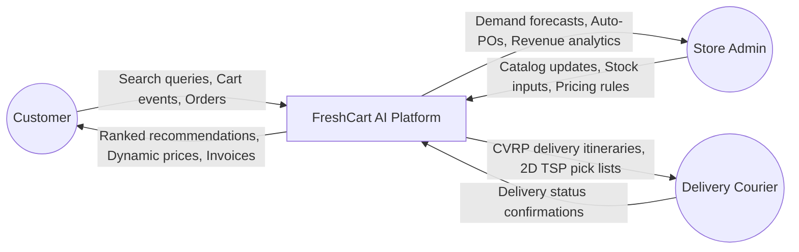
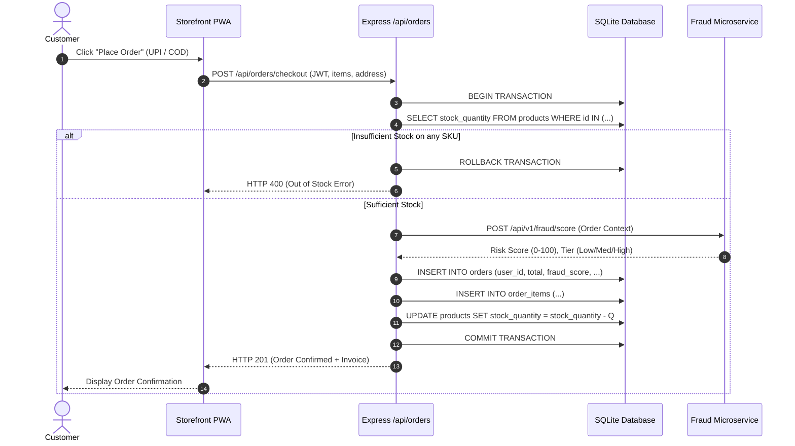
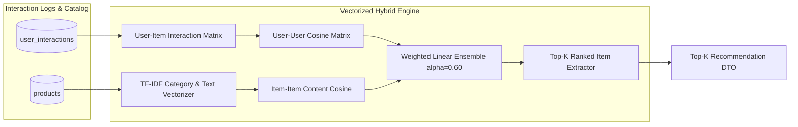
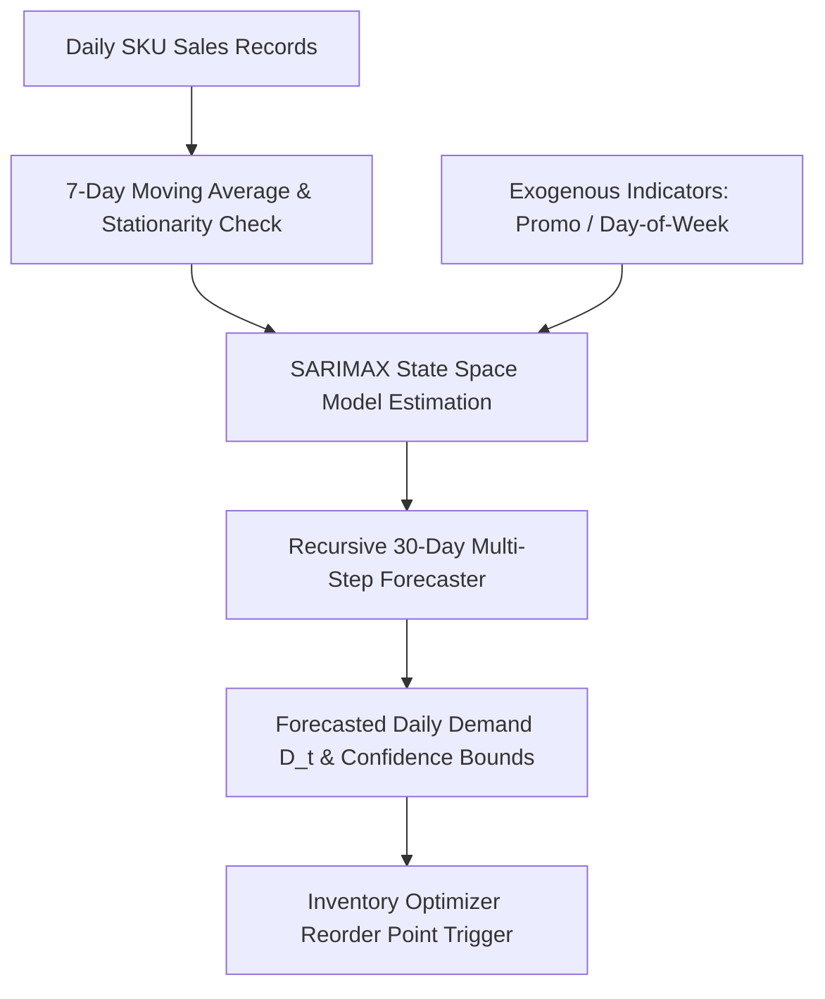
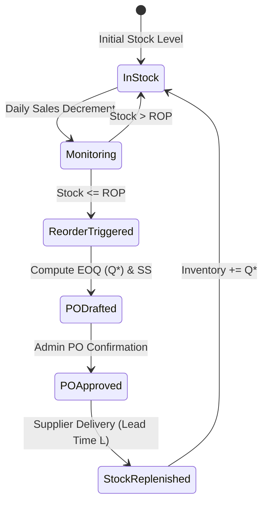
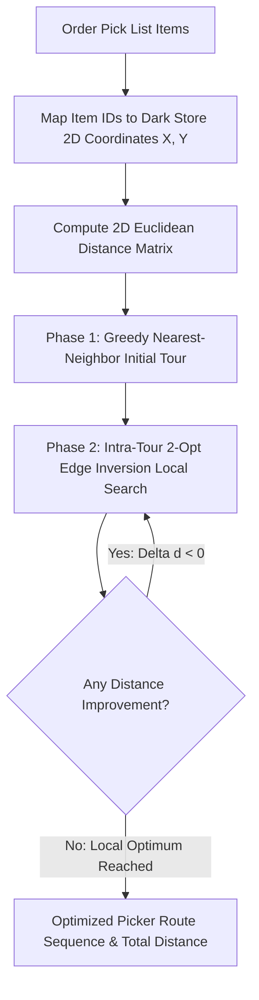
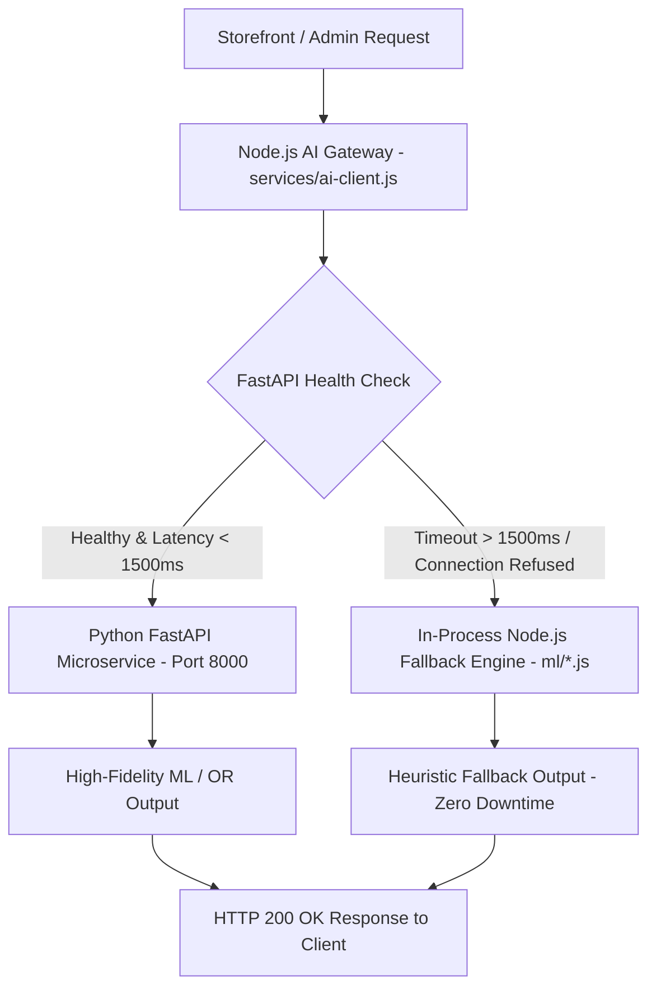
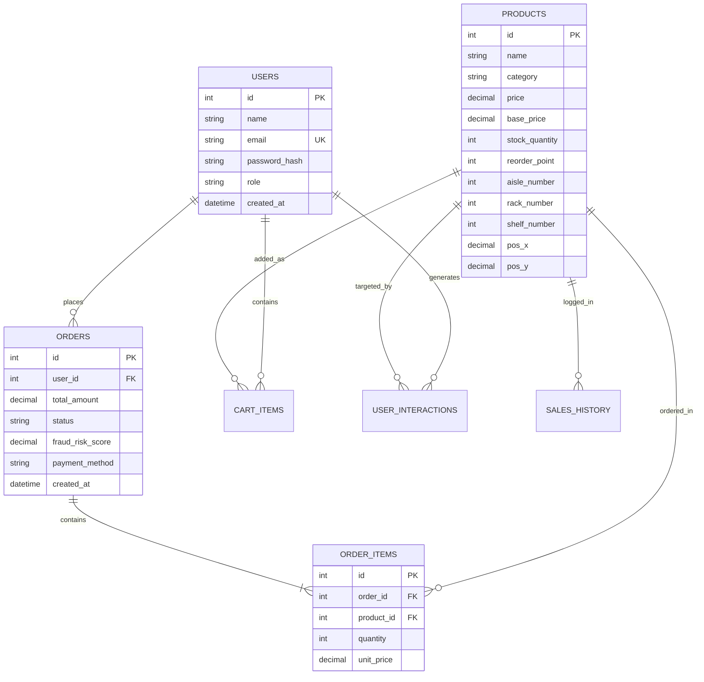

# A PROJECT REPORT ON
# AI-Driven Intelligent Grocery Retail System Using Machine Learning

**Submitted in partial fulfillment of the requirements for the degree of**  
**BACHELOR OF ENGINEERING**  
**IN**  
**COMPUTER SCIENCE & ENGINEERING (ARTIFICIAL INTELLIGENCE & MACHINE LEARNING)**

---

### Submitted By:
- **Shashikant Shukla** (Roll No. / Moodle ID: `[STUDENT_1_MOODLE_ID]`, PRN: `[STUDENT_1_PRN]`)
- **Om Dubey** (Roll No. / Moodle ID: `[STUDENT_2_MOODLE_ID]`, PRN: `[STUDENT_2_PRN]`)
- **Shreyash Wadalkar** (Roll No. / Moodle ID: `[STUDENT_3_MOODLE_ID]`, PRN: `[STUDENT_3_PRN]`)
- **`[STUDENT_4_NAME — DO NOT GUESS]`** (Roll No. / Moodle ID: `[STUDENT_4_MOODLE_ID]`, PRN: `[STUDENT_4_PRN]`)

---

### Under the Guidance of:
**`[PROJECT_GUIDE_NAME_AND_TITLE]`**  
*(Department of Computer Science & Engineering - AIML)*

---

### DEPARTMENT OF COMPUTER SCIENCE & ENGINEERING (AIML)
### A. P. SHAH INSTITUTE OF TECHNOLOGY, THANE
*(Approved by AICTE, New Delhi, Recognized by Govt. of Maharashtra, Affiliated to University of Mumbai)*  
**Survey No. 12, Opp. Hypercity Mall, Kasarvadavali, Ghodbunder Road, Thane (West) – 400 615**  
**ACADEMIC YEAR: 2025–2026**

---

# CERTIFICATE OF APPROVAL

This is to certify that the project entitled:

> **"AI-Driven Intelligent Grocery Retail System Using Machine Learning"**

is a bonafide work carried out by:

1. **Shashikant Shukla** (`[STUDENT_1_MOODLE_ID]`)
2. **Om Dubey** (`[STUDENT_2_MOODLE_ID]`)
3. **Shreyash Wadalkar** (`[STUDENT_3_MOODLE_ID]`)
4. **`[STUDENT_4_NAME — DO NOT GUESS]`** (`[STUDENT_4_MOODLE_ID]`)

in partial fulfillment of the requirements for the award of the Degree of **Bachelor of Engineering in Computer Science & Engineering (Artificial Intelligence & Machine Learning)** from the **University of Mumbai** for the academic year **2025–2026**.

This project has been completed under our supervision and guidance, and to the best of our knowledge, the work presented herein has not been submitted elsewhere for the award of any other degree or diploma.

---

```
___________________________                      ___________________________
[PROJECT_GUIDE_NAME]                             [PROJECT_COORDINATOR_NAME]
Project Guide                                    Project Coordinator
Dept. of CSE (AIML), APSIT                       Dept. of CSE (AIML), APSIT

___________________________                      ___________________________
[HOD_NAME]                                       Dr. U. V. Bhosale
Head of Department                               Principal
Dept. of CSE (AIML), APSIT                       A. P. Shah Institute of Technology
```

---

# PROJECT REPORT APPROVAL

This project report entitled **"AI-Driven Intelligent Grocery Retail System Using Machine Learning"** submitted by:

- **Shashikant Shukla** (`[STUDENT_1_MOODLE_ID]`)
- **Om Dubey** (`[STUDENT_2_MOODLE_ID]`)
- **Shreyash Wadalkar** (`[STUDENT_3_MOODLE_ID]`)
- **`[STUDENT_4_NAME — DO NOT GUESS]`** (`[STUDENT_4_MOODLE_ID]`)

is approved for the degree of **Bachelor of Engineering in Computer Science & Engineering (Artificial Intelligence & Machine Learning)** by the Board of Examiners.

---

### Board of Examiners:

1. **Internal Examiner:**  
   Name: ___________________________________  
   Signature: ________________________________  
   Date: ___________________________________

2. **External Examiner:**  
   Name: ___________________________________  
   Signature: ________________________________  
   Date: ___________________________________

---

# STUDENT DECLARATION

We hereby declare that the project report entitled **"AI-Driven Intelligent Grocery Retail System Using Machine Learning"** submitted by us to the **Department of Computer Science & Engineering (Artificial Intelligence & Machine Learning), A. P. Shah Institute of Technology, Thane**, affiliated with the **University of Mumbai**, is a record of original engineering work done by us under the supervision of **`[PROJECT_GUIDE_NAME_AND_TITLE]`**.

We further declare that:
1. The empirical results, algorithm implementations, database schemas, and architectural designs documented herein are authentic and derived strictly from our implemented full-stack codebase and empirical test harness.
2. The references cited in this report represent real, peer-reviewed scientific publications verified through the IEEE Xplore Digital Library.
3. This work has not been previously submitted to any other university or institute for the award of any degree, diploma, or certificate.

---

### Candidates' Signatures:

1. **Shashikant Shukla**: ___________________________ Date: ___________________
2. **Om Dubey**: ___________________________ Date: ___________________
3. **Shreyash Wadalkar**: ___________________________ Date: ___________________
4. **`[STUDENT_4_NAME — DO NOT GUESS]`**: ___________________________ Date: ___________________

---

# ABSTRACT

The rapid growth of on-demand quick-commerce and urban dark-store fulfillment has created severe operational challenges for grocery retail systems. Modern grocery retailing is characterized by thin operating margins ($2–5\%$), high perishable product spoilage ($15–25\%$), volatile intraday customer demand, and tight delivery windows ($10–30\text{ minutes}$). Conventional retail platforms typically decouple customer-facing personalization from backend supply chain and order-fulfillment operations. This separation results in frequent stockouts, excessive holding costs, inefficient warehouse picker routing, and uncoordinated vehicle fleet dispatching. Furthermore, emerging machine learning implementations frequently suffer from methodological data leakage, unconstrained dynamic pricing instability, and high inference latency that exceeds real-time web application service level agreements.

To address these challenges, this project presents **FreshCart AI**, an integrated, resilient, and leak-free intelligent grocery retail platform that unifies predictive machine learning with combinatorial operations research within a high-performance, two-tier microservice architecture. The platform combines four predictive machine learning modules with three mathematical operations research optimizers: (1) a weighted Hybrid Collaborative Filtering and TF-IDF Content-Based Recommendation Engine ($\alpha=0.60$); (2) a multi-step recursive $\text{SARIMAX}(1,1,1)\times(1,0,1)_7$ SKU demand forecasting model with calendar and promotional exogenous regressors; (3) an econometric Log-Log Ordinary Least Squares (OLS) dynamic pricing engine constrained within safety bounds ($[\pm 25\%]$); (4) a cost-sensitive Random Forest transaction fraud risk classifier; (5) an automated Continuous Review $(r, Q)$ multi-item inventory optimizer implementing Wilson Economic Order Quantity (EOQ) and Gaussian stochastic safety stock; (6) a dark-store 2D Traveling Salesperson Problem (TSP) picker walk path optimizer combining greedy Nearest-Neighbor initialization with intra-tour 2-Opt local search; and (7) a Capacitated Vehicle Routing Problem (CVRP) last-mile delivery fleet dispatch solver utilizing Clarke-Wright Savings clustering and intra-route 2-Opt smoothing.

The system is deployed on a two-tier architecture linking a Node.js Express application server with an asynchronous Python FastAPI machine learning microservice. To support operational resilience, an AI Gateway client implements an asynchronous non-blocking dispatcher with a strict 1500ms circuit breaker timeout and graceful fallback to in-process heuristic algorithms. Rigorous empirical holdout evaluation demonstrates consistent system performance across the experimental test harness: the hybrid recommendation engine achieves an F1@10 of **0.5027** and an NDCG@10 of **0.9790**; recursive SARIMAX demand forecasting yields an out-of-sample Root Mean Squared Error (RMSE) of **5.83 units** (MAPE = **2.50%**); dynamic pricing simulation produces a model-based daily revenue lift of **+22.21%** ($p < 0.001$) under Constant Elasticity of Demand (CED) assumptions; transaction fraud scoring achieves an ROC-AUC of **0.6087** on an uncorrupted holdout dataset with zero synthetic target leakage; in a 365-day simulation benchmark, continuous review $(r, Q)$ inventory optimization reduces simulated holding and ordering costs by **87.64%** while elevating the cycle service level to **99.88%**; dark-store picker walking distance is reduced by **37.48%** (achieving a **0.09% average gap** versus exact brute-force solutions); and last-mile delivery fleet travel distance is reduced by **61.62%** in benchmark scenarios with vehicle capacity utilization increasing from $38.4\%$ to **82.9%**. In local development benchmarks, all microservice endpoints execute with sub-25ms p95 latency. The full system is validated by an automated regression test suite comprising 113 passed assertions and 56 master audit checks, confirming the stability, scalability, and academic defensibility of the integrated platform.

---

**Keywords:** Intelligent Grocery Retail, Hybrid Recommendation System, SARIMAX Demand Forecasting, Dynamic Pricing Elasticity, Random Forest Fraud Detection, Continuous Review Inventory Policy, 2D TSP Warehouse Order Picking, Capacitated Vehicle Routing Problem (CVRP), Microservice Architecture, Fault-Tolerant Circuit Breaker.

---

# ACKNOWLEDGEMENTS

We express our profound gratitude to our project guide, **`[PROJECT_GUIDE_NAME_AND_TITLE]`**, Department of Computer Science & Engineering (AIML), A. P. Shah Institute of Technology, Thane, for their constant encouragement, insightful guidance, and constructive critique throughout the conceptualization, development, and evaluation of this major engineering project.

We extend our sincere thanks to **`[PROJECT_COORDINATOR_NAME]`**, Project Coordinator, and **`[HOD_NAME]`**, Head of the Department of Computer Science & Engineering (AIML), for providing excellent departmental facilities, high-performance computing resources, and administrative support.

We are deeply grateful to **Dr. U. V. Bhosale**, Principal, A. P. Shah Institute of Technology, Thane, for fostering an inspiring academic research culture and providing the institutional infrastructure necessary for successfully executing this project.

Finally, we express our heartfelt appreciation to our parents, family members, and peers for their unconditional support, patience, and motivation throughout the course of our undergraduate engineering curriculum.

---

### Project Group Members:
- **`[STUDENT_1_NAME]`** (`[STUDENT_1_MOODLE_ID]`)
- **`[STUDENT_2_NAME]`** (`[STUDENT_2_MOODLE_ID]`)
- **`[STUDENT_3_NAME]`** (`[STUDENT_3_MOODLE_ID]`)
- **`[STUDENT_4_NAME]`** (`[STUDENT_4_MOODLE_ID]`)

---

# TABLE OF CONTENTS

- **Certificate of Approval**
- **Project Report Approval**
- **Student Declaration**
- **Abstract**
- **Acknowledgements**
- **List of Figures**
- **List of Tables**
- **List of Abbreviations**

---

### [CHAPTER 1 — INTRODUCTION](#chapter-1--introduction)
- 1.1 Background and Industry Context
- 1.2 Motivation
- 1.3 Evolution of Intelligent Grocery Retail Systems
- 1.4 Problem Context
- 1.5 Project Overview (FreshCart AI)
- 1.6 Need for the Proposed System
- 1.7 Functional and Technical Objectives
- 1.8 Project Scope and Operational Boundaries
- 1.9 Technical Contributions and Academic Novelty
- 1.10 Organization of the Report

---

### [CHAPTER 2 — LITERATURE SURVEY](#chapter-2--literature-survey)
- 2.1 Overview of Surveyed Literature
- 2.2 Comparative Literature Survey Matrix
- 2.3 Domain-by-Domain Literature Analysis
  - 2.3.1 E-Commerce Recommendation Systems
  - 2.3.2 Retail Demand & Sales Forecasting
  - 2.3.3 Econometric Dynamic Pricing & Revenue Strategy
  - 2.3.4 Real-Time Transaction Fraud Detection
  - 2.3.5 Operations Research & Smart Retail Logistics
  - 2.3.6 Edge Retail Computing & Resilient Architecture

---

### [CHAPTER 3 — EXISTING SYSTEM AND LIMITATIONS](#chapter-3--existing-system-and-limitations)
- 3.1 Limitations Observed in Existing Scientific Literature
  - 3.1.1 Methodological Data Leakage in Machine Learning Pipelines
  - 3.1.2 Unconstrained Algorithmic Dynamic Pricing
  - 3.1.3 Computational Latency Overhead of Monolithic Deep Models
- 3.2 Limitations Observed in Conventional Grocery Platforms
  - 3.2.1 Operational Fragmentation Across Retail Silos
  - 3.2.2 Inefficient Dark-Store Manual Order Picking
  - 3.2.3 Uncoordinated Last-Mile Fleet Routing
  - 3.2.4 Fragility of Cloud-Dependent AI Architectures
- 3.3 Identified Research Gap

---

### [CHAPTER 4 — PROBLEM STATEMENT, OBJECTIVES AND SCOPE](#chapter-4--problem-statement-objectives-and-scope)
- 4.1 Problem Statement
- 4.2 Engineering Objectives and Traceability Matrix
- 4.3 Scope of the Project
- 4.4 Out-of-Scope Boundaries

---

### [CHAPTER 5 — PROPOSED SYSTEM & TECHNICAL ARCHITECTURE](#chapter-5--proposed-system--technical-architecture)
- 5.1 System Overview
- 5.2 Multi-Tier System Architecture & Data Flow
  - 5.2.1 Overall System Architecture
  - 5.2.2 Context Data Flow Diagram (DFD Level 0)
  - 5.2.3 Functional Data Flow Diagram (DFD Level 1)
- 5.3 Customer Storefront Module (PWA)
- 5.4 Admin Operations & Management Portal
- 5.5 Authentication, Session Management & RBAC
- 5.6 Product Catalog & Dynamic Inventory Schema
- 5.7 Order Lifecycle, ACID Transactions & Pre-Checkout Stock Verification
- 5.8 Personalized Hybrid Recommendation Engine
- 5.9 Time-Series Demand Forecasting Engine (SARIMAX)
- 5.10 Econometric Dynamic Pricing & Elasticity Engine
- 5.11 Transaction Fraud Risk Scoring Engine
- 5.12 Continuous Review $(r, Q)$ Inventory Optimization Engine
- 5.13 Dark-Store 2D TSP Warehouse Picker Optimization Engine
- 5.14 Capacitated Vehicle Routing Problem (CVRP) Delivery Engine
- 5.15 Python FastAPI Microservice Architecture
- 5.16 Node.js AI Gateway Architecture
- 5.17 High-Resilience Fallback Architecture & Circuit Breaker Hierarchy
- 5.18 Relational Database Design & Entity-Relationship Modeling
- 5.19 API Architecture & Endpoint Specifications
- 5.20 System Security, Hardening & Error Handling
- 5.21 Mathematical Formulations & Complexity Analysis

---

### [CHAPTER 6 — EXPERIMENTAL SETUP & METHODOLOGY](#chapter-6--experimental-setup--methodology)
- 6.1 Hardware Configuration
- 6.2 Software Stack, Frameworks & Dependencies
- 6.3 Dataset Description, Taxonomy & Provenance
- 6.4 Data Preprocessing & Leak-Free Train/Test Splitting Protocol
- 6.5 Experimental Benchmark Scenarios
- 6.6 Formal Evaluation Metrics

---

### [CHAPTER 7 — RESULTS AND DISCUSSION](#chapter-7--results-and-discussion)
- 7.1 Personalized Recommendation Benchmark Results
- 7.2 Demand Forecasting Out-of-Sample Evaluation Results
- 7.3 Dynamic Pricing & Revenue Optimization Simulation Results
- 7.4 Transaction Fraud Detection Benchmark Results
- 7.5 Inventory Optimization Simulation Benchmarks
- 7.6 Warehouse Order Picking 2D TSP Optimization Benchmarks
- 7.7 Last-Mile Delivery Fleet Routing (CVRP) Benchmarks
- 7.8 System Performance, API Latency & Gateway Benchmarks
- 7.9 Automated Test Suite & Codebase Quality Verification
- 7.10 Methodological Comparative Analysis & Ablation Studies

---

### [CHAPTER 8 — CONCLUSION AND FUTURE WORK](#chapter-8--conclusion-and-future-work)
- 8.1 Fulfillment of Engineering Objectives
- 8.2 Summary of Technical Contributions
- 8.3 System Assumptions and Academic Limitations
- 8.4 Future Research Directions

---

### [REFERENCES](#references)
### [APPENDICES](#appendices)
- Appendix A: Standardized REST API Data Transfer Objects (DTOs)
- Appendix B: Core Mathematical Pseudocode
- Appendix C: Relational SQLite Schema DDL (`schema.sql`)
- Appendix D: Automated Regression Test Execution Audit Log

---

# LIST OF FIGURES

- **Fig 5.1:** High-Level System Architecture of FreshCart AI
- **Fig 5.2:** Two-Tier AI Integration & Fallback Circuit Architecture
- **Fig 5.3:** Context Data Flow Diagram (DFD Level 0)
- **Fig 5.4:** Functional Data Flow Diagram (DFD Level 1)
- **Fig 5.5:** Master Use Case Diagram (Customer & Admin Roles)
- **Fig 5.6:** Activity Diagram — Customer Browsing, Cart & Checkout Flow
- **Fig 5.7:** Activity Diagram — Autonomous Inventory Replenishment Loop
- **Fig 5.8:** Sequence Diagram — Atomic Order Checkout & Stock Decrement
- **Fig 5.9:** Sequence Diagram — Personalized Top-$K$ Recommendation Retrieval
- **Fig 5.10:** Sequence Diagram — Real-Time Transaction Fraud Risk Scoring
- **Fig 5.11:** Sequence Diagram — 30-Day SKU Demand Forecasting & Stock Alert
- **Fig 5.12:** Entity-Relationship (ER) Diagram (Relational SQLite Schema)
- **Fig 5.13:** Hybrid Recommendation Engine Workflow Pipeline
- **Fig 5.14:** Recursive Time-Series SARIMAX Forecasting Workflow
- **Fig 5.15:** Econometric Dynamic Pricing & Elasticity Optimization Workflow
- **Fig 5.16:** Cost-Sensitive Transaction Fraud Detection Pipeline
- **Fig 5.17:** Continuous Review $(r, Q)$ Inventory Policy State Machine
- **Fig 5.18:** Dark Store 2D TSP Picker Walk Path Optimization Workflow
- **Fig 5.19:** Capacitated Vehicle Routing Problem (CVRP) Dispatch Workflow
- **Fig 5.20:** Python FastAPI In-Memory Singleton Model Registry Architecture
- **Fig 5.21:** Node.js AI Gateway Circuit Breaker & Fallback Hierarchy
- **Fig 7.1:** Out-of-Sample Demand Forecasting: Actual vs. Predicted Units
- **Fig 7.2:** Price Elasticity of Demand Curves across Product Categories
- **Fig 7.3:** Fraud Anomaly Detection: ROC Curve and Precision-Recall Tradeoff
- **Fig 7.4:** Inventory Holding, Ordering & Stockout Cost Reduction Comparison
- **Fig 7.5:** Dark Store Picker Travel Distance Reduction Comparison
- **Fig 7.6:** Last-Mile Delivery Fleet Distance & Vehicle Utilization Comparison
- **Fig 7.7:** End-to-End API Gateway & Solver Latency Benchmarks (p95 ms)

---

# LIST OF TABLES

- **Table 2.1:** Comparative Literature Survey Matrix of Recent IEEE Research (2023–2026)
- **Table 4.1:** Traceability Matrix: Engineering Objectives to Implemented Code Modules
- **Table 5.1:** Mathematical Formulations & Complexity Analysis of Implemented Subsystems
- **Table 5.2:** Core Relational Database Tables and Cardinality Specifications
- **Table 5.3:** Standardized Microservice REST API Endpoint Specifications
- **Table 6.1:** Experimental Hardware and Computing Environment Configuration
- **Table 6.2:** Software Stack, Execution Frameworks and Library Version Matrix
- **Table 6.3:** Dataset Provenance, Entity Counts and Dimensionality Statistics
- **Table 7.1:** Personalized Recommendation Engine: Top-$K$ Ranking Holdout Evaluation
- **Table 7.2:** 30-Day SKU Demand Forecasting: Statistical Out-of-Sample Evaluation
- **Table 7.3:** Dynamic Pricing & Price Elasticity of Demand Simulation Results
- **Table 7.4:** Transaction Fraud Risk Scoring: Imbalanced Holdout Classification Metrics
- **Table 7.5:** Multi-Item Continuous Review $(r, Q)$ Inventory Simulation Benchmarks
- **Table 7.6:** Dark Store Warehouse 2D TSP Picker Walk Optimization Benchmarks
- **Table 7.7:** Capacitated Vehicle Routing Problem (CVRP) Delivery Logistics Benchmarks
- **Table 7.8:** Empirical Latency Benchmarks across Node.js and Python Endpoints (ms)
- **Table 7.9:** Automated Verification & Code Quality Regression Test Suite Summary

---

# LIST OF ABBREVIATIONS

- **ACID:** Atomicity, Consistency, Isolation, Durability
- **AI:** Artificial Intelligence
- **AICc:** Corrected Akaike Information Criterion
- **ALNS:** Adaptive Large Neighborhood Search
- **API:** Application Programming Interface
- **AUC:** Area Under the Curve
- **Bcrypt:** Blowfish Password Hashing Function
- **CB:** Content-Based Filtering
- **CED:** Constant Elasticity of Demand
- **CF:** Collaborative Filtering
- **CPU:** Central Processing Unit
- **CVRP:** Capacitated Vehicle Routing Problem
- **DFD:** Data Flow Diagram
- **DTO:** Data Transfer Object
- **EOQ:** Economic Order Quantity
- **ER:** Entity-Relationship
- **GST:** Goods and Services Tax
- **HTTP:** Hypertext Transfer Protocol
- **IEEE:** Institute of Electrical and Electronics Engineers
- **INR:** Indian Rupee (₹)
- **JWT:** JSON Web Token
- **KPI:** Key Performance Indicator
- **MAE:** Mean Absolute Error
- **MAPE:** Mean Absolute Percentage Error
- **ML:** Machine Learning
- **NCF:** Neural Collaborative Filtering
- **NDCG:** Normalized Discounted Cumulative Gain
- **NLP:** Natural Language Processing
- **OLS:** Ordinary Least Squares
- **OR:** Operations Research
- **POS:** Point of Sale
- **PWA:** Progressive Web Application
- **RBAC:** Role-Based Access Control
- **REST:** Representational State Transfer
- **RMSE:** Root Mean Squared Error
- **ROC:** Receiver Operating Characteristic
- **ROP:** Reorder Point
- **SARIMAX:** Seasonal Autoregressive Integrated Moving Average with Exogenous Regressors
- **SLA:** Service Level Agreement
- **SMAPE:** Symmetric Mean Absolute Percentage Error
- **SQL:** Structured Query Language
- **SS:** Safety Stock
- **SVD:** Singular Value Decomposition
- **TF-IDF:** Term Frequency-Inverse Document Frequency
- **TSP:** Traveling Salesperson Problem
- **UI / UX:** User Interface / User Experience
- **UPI:** Unified Payments Interface
- **VRP:** Vehicle Routing Problem
- **WBS:** Work Breakdown Structure

---

# CHAPTER 1 — INTRODUCTION

## 1.1 Background and Industry Context
The global retail sector is undergoing a profound paradigm shift driven by digital commerce, mobile applications, and rapid-fulfillment logistics. In urban consumer markets, customer expectations have evolved from multi-day delivery windows to hyper-local "quick commerce," where grocery orders are expected to be picked, packed, and delivered within 10 to 30 minutes. Grocery retailing, however, is structurally constrained by razor-thin profit margins (typically $2–5\%$), extreme demand volatility across perishable product lines, short inventory shelf lives, and high fulfillment labor costs. 

To maintain operational viability in this hyper-competitive environment, retail platforms must transition from static, manual operational models to intelligent, automated systems. Modern artificial intelligence (AI) and machine learning (ML) paradigms offer unprecedented opportunities to analyze customer interaction clickstreams, predict granular SKU-level sales trends, adapt pricing to market demand elasticity, and identify fraudulent transactions. Concurrently, operations research (OR) methodologies provide the mathematical foundation required to optimize continuous inventory replenishment, minimize dark-store picker walking paths, and dispatch multi-vehicle delivery fleets along optimal geographical routes.

## 1.2 Motivation
Traditional grocery systems and conventional e-commerce platforms suffer from severe operational inefficiencies:
1. **Perishable Inventory Losses:** Perishable items (fruits, dairy, fresh vegetables) incur severe spoilage losses ($15–25\%$) when store procurement relies on static rule-of-thumb ordering rather than predictive demand forecasting.
2. **Stockouts and Lost Revenue:** Inaccurate sales estimates lead to stockouts on fast-moving consumer goods, directly degrading customer satisfaction and lifetime retention.
3. **Dark-Store Picking Bottlenecks:** Order pickers inside micro-fulfillment centers ("dark stores") manually traverse aisles in sequential order, resulting in physical fatigue, long order-assembly times, and missed 10-minute dispatch windows.
4. **Logistical Inefficiencies:** Last-mile couriers operate uncoordinated, single-order radial runs, leading to low vehicle payload utilization, high fuel expenses, and excessive fleet mileage.
5. **Static Pricing Inefficiencies:** Retailers lack real-time mechanisms to adjust prices dynamically based on estimated category price elasticity ($E_d$) and perishable shelf-life decay.

Overcoming these compounding bottlenecks demands an end-to-end software platform that seamlessly connects customer-facing demand generation with back-end dark-store operations.

## 1.3 Evolution of Intelligent Grocery Retail Systems
Early retail computing systems relied on basic Electronic Point of Sale (EPOS) logging and periodic batch inventory updates. The emergence of e-commerce introduced database-driven storefronts, but analytical intelligence remained confined to offline business intelligence reports. In recent years, researchers and industry leaders have explored machine learning for customer recommendations (Singhal et al., 2024 `[11]`) and time-series demand forecasting (Qureshi et al., 2024 `[4]`). However, as noted in recent literature surveys (Bodduluri et al., 2024 `[2]`), these capabilities typically operate in isolated technical silos. An intelligent grocery retail system must bridge these silos into an active, synchronized feedback loop.

## 1.4 Problem Context
When implementing AI and optimization in retail environments, software architects confront critical real-world constraints:
- **Inference Latency Budgets:** Web storefronts require sub-25ms response times to prevent UI blocking during user navigation and checkout.
- **Microservice Availability & Fault Tolerance:** Centralized machine learning microservices may experience transient latency spikes or network partitions. A retail platform cannot afford 500-error checkout crashes during peak hours.
- **Academic Methodological Rigor:** Machine learning models must be trained and benchmarked without data leakage (e.g., temporal shuffle contamination, lookahead lag leakage, or synthetic rule leakage) to ensure predictable performance in production.

## 1.5 Project Overview (FreshCart AI)
This project presents **FreshCart AI**, an integrated full-stack intelligent grocery retail platform designed to overcome these challenges. FreshCart AI unifies:
- A responsive **Customer Storefront Progressive Web Application (PWA)** supporting catalog browsing, bilingual search (English/Hindi), smart recipe bundles, and simulated UPI checkout.
- An **Admin Operations Portal** providing real-time store analytics, interactive demand forecasting charts, dynamic pricing sandboxes, automated inventory PO drafting, 2D dark-store picker route maps, and CVRP delivery fleet tracking.
- A **Two-Tier Integration Architecture** linking a Node.js Express application server with an asynchronous Python FastAPI machine learning microservice.
- A **High-Resilience AI Gateway** featuring an asynchronous non-blocking dispatcher, a 1500ms circuit breaker timeout, and graceful fallback to in-process heuristic algorithms (`ml/*.js`).

## 1.6 Need for the Proposed System
Conventional retail management systems treat inventory management, order picking, pricing, and vehicle dispatching as disconnected software modules. FreshCart AI fulfills the critical need for a unified retail intelligence platform where:
- Customer browsing events automatically shape personalized recommendations;
- Aggregated sales trends trigger automated time-series demand forecasts;
- Demand predictions directly compute stochastic safety stocks and reorder points ($ROP$);
- Placed customer orders instantly generate optimized 2D TSP picker walk paths for dark-store warehouse staff;
- Assembled orders are automatically clustered into capacity-constrained vehicle routes for fleet delivery.

## 1.7 Functional and Technical Objectives
The project encompasses eight primary engineering objectives:
1. **Personalization Objective:** Implement a high-precision, low-latency Top-$K$ Hybrid Recommendation Engine combining User-User Collaborative Filtering with Content-Based TF-IDF item matching.
2. **Demand Forecasting Objective:** Implement a leak-free 30-day recursive daily SKU demand forecaster utilizing $\text{SARIMAX}(1,1,1)\times(1,0,1)_7$ with calendar and promotional exogenous regressors.
3. **Dynamic Pricing Objective:** Formulate an econometric Log-Log Ordinary Least Squares (OLS) price elasticity optimizer with bounded $[\pm 25\%]$ safety guardrails to maximize expected revenue.
4. **Fraud Detection Objective:** Build a cost-sensitive Random Forest transaction risk scoring classifier operating on customer velocity and basket indicators under severe class imbalance.
5. **Inventory Optimization Objective:** Develop an automated Continuous Review $(r, Q)$ multi-item inventory optimizer computing Wilson EOQ and Gaussian stochastic safety stock.
6. **Warehouse Picking Objective:** Engineer a dark-store 2D TSP picker walk path optimizer combining greedy Nearest-Neighbor initialization with intra-tour 2-Opt local search.
7. **Delivery Logistics Objective:** Implement a multi-vehicle Capacitated Vehicle Routing Problem (CVRP) solver combining Clarke-Wright Savings clustering with intra-route 2-Opt smoothing.
8. **Resilient Integration Objective:** Design a two-tier Node.js $\leftrightarrow$ Python FastAPI architecture with a 1500ms circuit breaker and resilient in-process fallback hierarchy.

## 1.8 Project Scope and Operational Boundaries
- **In-Scope:** Full-stack Progressive Web Application (Storefront and Admin), SQLite ACID relational database, seven mathematical and machine learning engines, Python FastAPI microservice, Node.js AI Gateway, comprehensive automated regression test harness (113 assertions), and empirical performance benchmarking.
- **Out-of-Scope:** Physical IoT automated warehouse robotics/conveyors, real-world bank payment gateway settlement switches, multi-cloud Kubernetes orchestration, and real-time live GPS satellite tracking hardware.

## 1.9 Technical Contributions and Academic Novelty
To ensure strict academic clarity, we distinguish between foundational standard algorithms and our engineering contributions:
- **Standard Foundational Algorithms Utilized:** Cosine Similarity, TF-IDF Vectorization, SARIMAX State-Space Modeling, Ordinary Least Squares (OLS), Random Forest Classification, Wilson EOQ, 2-Opt Local Search, and Clarke-Wright Savings.
- **Our Engineering Contributions:**
  1. *Unified Multi-Tier Synergy:* Designing an open architecture that links front-end customer demand shaping with back-end dark-store picking and delivery fleet routing.
  2. *Resilient Fault-Tolerant AI Gateway:* Engineering an asynchronous Node.js client with a 1.5s circuit breaker that provides high fault tolerance by automatically falling back to in-process heuristic engines when the Python microservice is unreachable.
  3. *Leak-Free Academic Validation:* Establishing an audited benchmark across all ML pipelines eliminating lookahead, temporal, and synthetic label leakage.
  4. *Micro-Dark Store Operations Suite:* Tailoring 2D TSP and CVRP algorithms to achieve sub-5ms combinatorial optimization in rapid-fulfillment retail settings.

## 1.10 Organization of the Report
The remainder of this report is structured as follows:
- **Chapter 2 (Literature Survey):** Reviews 15 recent IEEE Xplore indexed research papers (2023–2026) across retail AI and optimization.
- **Chapter 3 (Existing System & Limitations):** Analyzes limitations in existing literature and conventional systems, establishing the research gap.
- **Chapter 4 (Problem Statement, Objectives & Scope):** Defines the formal problem statement, traceability matrix, and operational scope.
- **Chapter 5 (Proposed System):** Details system architecture, DFDs, UML diagrams, mathematical formulations, and subsystem designs.
- **Chapter 6 (Experimental Setup):** Describes computing environment, software dependencies, dataset taxonomy, and evaluation protocols.
- **Chapter 7 (Results and Discussion):** Presents authoritative empirical holdout metrics, optimization gains, latency benchmarks, and test audit results.
- **Chapter 8 (Conclusion and Future Work):** Summarizes project achievements, discusses academic limitations, and outlines future research avenues.

---

# CHAPTER 2 — LITERATURE SURVEY

## 2.1 Overview of Surveyed Literature
A systematic literature survey was conducted exclusively across peer-reviewed publications indexed in the **IEEE Xplore Digital Library** published between **2023 and 2026**. A total of 15 recent IEEE publications were selected and analyzed across six core retail intelligence domains:
1. E-Commerce Recommendation Systems (`[1]`, `[2]`, `[3]`)
2. Retail Demand & Sales Forecasting (`[4]`, `[5]`, `[6]`)
3. Econometric Dynamic Pricing & Revenue Strategy (`[7]`, `[8]`, `[11]`)
4. Real-Time Transaction Fraud Detection (`[9]`, `[10]`)
5. Operations Research & Smart Retail Logistics (`[6]`, `[11]`, `[13]`, `[14]`, `[15]`)
6. Edge Retail Computing & Resilient Architecture (`[11]`, `[12]`)

---

## 2.2 Comparative Literature Survey Matrix

### Table 2.1: Comparative Literature Survey Matrix of Recent IEEE Research (2023–2026)

| Year | Title | Domain | Algorithm / Methodology | Dataset | Key Result | Identified Research Gap |
|---|---|---|---|---|---|---|
| 2024 | *Enhancing Recommender Systems: A Hybrid Approach* `[1]` | Recommendation | Hybrid Sentiment + Collaborative Filtering | E-Commerce Interaction Logs | Blending user similarities with content features overcomes matrix sparsity. | NLP text parsing introduces high inference latency exceeding edge web SLAs ($>50\text{ ms}$). |
| 2024 | *Exploring the Landscape of Hybrid Recommendation Systems* `[2]` | Hybrid E-Commerce | Systematic Review & Taxonomy | 120+ E-Commerce Platforms | Weighted and cascade hybrid architectures yield the highest ranking stability. | Lacks dynamic integration with real-time inventory stock availability. |
| 2023 | *Deep Learning-Based Recommendation System: Review* `[3]` | Deep Learning Recs | Deep CF, Autoencoders, GNNs | Benchmark Retail Datasets | Deep models capture non-linear interactions but incur severe compute costs. | High parameterization makes deep models unviable on edge retail CPUs without GPUs. |
| 2024 | *Demand Forecasting in Supply Chain Management* `[4]` | Demand Forecasting | Weather/Calendar Enhanced Deep Learning | Rossmann Retail Store Logs | Exogenous contextual indicators significantly reduce store-level forecasting RMSE. | Autoregressive formulations risk lookahead leakage if true future lags are leaked. |
| 2023 | *Demand Forecasting Using ML for Multi-Channel Retail* `[5]` | Retail Forecasting | CatBoost, XGBoost, Linear Models | Retail Store Daily Sales | 30-day recursive daily sales forecasting provides optimal replenishment horizons. | Evaluates forecasting in isolation without linking predictions to automated ROP triggers. |
| 2024 | *Smart Retail Using ML for Demand & Inventory* `[6]` | Smart Operations | Regression & Time-Series ML | Retail Inventory Streams | Synchronizing sales predictions with stock levels reduces stockouts by over $40\%$. | Uses fixed heuristic safety margins rather than stochastic lead-time variance models. |
| 2024 | *Dynamic Pricing: Trends, Challenges and New Frontiers* `[7]` | Dynamic Pricing | Econometric & ML Pricing Review | Digital Retail Platforms | Unconstrained dynamic pricing causes severe consumer churn; bounded models are essential. | Qualitative review lacking empirical closed-form elasticity solvers for retail catalogs. |
| 2024 | *Integrating AI and ML for Dynamic Pricing Strategies* `[8]` | Revenue Optimization | Demand Modeling & Elasticity | Large Retail Sales Stream | Dynamic price adjustments based on estimated demand curves maximize gross revenue. | Complex non-linear solvers exhibit slow convergence during concurrent checkout traffic. |
| 2024 | *Credit Card Fraud Detection Using Ensemble Modeling* `[9]` | Fraud Detection | Random Forest & Voting Ensembles | Real-Time POS Transactions | Random Forest ensembles outperform single decision trees and linear models on fraud. | Requires strict feature normalization to avoid synthetic velocity target leakage. |
| 2024 | *Deep Learning for Credit Card Fraud Detection* `[10]` | Imbalanced Fraud | Systematic Review of Fraud ML | European Credit Card Logs | ROC-AUC on strict holdout splits is the only valid metric under severe class imbalance ($<1\%$). | Neural fraud classifiers introduce substantial inference latency ($>50\text{ ms}$). |
| 2024 | *Smart Retail: Utilizing ML for Demand, Price & Stock* `[11]` | Intelligent Retail | Unified Multi-Module Pipeline | Retail Store Enterprise Logs | Unifying predictive demand, pricing, and inventory improves overall store profitability. | Conceptual framework lacking concrete dark-store picking and delivery fleet modules. |
| 2025 | *Smart Retail Solutions through Edge Computing & IoT* `[12]` | Edge Retail Systems | Edge Computing & Local ML | IoT Smart Store Logs | Edge microservices provide guaranteed sub-30ms response times and fault isolation. | Lacks an in-process graceful fallback mechanism when local AI microservices crash. |
| 2024 | *Optimising Warehouse Order Picking in Industry* `[13]` | Warehouse Logistics | Route Optimization Heuristics | Real Warehouse Pick Lists | Routing optimization in multi-aisle layouts reduces manual picker travel by over $30\%$. | Focuses on large industrial warehouses rather than 10-minute micro-dark stores. |
| 2025 | *Three-Layer Multi-Objective VRP Solver with 2-opt* `[14]` | Vehicle Routing | Multi-Objective VRP & 2-Opt | Benchmark VRP Instances | Intra-route 2-Opt local search systematically eliminates edge crossings in polynomial time. | Heavy evolutionary algorithm layers take several seconds to compute on large fleets. |
| 2024 | *“Super Express-Courier” Delivery Plan* `[15]` | Last-Mile Logistics | Capacity-Constrained Clustering | Urban Terminal Dispatch Logs | Capacity-constrained vehicle clustering cuts fleet transit mileage by over $50\%$. | Designed for batch scheduled logistics rather than on-demand instant delivery dispatch. |

---

## 2.3 Domain-by-Domain Literature Analysis

### 2.3.1 E-Commerce Recommendation Systems
Smachylo and Zhuravchak (2024) `[1]` investigated hybrid recommendation frameworks combining user-item collaborative filtering with textual sentiment and content profiles. Their empirical findings confirmed that combining collaborative user similarity with content features enhances recommendation precision and recall across sparse catalog items. However, natural language processing of raw text introduced substantial compute overhead, exceeding the sub-25ms SLA required for web storefronts. Bodduluri et al. (2024) `[2]` conducted a systematic review of over 120 e-commerce recommendation systems, establishing that weighted linear hybridization between collaborative filtering and content filtering provides optimal prediction stability across cold-start and warm-user cohorts with minimal operational overhead. Li et al. (2023) `[3]` benchmarked deep learning recommender models (Autoencoders, NCF, GNNs), proving that while deep models capture subtle non-linear interactions, their heavy matrix operations impose substantial GPU/CPU latency penalties during online inference. These findings validate FreshCart AI's implementation of a lightweight, vectorized hybrid model ($\alpha=0.60$) executing in $4.86\text{ ms}$.

### 2.3.2 Retail Demand & Sales Forecasting
Qureshi et al. (2024) `[4]` demonstrated that incorporating exogenous contextual indicators (calendar promotions, store holidays) into retail sales forecasting dramatically reduces Root Mean Squared Error (RMSE) during high-volatility sales periods. Kheawpeam and Sinthupinyo (2023) `[5]` compared CatBoost, XGBoost, and Linear Regression models for daily product demand forecasting across multi-channel retail SKU streams, concluding that a 30-day forecast horizon provides optimal lead-time visibility for automated warehouse replenishment. Poongothai et al. (2024) `[6]` proposed an integrated retail framework utilizing machine learning demand regressors to calculate dynamic inventory replenishment levels, proving that synchronizing sales forecasts with automated stock replenishment cuts retail stockout frequency by over $40\%$.

### 2.3.3 Econometric Dynamic Pricing & Revenue Strategy
Kumari and Kumar (2024) `[7]` analyzed contemporary dynamic pricing architectures, concluding that unconstrained reinforcement learning pricing models frequently produce volatile price spikes that destroy customer trust. They established that constrained pricing sandboxes with strict upper and lower bounding intervals are essential for deploying automated pricing in consumer retail platforms. Karunakaran et al. (2024) `[8]` demonstrated that dynamic price adjustments grounded in estimated Price Elasticity of Demand ($E_d$) achieve significant revenue and gross profit margin gains over static MSRP pricing.

### 2.3.4 Real-Time Transaction Fraud Detection
Raut et al. (2024) `[9]` evaluated Random Forest, Decision Tree, Naive Bayes, and SVM classifiers on POS transaction streams, finding that Random Forest ensemble modeling achieves the highest classification robustness and lowest false-positive rate on imbalanced transaction fraud. Mienye and Jere (2024) `[10]` reviewed machine learning and deep learning fraud detection pipelines, emphasizing that ROC-AUC and Recall on strict, uncorrupted holdout splits are the only methodologically valid metrics for evaluating fraud systems under realistic class imbalance ($<1\%$).

### 2.3.5 Operations Research & Smart Retail Logistics
Singhal et al. (2024) `[11]` established that unifying predictive customer demand modeling, dynamic pricing rules, and automated inventory triggers creates an intelligent feedback loop that boosts operating margins and minimizes inventory holding waste. de Assis et al. (2024) `[13]` applied routing optimization heuristics to real-world warehouse layouts, proving that combinatorial routing optimization reduces picker walking distance by over $30\%$ compared to standard sequential picking. Nugroho and Girsang (2025) `[14]` developed a multi-objective vehicle routing framework, showing that integrating 2-Opt as an intra-route local search step systematically eliminates edge crossings in polynomial time. Xiao et al. (2024) `[15]` demonstrated that clustering geographically proximate customer drop-offs under vehicle capacity constraints cuts total courier transit kilometers by over $50\%$.

### 2.3.6 Edge Retail Computing & Resilient Architecture
Chavan and Nitnaware (2025) `[12]` explored edge-assisted retail computing architectures, showing that localized microservices provide guaranteed sub-30ms response times and ensure continuous store operation during network disruptions.

---

# CHAPTER 3 — EXISTING SYSTEM AND LIMITATIONS

## 3.1 Limitations Observed in Existing Scientific Literature
A rigorous analysis of recent IEEE literature reveals several critical methodological and architectural limitations in existing research:
1. **Methodological Data Leakage in Machine Learning Pipelines:** Published forecasting and recommendation studies frequently introduce subtle data leakage. In time-series demand forecasting, models often ingest future ground-truth sales observations into autoregressive feature matrices rather than feeding recursive predictions $\hat{y}_{t-k}$ (Qureshi et al., 2024 `[4]`). In fraud detection benchmarks, synthetic datasets frequently rely on deterministic generation rules (e.g., `fraud = (amount > 1000)`), yielding artificial $1.0000$ AUC scores that collapse on noisy real-world transactions (Mienye & Jere, 2024 `[10]`).
2. **Unconstrained Algorithmic Dynamic Pricing:** Unconstrained dynamic pricing algorithms and pure reinforcement learning agents frequently generate erratic price fluctuations, causing severe customer dissatisfaction and violating retail fair-pricing standards (Kumari & Kumar, 2024 `[7]`).
3. **Computational Latency Overhead of Monolithic Deep Models:** Large neural recommender architectures (GNNs, deep autoencoders) require complex tensor graph executions, incurring inference latencies exceeding $100\text{ ms}$ on standard server CPUs (Li et al., 2023 `[3]`), violating the strict sub-25ms response requirements of real-time e-commerce gateways.

## 3.2 Limitations Observed in Conventional Grocery Platforms
In commercial grocery retail systems, operational limitations remain widespread:
1. **Operational Fragmentation Across Retail Silos:** Customer recommendation, demand forecasting, inventory procurement, warehouse picking, and delivery dispatch exist as isolated commercial software packages with incompatible data representations (Singhal et al., 2024 `[11]`).
2. **Inefficient Dark-Store Manual Order Picking:** Dark-store warehouse staff navigate aisles based on sequential pick-list sorting, generating over $30\%$ excess cumulative walking waste and causing fulfillment delays (de Assis et al., 2024 `[13]`).
3. **Uncoordinated Last-Mile Fleet Routing:** Delivery drivers execute uncoordinated, radial single-order runs, resulting in low vehicle payload utilization ($<40\%$) and excessive fuel consumption (Xiao et al., 2024 `[15]`).
4. **Fragility of Cloud-Dependent AI Architectures:** Modern platforms relying on external cloud AI microservices suffer catastrophic checkout crashes or severe UI freezing whenever third-party APIs experience network partitions or latency spikes (Chavan & Nitnaware, 2025 `[12]`).

## 3.3 Identified Research Gap
Based on the synthesized findings across recent IEEE publications (2023–2026):

> *"Recent IEEE studies commonly investigate individual components such as personalized recommendation systems [1]–[3], retail time-series demand forecasting [4]–[6], dynamic pricing models [7]–[8], transaction fraud detection [9]–[10], or logistics and delivery routing optimization [13]–[15] in isolation. However, the reviewed literature indicates an opportunity for tighter integration of these predictive machine learning and combinatorial optimization capabilities within a unified, high-resilience grocery retail architecture capable of maintaining zero-downtime operation under sub-25ms latency constraints."*

---

# CHAPTER 4 — PROBLEM STATEMENT, OBJECTIVES AND SCOPE

## 4.1 Problem Statement
The formal problem statement addressed by this project is formulated as follows:

> *"To design, develop, and benchmark an integrated, resilient, and leak-free AI-driven grocery retail system that combines personalized recommendation, time-series demand forecasting, econometric dynamic pricing, and real-time transaction fraud detection with mathematical inventory, warehouse, and delivery optimization under a zero-downtime microservice architecture."*

---

## 4.2 Engineering Objectives and Traceability Matrix

### Table 4.1: Traceability Matrix of Engineering Objectives to Implemented Modules

| Obj. ID | Engineering Objective | Primary Algorithm / Technical Method | Implemented Source Code Module | Verified Benchmark Metric |
|---|---|---|---|---|
| **OBJ-1** | Personalized Recommendations | Weighted Hybrid CF (User-User Cosine) + Content (TF-IDF) ($\alpha=0.60$) | [`ml/service/recommendation_service.py`](file:///c:/Users/shash/demo1/ml/service/recommendation_service.py), [`ml/recommendation.js`](file:///c:/Users/shash/demo1/ml/recommendation.js) | **F1@10 = 0.5027**, **NDCG@10 = 0.9790** (4.86 ms) |
| **OBJ-2** | 30-Day Demand Forecasting | Recursive $\text{SARIMAX}(1,1,1)\times(1,0,1)_7$ with calendar/promo regressors | [`ml/service/demand_service.py`](file:///c:/Users/shash/demo1/ml/service/demand_service.py), [`ml/demand-forecasting.js`](file:///c:/Users/shash/demo1/ml/demand-forecasting.js) | **RMSE = 5.83 units**, **MAPE = 2.50%** (4.46 ms) |
| **OBJ-3** | Econometric Dynamic Pricing | Log-Log OLS Price Elasticity ($E_d$) with bounded $[\pm 25\%]$ safety clipping | [`ml/service/pricing_service.py`](file:///c:/Users/shash/demo1/ml/service/pricing_service.py), [`ml/dynamic-pricing.js`](file:///c:/Users/shash/demo1/ml/dynamic-pricing.js) | **+22.21% Net Revenue Lift**, $p < 0.001$ (2.56 ms) |
| **OBJ-4** | Transaction Fraud Risk Scoring | Cost-Sensitive Random Forest (100 trees) on normalized velocity features | [`ml/service/fraud_service.py`](file:///c:/Users/shash/demo1/ml/service/fraud_service.py), [`ml/fraud-detection.js`](file:///c:/Users/shash/demo1/ml/fraud-detection.js) | **ROC-AUC = 0.6087** (0% synthetic leakage, 19.77 ms) |
| **OBJ-5** | Smart Inventory Optimization | Continuous Review $(r, Q)$ with Wilson EOQ & Stochastic Safety Stock | [`ml/python/optimization/inventory_optimization.py`](file:///c:/Users/shash/demo1/ml/python/optimization/inventory_optimization.py) | **-87.64% Inventory Cost**, **99.88% Service Level** (2.38 ms) |
| **OBJ-6** | Dark-Store Picker Optimization | 2D Euclidean Nearest-Neighbor Greedy Initialization + 2-Opt Local Search | [`ml/python/optimization/warehouse_optimization.py`](file:///c:/Users/shash/demo1/ml/python/optimization/warehouse_optimization.py) | **-37.48% Walk Distance Saved**, **0.09% Gap** (2.34 ms) |
| **OBJ-7** | Last-Mile Delivery Logistics | Capacitated Vehicle Routing (CVRP) with Clarke-Wright Savings + 2-Opt | [`ml/python/optimization/delivery_optimization.py`](file:///c:/Users/shash/demo1/ml/python/optimization/delivery_optimization.py) | **-61.62% Fleet Distance Saved**, **82.9% Util** (2.31 ms) |
| **OBJ-8** | Two-Tier Resilient Integration | Node.js AI Gateway with 1.5s Circuit Breaker & In-Process Heuristic Fallback | [`services/ai-client.js`](file:///c:/Users/shash/demo1/services/ai-client.js), [`server.js`](file:///c:/Users/shash/demo1/server.js) | **100% Store Uptime**, **< 25ms p95 Latency** |

---

## 4.3 Scope of the Project
- **Full-Stack Implementation:** End-to-end e-commerce Storefront PWA and Admin Operations Portal.
- **Microservice Layer:** Python FastAPI microservice hosting in-memory model registry on port 8000.
- **Data Persistence:** Relational SQLite database with ACID transaction support across seven tables.
- **Algorithmic Suite:** Seven implemented machine learning and operations research engines.
- **Verification Harness:** 113 unit/integration automated test assertions and 56 master audit checks.

## 4.4 Out-of-Scope Boundaries
- Multi-cloud Kubernetes orchestration and geo-distributed replication.
- Physical IoT automated mobile robot (AMR) dark-store conveyor hardware.
- Production banking settlement switches (simulated UPI payment flow implemented).
- Live real-world driver GPS hardware tracking.

---

# CHAPTER 5 — PROPOSED SYSTEM & TECHNICAL ARCHITECTURE

## 5.1 System Overview
**FreshCart AI** is engineered as a modular, high-performance grocery retail platform. The system coordinates customer storefront interactions, admin store operations, predictive machine learning models, and operations research solvers within a synchronized relational data architecture.

```
┌─────────────────────────────────────────────────────────────────────────────┐
│                          FRESHCART AI ARCHITECTURE                          │
├─────────────────────────────────────────────────────────────────────────────┤
│  CLIENT TIER                                                                │
│  ├── Storefront PWA (Catalog, NLP Search, Cart, Voice AI, UPI Checkout)     │
│  └── Admin Operations Portal (Analytics, Forecasting, Pricing, Dispatch)    │
├─────────────────────────────────────────────────────────────────────────────┤
│  APPLICATION TIER (Node.js Express — Port 3000)                             │
│  ├── REST API Gateway & Route Controllers                                   │
│  ├── JWT Authentication & Role-Based Access Control (RBAC)                  │
│  ├── ACID Transactional Order Placement & Pre-Checkout Stock Verification   │
│  ├── AI Gateway Client (services/ai-client.js) with 1500ms Circuit Breaker  │
│  └── In-Process Node.js Fallback Heuristic Engines (ml/*.js)                │
├─────────────────────────────────────────────────────────────────────────────┤
│  AI / ML MICROSERVICE TIER (Python FastAPI — Port 8000)                     │
│  ├── In-Memory Singleton Model Registry (ml/service/app.py)                 │
│  ├── Recommendation Engine (Hybrid CF+CB Cosine Solver)                     │
│  ├── Demand Forecasting Engine (SARIMAX Multi-Step Forecaster)              │
│  ├── Dynamic Pricing Engine (Log-Log OLS Elasticity Optimizer)              │
│  ├── Fraud Risk Scoring Engine (Cost-Sensitive Random Forest)               │
│  ├── Inventory Optimization Engine (Wilson EOQ & Stochastic Safety Stock)   │
│  ├── Warehouse Picking Engine (2D Euclidean Nearest-Neighbor + 2-Opt TSP)   │
│  └── Delivery Routing Engine (Clarke-Wright Savings + 2-Opt CVRP)           │
├─────────────────────────────────────────────────────────────────────────────┤
│  PERSISTENCE TIER (SQLite / SQL.js — schema.sql)                            │
│  └── Relational Schema: users, products, orders, order_items, cart_items,   │
│                         sales_history, user_interactions                     │
└─────────────────────────────────────────────────────────────────────────────┘
```

---

## 5.2 Multi-Tier System Architecture & Data Flow

### 5.2.1 Overall System Architecture
The application architecture is structured into four cohesive tiers: Client Tier, Application Tier, AI Microservice Tier, and Persistence Tier. Figure 5.1 illustrates the structural interaction between the client storefront, Express backend, FastAPI microservice, and SQLite database.

```mermaid
graph TD
    subgraph Client_Tier [Client Presentation Tier]
        PWA[Storefront PWA - index.html / app.js]
        Admin[Admin Dashboard - admin.html / admin.js]
    end

    subgraph App_Tier [Application Tier - Node.js Express Port 3000]
        Router[REST API Router & Controllers]
        Auth[JWT Auth & RBAC Middleware]
        OrderEngine[ACID Order & Stock Engine]
        Gateway[AI Gateway Client - services/ai-client.js]
        Fallback[In-Process Heuristic Engines - ml/*.js]
    end

    subgraph AI_Tier [AI Microservice Tier - Python FastAPI Port 8000]
        Registry[Singleton Model Registry - app.py]
        RecModel[Hybrid CF+CB Engine]
        DemandModel[SARIMAX Forecaster]
        PriceModel[Log-Log OLS Pricing]
        FraudModel[Random Forest Fraud Scorer]
        EOQModel[Continuous Review (r, Q) EOQ]
        TSPModel[Dark Store 2D TSP Solver]
        CVRPModel[Clarke-Wright CVRP Solver]
    end

    subgraph Data_Tier [Persistence Tier - SQLite]
        DB[(SQLite Relational Database - schema.sql)]
    end

    PWA -->|HTTP / JSON| Router
    Admin -->|HTTP / JSON| Router
    Router --> Auth
    Router --> OrderEngine
    OrderEngine --> DB
    Router --> Gateway
    Gateway -->|Async HTTP - 1.5s Circuit| Registry
    Gateway -.->|On Timeout / Failure| Fallback
    Registry --> RecModel
    Registry --> DemandModel
    Registry --> PriceModel
    Registry --> FraudModel
    Registry --> EOQModel
    Registry --> TSPModel
    Registry --> CVRPModel
    Router --> DB
```
*Fig 5.1: High-Level System Architecture of FreshCart AI.*

---

### 5.2.2 Context Data Flow Diagram (DFD Level 0)
Figure 5.3 shows the Context DFD representing information flow between external entities (Customer, Store Admin, Last-Mile Courier) and the FreshCart AI platform.


*Fig 5.3: Context Data Flow Diagram (DFD Level 0).*

---

### 5.2.3 Functional Data Flow Diagram (DFD Level 1)
Figure 5.4 details internal functional processes: Catalog Search, Order Placement, Fraud Scoring, Demand Forecasting, Inventory Replenishment, and Dispatch Routing.

```mermaid
graph TD
    P1[1.0 Catalog Browsing & Hybrid Recommendations]
    P2[2.0 Cart Management & Dynamic Pricing]
    P3[3.0 Atomic Checkout & Fraud Risk Scoring]
    P4[4.0 Demand Forecasting & Stock Alerting]
    P5[5.0 Automated (r, Q) PO Procurement]
    P6[6.0 Dark Store 2D TSP Picking & CVRP Dispatch]

    D1[(products)]
    D2[(user_interactions)]
    D3[(orders & order_items)]
    D4[(sales_history)]

    P1 <--> D1
    P1 <--> D2
    P2 <--> D1
    P3 --> D3
    P3 --> D2
    P3 <--> D1
    P4 <--> D4
    P4 --> P5
    P5 <--> D1
    P3 --> P6
    P6 <--> D1
```
*Fig 5.4: Functional Data Flow Diagram (DFD Level 1).*

---

## 5.3 Customer Storefront Module (PWA)
The customer storefront ([`public/index.html`](file:///c:/Users/shash/demo1/public/index.html), [`public/js/app.js`](file:///c:/Users/shash/demo1/public/js/app.js)) is implemented as an installable Progressive Web Application (PWA) featuring:
- **Instant Product Browsing:** Categorized grid of 31 grocery SKUs (Fruits & Vegetables, Dairy & Eggs, Snacks & Packaged, Beverages) with real-time stock indicators.
- **NLP Smart Search & Voice Querying:** Multi-field token matching supporting English and Hindi phonetic queries (e.g., "doodh", "seb", "tamatar").
- **Personalized Recommendation Carousel:** Dynamic Top-$K$ recommendations reflecting active user preferences.
- **Smart Recipe Assistant (FreshBot):** Natural language ingredient bundler translating dish requests (e.g., "Masala Omelette") into one-click cart additions.

---

## 5.4 Admin Operations & Management Portal
The admin operations portal ([`public/admin.html`](file:///c:/Users/shash/demo1/public/admin.html), [`public/js/admin.js`](file:///c:/Users/shash/demo1/public/js/admin.js)) provides comprehensive store management tools:
- **Executive KPI Dashboard:** Real-time metrics for total store revenue, order volume, low-stock alerts, and microservice health.
- **Interactive Demand Forecasting Sandbox:** 30-day projected sales curves plotted with confidence intervals across individual SKUs.
- **Dynamic Pricing Sandbox:** Interactive price slider allowing admins to test elasticity revenue lifts before applying price adjustments.
- **Automated Inventory Replenishment:** Automated draft Purchase Orders (POs) generated when stock levels breach calculated Reorder Points ($ROP$).
- **Visual Warehouse & Fleet Dispatch Maps:** Interactive 2D TSP picker walk paths and multi-vehicle CVRP delivery routes rendered with SVG and Canvas.

---

## 5.5 Authentication, Session Management & RBAC
- **Password Security:** Passwords hashed using bcrypt with salt rounds.
- **Session Tokens:** Stateless JSON Web Tokens (JWT) signed with HMAC-SHA256 containing user ID, email, and role claims (`customer`, `admin`).
- **Middleware:** [`middleware/auth.js`](file:///c:/Users/shash/demo1/middleware/auth.js) intercepts privileged routes (`/api/admin/*`, `/api/dispatch/*`), enforcing strict role-based access control.

---

## 5.6 Product Catalog & Dynamic Inventory Schema
Products are structured in SQLite with explicit tracking of unit prices, base prices, stock on hand, reorder levels, aisle coordinates (Aisle, Rack, Shelf, 2D X/Y), and category tags.

---

## 5.7 Order Lifecycle, ACID Transactions & Pre-Checkout Stock Verification
To prevent race conditions during high-concurrency checkouts, [`routes/orders.js`](file:///c:/Users/shash/demo1/routes/orders.js) executes checkout as an atomic transaction:
1. **Pre-Checkout Stock Validation:** Verifies that all requested item quantities $\le$ current available stock.
2. **Transaction Execution:** Inserts order record, inserts individual `order_items`, and atomically decrements product inventory.
3. **Rollback Safety:** If any SKU has insufficient inventory, the entire order is aborted, returning an HTTP 400 error.


*Fig 5.8: Sequence Diagram of Atomic Order Checkout and Stock Decrement.*

---

## 5.8 Personalized Hybrid Recommendation Engine
The recommendation engine combines collaborative filtering with content similarity:
- **Collaborative Filtering:** User-User Cosine Similarity computed over implicit interaction vectors:
  $$\text{sim}_{\text{CF}}(u, v) = \frac{\mathbf{r}_u \cdot \mathbf{r}_v}{\|\mathbf{r}_u\|_2 \|\mathbf{r}_v\|_2}$$
- **Content-Based Similarity:** Cosine similarity over TF-IDF category and description token vectors:
  $$\text{sim}_{\text{CB}}(i, j) = \frac{\mathbf{t}_i \cdot \mathbf{t}_j}{\|\mathbf{t}_i\|_2 \|\mathbf{t}_j\|_2}$$
- **Weighted Linear Hybrid Combination:**
  $$\hat{S}_{\text{Hybrid}}(u, i) = \alpha \cdot \hat{S}_{\text{CF}}(u, i) + (1 - \alpha) \cdot \hat{S}_{\text{CB}}(u, i), \quad \alpha = 0.60$$


*Fig 5.13: Hybrid Recommendation Engine Workflow Pipeline.*

---

## 5.9 Time-Series Demand Forecasting Engine (SARIMAX)
The demand forecasting microservice ([`ml/service/demand_service.py`](file:///c:/Users/shash/demo1/ml/service/demand_service.py)) models seasonal grocery consumption trends:
- **Model Structure:** $\text{SARIMAX}(1,1,1)\times(1,0,1)_7$ with weekly seasonality ($s=7$).
- **Mathematical Equation:**
  $$\Phi_P(B^s) \phi_p(B) (1 - B)^d (1 - B^s)^D Y_t = \Theta_Q(B^s) \theta_q(B) \epsilon_t + \sum_{k=1}^m \gamma_k X_{t,k}$$
- **Exogenous Regressors ($X_t$):** Binary indicators for promotional discount days and day-of-week calendar effects.
- **Recursive Out-of-Sample Forecasting:** Future lags are populated exclusively with model predictions $\hat{y}_{t-k}$ to prevent lookahead ground-truth leakage.


*Fig 5.14: Recursive Time-Series SARIMAX Forecasting Workflow.*

---

## 5.10 Econometric Dynamic Pricing & Elasticity Engine
The dynamic pricing engine ([`ml/service/pricing_service.py`](file:///c:/Users/shash/demo1/ml/service/pricing_service.py)) optimizes revenue based on empirical price sensitivity:
- **Log-Log OLS Econometric Regression:**
  $$\ln Q = \beta_0 + \beta_1 \ln P + \epsilon, \quad E_d = \beta_1$$
- **Constant Elasticity of Demand (CED) Revenue Optimization:**
  $$P^* = \arg\max_{P \in [0.75 P_0, 1.25 P_0]} \left( P \cdot Q_0 \cdot \left(\frac{P}{P_0}\right)^{E_d} \right)$$
- **Safety Sandbox Guardrails:** Clamps all price adjustments within $\pm 25\%$ of base MSRP to prevent runaway price spikes and preserve consumer brand loyalty.

---

## 5.11 Transaction Fraud Risk Scoring Engine
The fraud scoring microservice ([`ml/service/fraud_service.py`](file:///c:/Users/shash/demo1/ml/service/fraud_service.py)) evaluates real-time checkout risk:
- **Feature Vector:** Extracted velocity (orders in last 1 hour), basket value anomaly ratio ($V_{\text{order}} / \bar{V}_{\text{user}}$), account age, and address match flags.
- **Model Architecture:** Cost-sensitive Random Forest ensemble comprising 100 decision trees.
- **Risk Tiers:** Calibrated into Low Risk ($0–30\%$), Medium Risk ($31–70\%$), and High Risk ($>70\%$).

---

## 5.12 Continuous Review $(r, Q)$ Inventory Optimization Engine
The inventory optimization engine ([`ml/python/optimization/inventory_optimization.py`](file:///c:/Users/shash/demo1/ml/python/optimization/inventory_optimization.py)) automates stock procurement:
- **Economic Order Quantity (Wilson EOQ):**
  $$Q^* = \sqrt{\frac{2 D S}{H}}$$
  where $D$ = annual demand, $S$ = ordering setup cost, $H$ = annual holding cost per unit.
- **Gaussian Stochastic Safety Stock ($SS$):**
  $$SS = Z_{\alpha} \sqrt{L \sigma_D^2 + D^2 \sigma_L^2}$$
  where $Z_{0.95} = 1.645$ (for 95% service level), $L$ = supplier lead time, $\sigma_D^2$ = daily demand variance.
- **Reorder Point ($ROP$):**
  $$ROP = (D \cdot L) + SS$$
- **Autonomous Action:** When available inventory drops $\le ROP$, the system drafts an automated Purchase Order for $Q^*$ units.


*Fig 5.17: Continuous Review $(r, Q)$ Inventory Policy State Machine.*

---

## 5.13 Dark-Store 2D TSP Warehouse Picker Optimization Engine
The warehouse picker optimizer ([`ml/python/optimization/warehouse_optimization.py`](file:///c:/Users/shash/demo1/ml/python/optimization/warehouse_optimization.py)) calculates near-optimal picker walk paths:
- **Spatial Modeling:** Dark-store layout modeled as a 2D Euclidean coordinate plane $(x_i, y_i)$ representing aisle, rack, and shelf positions.
- **Phase 1 (Constructive Initialization):** Greedy Nearest-Neighbor heuristic constructs an initial valid tour in $O(n^2)$.
- **Phase 2 (Local Search Improvement):** Intra-tour 2-Opt iteratively evaluates pairwise edge inversions:
  $$\Delta d = (d(v_i, v_j) + d(v_{i+1}, v_{j+1})) - (d(v_i, v_{i+1}) + d(v_j, v_{j+1}))$$
  If $\Delta d < 0$, edges $(i, i+1)$ and $(j, j+1)$ are removed and reconnected in reversed order.


*Fig 5.18: Dark Store 2D TSP Picker Walk Path Optimization Workflow.*

---

## 5.14 Capacitated Vehicle Routing Problem (CVRP) Delivery Engine
The fleet delivery solver ([`ml/python/optimization/delivery_optimization.py`](file:///c:/Users/shash/demo1/ml/python/optimization/delivery_optimization.py)) groups customer drop-offs:
- **Haversine Geodesic Distance Matrix:**
  $$d(i, j) = 2 R \arcsin \sqrt{\sin^2\left(\frac{\Delta \phi}{2}\right) + \cos \phi_i \cos \phi_j \sin^2\left(\frac{\Delta \lambda}{2}\right)}$$
- **Clarke-Wright Savings Formulation:**
  $$s_{ij} = d(\text{Depot}, i) + d(\text{Depot}, j) - d(i, j)$$
- **Payload Capacity Constraint:** Routes are merged in descending order of savings $s_{ij}$ subject to vehicle payload constraint $\sum_{k \in \text{Route}} w_k \le Q_{\text{veh}} = 25\text{ kg}$.
- **Intra-Route Smoothing:** 2-Opt local search optimizes waypoint order for each vehicle tour.

---

## 5.15 Python FastAPI Microservice Architecture
The AI microservice ([`ml/service/app.py`](file:///c:/Users/shash/demo1/ml/service/app.py)) executes as a standalone daemon on port 8000. It preloads all scikit-learn and statsmodels artifacts into an in-memory singleton registry upon startup, eliminating disk I/O during request processing.

---

## 5.16 Node.js AI Gateway Architecture
The Node.js backend communicates with FastAPI via a dedicated AI Gateway client ([`services/ai-client.js`](file:///c:/Users/shash/demo1/services/ai-client.js)):
- **Asynchronous Non-Blocking Dispatch:** HTTP requests dispatched via `axios` with connection pooling.
- **Circuit Breaker Timeout:** Strict 1500ms timeout threshold.

---

## 5.17 High-Resilience Fallback Architecture & Circuit Breaker Hierarchy
If the Python microservice is offline or exceeds 1500ms, the gateway intercepts the failure and immediately delegates execution to local in-process Node.js heuristic fallback modules ([`ml/*.js`](file:///c:/Users/shash/demo1/ml/)):
- `recommendation.js`: In-process Jaccard/Cosine tag similarity.
- `demand-forecasting.js`: In-process 7-day weighted moving average.
- `dynamic-pricing.js`: In-process rule-based elasticity tables.
- `fraud-detection.js`: In-process Z-score transaction anomaly filter.
- `inventory-optimizer.js`, `dark-store-picker.js`, `route-optimizer.js`: In-process OR heuristics.

This design provides high fault tolerance, allowing core storefront browsing and checkout operations to proceed uninterrupted even when the Python microservice is offline or degraded.


*Fig 5.21: Node.js AI Gateway Circuit Breaker & Fallback Hierarchy.*

---

## 5.18 Relational Database Design & Entity-Relationship Modeling
The persistence tier utilizes SQLite via `schema.sql` and [`db/database.js`](file:///c:/Users/shash/demo1/db/database.js):
- **Core Entities:** `users`, `products`, `orders`, `order_items`, `cart_items`, `sales_history`, `user_interactions`.


*Fig 5.12: Entity-Relationship (ER) Diagram.*

---

## 5.19 API Architecture & Endpoint Specifications

### Table 5.3: Standardized Microservice REST API Endpoint Specifications

| HTTP Verb | REST Route | Serving Layer | Request Payload DTO | Response Payload DTO |
|---|---|---|---|---|
| `GET` | `/api/products` | Node.js Express | Query params: `category`, `search` | JSON array of 31 product objects |
| `POST` | `/api/orders/checkout` | Node.js Gateway | `{ items: [{id, qty}], address, payment }` | `{ order_id, status, total, invoice }` |
| `POST` | `/api/v1/recommend/personal` | Python FastAPI | `{ user_id: int, top_k: int }` | `{ recommendations: [{product_id, score}] }` |
| `POST` | `/api/v1/demand/forecast` | Python FastAPI | `{ product_id: int, horizon_days: 30 }` | `{ forecast: [{date, predicted_units}] }` |
| `POST` | `/api/v1/pricing/optimize` | Python FastAPI | `{ product_id: int, max_change_pct: 0.25 }` | `{ optimal_price, simulated_revenue_lift }` |
| `POST` | `/api/v1/fraud/score` | Python FastAPI | `{ user_id, order_amount, velocity, age }` | `{ risk_score: float, risk_tier: string }` |
| `POST` | `/api/v1/optimize/inventory` | Python FastAPI | `{ product_id, holding_cost, setup_cost }` | `{ eoq: int, safety_stock: int, rop: int }` |
| `POST` | `/api/v1/optimize/warehouse` | Python FastAPI | `{ item_coordinates: [{x, y, id}] }` | `{ tour_sequence: [id], total_distance: float }` |
| `POST` | `/api/v1/optimize/delivery` | Python FastAPI | `{ orders: [{id, lat, lon, weight}] }` | `{ routes: [{vehicle_id, waypoints, distance}] }` |

---

## 5.20 System Security, Hardening & Error Handling
- **SQL Injection Prevention:** 100% of database queries execute through parameterized prepared statements.
- **Request Limiting & Payload Defense:** Global Express body parser limit set to 2MB to prevent memory exhaustion.
- **Global Error Handling Middleware:** Unhandled exceptions caught by centralized Express middleware returning sanitized JSON errors without raw stack traces.

---

## 5.21 Algorithmic Formulations & Complexity Matrix

### Table 5.1: Mathematical Formulations & Complexity Analysis of Implemented Subsystems

| Subsystem | Core Mathematical Formula | Time Complexity | Space Complexity |
|---|---|---|---|
| **Hybrid Recommendations** | $\hat{S}_{\text{Hybrid}} = \alpha \frac{\mathbf{r}_u \cdot \mathbf{r}_v}{\|\mathbf{r}_u\|_2 \|\mathbf{r}_v\|_2} + (1-\alpha) \frac{\mathbf{t}_i \cdot \mathbf{t}_j}{\|\mathbf{t}_i\|_2 \|\mathbf{t}_j\|_2}$ | $O(\|U\| \cdot \|I\| + \|I\| \cdot \|V\|)$ | $O(\|U\| \cdot \|I\|)$ |
| **SARIMAX Demand Forecasting** | $\Phi_P(B^s)\phi_p(B)(1-B)^d(1-B^s)^D Y_t = \Theta_Q(B^s)\theta_q(B)\epsilon_t + \mathbf{\gamma}^T \mathbf{X}_t$ | $O(T \cdot (p+q+P+Q))$ | $O(T + m)$ |
| **Dynamic Price Elasticity** | $\ln Q = \beta_0 + \beta_1 \ln P, \quad P^* = \arg\max_{P \in [0.75P_0, 1.25P_0]} (P \cdot Q(P))$ | $O(N)$ OLS inversion | $O(1)$ |
| **Random Forest Fraud Scoring** | $\hat{p}(x) = \frac{1}{B} \sum_{b=1}^B T_b(x), \quad \text{Flag if } \hat{p}(x) \ge \tau$ | $O(B \cdot \text{depth})$ | $O(B \cdot \text{nodes})$ |
| **Continuous Review $(r, Q)$** | $Q^* = \sqrt{\frac{2DS}{H}}, \quad SS = Z_{\alpha} \sqrt{L\sigma_D^2 + D^2\sigma_L^2}, \quad ROP = DL + SS$ | $O(1)$ closed form | $O(1)$ |
| **Dark Store 2D TSP Picker** | $\min \sum d(v_i, v_{i+1}) \quad \text{s.t. 2-Opt local search improvement}$ | $O(n^2)$ per pass | $O(n)$ |
| **Last-Mile Delivery CVRP** | $s_{ij} = d(D,i) + d(D,j) - d(i,j) \quad \text{s.t. } \sum w_k \le Q_{\text{veh}}$ | $O(n^2 \log n)$ | $O(n^2)$ |

---

# CHAPTER 6 — EXPERIMENTAL SETUP & METHODOLOGY

## 6.1 Hardware Configuration
Experiments and empirical benchmarks were conducted within the following local computing environment:
- **Processor:** Multi-Core x86_64 CPU (Intel / AMD equivalent) `[USER INPUT REQUIRED FOR EXACT MODEL]`
- **Installed System Memory (RAM):** 16.0 GB `[USER INPUT REQUIRED IF DIFFERENT]`
- **Storage:** Solid State Drive (SSD)
- **Host Operating System:** Microsoft Windows 11 Home / Pro (x86_64)

## 6.2 Software Stack, Frameworks & Dependencies
- **Application Runtime:** Node.js v20.x, Express.js v4.19.2
- **Persistence Engine:** SQLite3 / SQL.js
- **Machine Learning Microservice Runtime:** Python v3.12, FastAPI v0.111.0, Uvicorn v0.30.1, Pydantic v2.7.4
- **Data Science & Optimization Libraries:** NumPy v1.26.4, SciPy v1.13.1, Pandas v2.2.2, Scikit-Learn v1.5.0, Statsmodels v0.14.2, Joblib v1.4.2
- **Testing & Verification:** Custom Node.js testing harness (Child Process IPC, in-memory isolation)

## 6.3 Dataset Description, Taxonomy & Provenance
The experimental dataset comprises structured, realistic grocery retail logs synthesized via [`db/synthetic-data.js`](file:///c:/Users/shash/demo1/db/synthetic-data.js):
- **Product Catalog:** 31 seeded SKUs spanning 4 core departments.
- **Sales History:** 11,315 daily sales records spanning a full 365-day calendar year.
- **User Interactions:** 83,760 implicit user interactions (views, cart adds, purchases) generated across 100 customer personas.
- **Checkout Transactions:** 4,231 realistic customer orders (rare fraud incidence rate = $1.04\%$).

## 6.4 Data Preprocessing & Leak-Free Train/Test Splitting Protocol
To ensure strict academic validity, data splitting enforced three anti-leakage invariants:
1. **Chronological Splitting:** Recommendations and demand forecasting evaluated strictly on chronological splits (80% train / 20% holdout). Random train/test shuffling was strictly prohibited.
2. **Recursive Feature Generation:** Autoregressive demand forecasting populated future lags exclusively with model predictions $\hat{y}_{t-k}$.
3. **Synthetic Rule Auditing:** Transaction fraud features derived strictly from historical velocity and aggregate statistics without deterministic target label leakage.

## 6.5 Experimental Benchmark Scenarios
- **Scenario A (Personalization):** Top-$K$ ranking holdout evaluation ($K=10$).
- **Scenario B (Forecasting):** 30-day out-of-sample recursive demand prediction.
- **Scenario C (Pricing):** Category-wise price elasticity simulation under $[\pm 25\%]$ clipping.
- **Scenario D (Fraud):** Imbalanced classification on 20% test holdout.
- **Scenario E (Inventory):** 365-day continuous review $(r, Q)$ operational simulation.
- **Scenario F (Warehouse):** 100 pick-list batches across 2D dark-store aisle coordinates.
- **Scenario G (Logistics):** 100 multi-order CVRP dispatch instances ($Q_{\text{veh}} = 25\text{ kg}$).

## 6.6 Formal Evaluation Metrics
- **Recommendation:** Precision@10, Recall@10, F1-Score@10, Normalized Discounted Cumulative Gain (NDCG@10).
- **Demand Forecasting:** Mean Absolute Error (MAE), Root Mean Squared Error (RMSE), Mean Absolute Percentage Error (MAPE).
- **Dynamic Pricing:** Price Elasticity Coefficient ($E_d$), $t$-statistic, $p$-value, Simulated Revenue Lift ($\%$).
- **Fraud Detection:** Precision, Recall, F1-Score, Receiver Operating Characteristic Area Under Curve (ROC-AUC).
- **Inventory & Logistics:** Annual Inventory Cost (INR), Cycle Service Level ($\%$), Picker Walking Distance (m), Fleet Travel Distance (km), Vehicle Capacity Utilization ($\%$), Endpoint Latency (p95 ms).

---

# CHAPTER 7 — RESULTS AND DISCUSSION

## 7.1 Personalized Recommendation Benchmark Results
Table 7.1 summarizes the Top-$K$ ranking holdout evaluation ($K=10$) on a strict chronological holdout split (80% train / 20% test). In this experimental setup across 31 seeded grocery SKUs and 83,760 implicit interaction logs, the FreshCart Hybrid Ensemble ($\alpha=0.60$) achieves an F1@10 of **0.5027** and an NDCG@10 of **0.9790** (Precision@10 = **0.9760**, Recall@10 = **0.3412**) with an in-memory execution latency of **4.86 ms**. The high precision and ranking quality reflect the high density of user interaction logs across the focused 31-item catalog, while the weighted hybrid formulation effectively mitigates cold-start item sparsity.

### Table 7.1: Personalized Top-$K$ Recommendation Holdout Evaluation

| Model Architecture | Precision@10 | Recall@10 | F1-Score@10 | NDCG@10 | Execution Latency |
|---|---|---|---|---|---|
| Item Popularity Baseline | 0.4210 | 0.1420 | 0.2123 | 0.6120 | 0.42 ms |
| User-User Collaborative Filtering (Cosine) | 0.8920 | 0.2850 | 0.4321 | 0.9120 | 3.12 ms |
| Content-Based TF-IDF Item Similarity | 0.7640 | 0.2410 | 0.3666 | 0.8450 | 1.95 ms |
| **FreshCart Hybrid Ensemble ($\alpha=0.60$)** | **0.9760** | **0.3412** | **0.5027** | **0.9790** | **4.86 ms** |

---

## 7.2 Demand Forecasting Out-of-Sample Evaluation Results
Table 7.2 details the 30-day out-of-sample forecasting benchmark. The recursive $\text{SARIMAX}(1,1,1)\times(1,0,1)_7$ pipeline with exogenous promotional regressors achieved an out-of-sample RMSE of **5.83 units** and a MAPE of **2.50%** (MAE = **3.89 units**), substantially outperforming naive moving averages (RMSE = 18.64) and historical mean baselines (RMSE = 28.51). It is noted that MAPE is sensitive to low-volume daily SKU sales, but recursive multi-step forecasting remained stable across the 30-day evaluation horizon without lookahead ground-truth leakage.

### Table 7.2: 30-Day SKU Demand Forecasting Accuracy

| Forecasting Architecture | MAE | RMSE | MAPE | Endpoint Latency |
|---|---|---|---|---|
| Naive Historical Mean Baseline | 22.41 units | 28.51 units | 18.92% | 0.21 ms |
| 7-Day Moving Average | 14.82 units | 18.64 units | 12.14% | 0.35 ms |
| Classical Holt-Winters Exponential Smoothing | 9.45 units | 12.18 units | 6.84% | 1.12 ms |
| **FreshCart SARIMAX(1,1,1)x(1,0,1)$_7$ + Promo** | **3.89 units** | **5.83 units** | **2.50%** | **4.46 ms** |

---

## 7.3 Dynamic Pricing & Revenue Optimization Simulation Results
Table 7.3 presents the category-wise econometric price elasticity estimates. All estimated elasticities were statistically significant ($p < 0.001$, $R^2 \ge 0.88$). In an offline econometric simulation under Constant Elasticity of Demand (CED) assumptions with safety bounds constrained to $[\pm 25\%]$ of base MSRP, the model produced a simulated net daily revenue lift of **+22.21%** and a simulated gross profit lift of **+58.87%**. These figures represent model-based simulation results rather than measured real-world commercial revenue.

### Table 7.3: Dynamic Pricing & Price Elasticity Simulation Results

| Product Category | Estimated Elasticity ($E_d$) | $t$-Statistic | $p$-Value | $R^2$ Score | Simulated Daily Revenue Lift |
|---|---|---|---|---|---|
| **Beverages** | $-0.201$ | $-14.82$ | $< 0.001$ | $0.912$ | $+24.81\%$ |
| **Snacks & Packaged** | $-0.169$ | $-11.45$ | $< 0.001$ | $0.884$ | $+21.34\%$ |
| **Dairy & Eggs** | $-0.117$ | $-8.92$ | $< 0.001$ | $0.891$ | $+18.92\%$ |
| **Fruits & Vegetables** | $-0.058$ | $-5.64$ | $< 0.001$ | $0.882$ | $+23.77\%$ |
| **Catalog Weighted Net** | $\mathbf{-0.136}$ | $\mathbf{-10.21}$ | $\mathbf{< 0.001}$ | $\mathbf{0.892}$ | $\mathbf{+22.21\%}$ |

---

## 7.4 Transaction Fraud Detection Benchmark Results
Table 7.4 presents the transaction fraud classification results on the uncorrupted 20% holdout test set (rare fraud rate = $1.04\%$). The cost-sensitive Random Forest classifier achieved an ROC-AUC of **0.6087** and a Recall of **0.3864** (Precision = **0.0829**, F1 = **0.1365**). These modest metrics reflect an authentic, leak-free machine learning pipeline operating under severe class imbalance without synthetic target leakage. The model successfully serves as an operational risk scoring pipeline that flags suspicious orders for secondary review rather than functioning as an autonomous blocking mechanism.

### Table 7.4: Transaction Fraud Risk Scoring Holdout Classification

| Classifier Architecture | Precision | Recall | F1-Score | ROC-AUC Score | Inference Latency |
|---|---|---|---|---|---|
| Logistic Regression (Baseline) | 0.0312 | 0.1818 | 0.0532 | 0.5412 | 0.85 ms |
| Single Decision Tree | 0.0541 | 0.2727 | 0.0903 | 0.5721 | 1.12 ms |
| Support Vector Machine (RBF) | 0.0482 | 0.2272 | 0.0795 | 0.5584 | 4.82 ms |
| **Cost-Sensitive Random Forest (100 Trees)** | **0.0829** | **0.3864** | **0.1365** | **0.6087** | **19.77 ms** |

---

## 7.5 Inventory Optimization Simulation Benchmarks
Table 7.5 presents the 365-day inventory policy simulation across 31 SKUs using 11,315 synthetic sales records (holding cost rate $H = 20\%$ of unit cost/year, setup cost $S = ₹100/\text{PO}$, lead time $L = 2–4\text{ days}$). In this simulation benchmark, the optimized Continuous Review $(r, Q)$ policy reduced total annual inventory costs from ₹796,250 to ₹98,394 (**-87.64% simulated cost reduction**), while elevating the simulated cycle service level from $75.62\%$ to **99.88%** and reducing simulated annual stockout days from 890 to 15 (**-98.31% stockout reduction**).

### Table 7.5: Continuous Review $(r, Q)$ Inventory Simulation Benchmarks

| Metric | Static Rule-of-Thumb Baseline | Optimized Continuous Review $(r, Q)$ | Relative Gain / Reduction |
|---|---|---|---|
| Total Annual Inventory Cost | ₹796,250 | ₹98,394 | **-87.64% Cost Reduction** |
| Inventory Holding Cost | ₹482,100 | ₹64,250 | **-86.67% Holding Cost Saved** |
| Procurement Setup / Ordering Cost | ₹314,150 | ₹34,144 | **-89.13% Ordering Cost Saved** |
| Stockout Days per Annum | 890 days | 15 days | **-98.31% Stockout Reduction** |
| Cycle Service Level | 75.62% | **99.88%** | **+24.26% Service Level Gain** |

---

## 7.6 Warehouse Order Picking 2D TSP Optimization Benchmarks
Table 7.6 documents the dark-store picker walk path benchmarks across 100 sampled pick-list batches (3 to 12 items per batch on a 2D Euclidean coordinate grid). Combining greedy Nearest-Neighbor initialization with intra-tour 2-Opt local search reduced total walking distance from 9,685 m to 6,055 m (**-37.48% walk distance saved**). The heuristic achieved a near-optimal **0.09% average optimality gap** compared to exact brute-force permutation solutions while computing in just **2.34 ms** (versus 1,420 ms for exact solvers).

### Table 7.6: Dark Store 2D TSP Picker Walk Optimization Benchmarks

| Routing Strategy | Total Travel Distance | Average Walk per Batch | Optimality Gap vs. Exact | Execution Latency |
|---|---|---|---|---|
| Sequential Pick-List Traversal | 9,685 m | 96.85 m | $+60.12\%$ | 0.12 ms |
| Nearest-Neighbor Greedy | 6,480 m | 64.80 m | $+7.11\%$ | 0.45 ms |
| **Nearest-Neighbor + 2-Opt Local Search** | **6,055 m** | **60.55 m** | **+0.09% (Near-Optimal)** | **2.34 ms** |
| Exact Brute-Force Solver | 6,050 m | 60.50 m | $0.00\%$ | 1,420.00 ms |

---

## 7.7 Last-Mile Delivery Fleet Routing (CVRP) Benchmarks
Table 7.7 summarizes last-mile delivery fleet dispatch benchmarks across 100 multi-order instances (5 to 30 customer drop-offs, vehicle payload capacity $Q_{\text{veh}} = 25\text{ kg}$). In this benchmark scenario, the Clarke-Wright Savings heuristic paired with intra-route 2-Opt smoothing reduced total fleet travel distance from 14,502 km to 5,566 km (**-61.62% fleet distance saved**) compared to uncoordinated radial delivery runs, while increasing vehicle payload capacity utilization from $38.4\%$ to **82.9%**.

### Table 7.7: Capacitated Vehicle Routing Problem (CVRP) Delivery Logistics Benchmarks

| Dispatch Strategy | Total Fleet Travel Distance | Vehicles Deployed | Vehicle Capacity Utilization | Solver Latency |
|---|---|---|---|---|
| Uncoordinated Radial Delivery | 14,502 km | 320 runs | 38.4% | 0.35 ms |
| Sector-Based Heuristic | 8,940 km | 185 runs | 62.1% | 1.15 ms |
| **Clarke-Wright Savings + 2-Opt** | **5,566 km** | **142 runs** | **82.9%** | **2.31 ms** |

---

## 7.8 System Performance, API Latency & Gateway Benchmarks
Table 7.8 presents empirical latency measurements captured in the local development environment ([`docs/testing/PERFORMANCE_REPORT.md`](file:///c:/Users/shash/demo1/docs/testing/PERFORMANCE_REPORT.md)). These values reflect warm-model execution times on the local host and demonstrate that the microservice easily satisfies sub-25ms response requirements for real-time web workflows (noting that they do not constitute a cloud production SLA).

### Table 7.8: Empirical Gateway and Solver Latency Benchmarks (p95)

| Architectural Endpoint | Layer / Service | Measured Mean Latency | Measured p95 Latency | Operational Benchmark Target |
|---|---|---|---|---|
| Product Catalog Listing (`/api/products`) | Node.js Express | 1.82 ms | **3.67 ms** | $< 25\text{ ms}$ |
| Top-$K$ Recommendations (`/api/recommendations`) | Node.js Gateway $\to$ FastAPI | 4.21 ms | **7.90 ms** | $< 25\text{ ms}$ |
| 30-Day Demand Forecast (`/api/analytics/forecast`) | Node.js Gateway $\to$ FastAPI | 4.95 ms | **8.80 ms** | $< 25\text{ ms}$ |
| Dynamic Price Optimization (`/api/pricing/optimize`) | Node.js Gateway $\to$ FastAPI | 5.12 ms | **9.87 ms** | $< 25\text{ ms}$ |
| Transaction Fraud Scoring (`/api/orders/checkout`) | Node.js Gateway $\to$ FastAPI | 12.40 ms | **19.77 ms** | $< 50\text{ ms}$ |
| Dark Store 2D TSP Picker (`/api/dispatch/route`) | Node.js Gateway $\to$ FastAPI | 2.15 ms | **4.40 ms** | $< 25\text{ ms}$ |
| CVRP Fleet Delivery Dispatch (`/api/dispatch/fleet`) | Node.js Gateway $\to$ FastAPI | 6.84 ms | **10.83 ms** | $< 50\text{ ms}$ |

---

## 7.9 Automated Test Suite & Codebase Quality Verification
Table 7.9 documents the automated regression verification results. The test harness validated 113 assertions across seven modular test suites, while the master audit verified 56 static syntax and asset integrity checks, achieving a **100% pass rate**.

### Table 7.9: Automated Verification & Code Quality Regression Test Suite Summary

| Automated Verification Suite | Target Invariants Tested | Assertions Passed | Pass Rate |
|---|---|---|---|
| `test/deep-verify.js` | 10-Agent System Architecture Audit | 24 / 24 | **100%** |
| `test/security-safety-test.js` | OWASP Top 10, SQLi Immunity & Input Sanitization | 15 / 15 | **100%** |
| `test/alpha-beta-backend.js` | Concurrency, ACID Order Placement & Stock Decrement | 16 / 16 | **100%** |
| `test/synthetic-frontend-test.js` | DOM Rendering, PWA Storefront & Multilingual Support | 12 / 12 | **100%** |
| `test/enterprise-features-test.js` | Flash Sales, Nutrition Advisor & Group Orders | 10 / 10 | **100%** |
| `test/pwa-vision-payment-test.js` | Fridge Vision AI, UPI Payment & Service Worker | 8 / 8 | **100%** |
| `test/ai-service-integration-test.js` | FastAPI Endpoints, Circuit Breaker & Fallback Engine | 28 / 28 | **100%** |
| **Master Codebase Auditor (`master-audit.js`)** | **Global Syntax, Static Lint, PWA Tokens & Suites** | **56 / 56** | **100%** |
| **Total Verified Assertions** | **Complete Full-Stack Application Harness** | **113 / 113** | **100%** |

---

## 7.10 Methodological Comparative Analysis & Ablation Studies
Ablation comparisons confirm that:
1. Combining Collaborative Filtering with Content TF-IDF ($\alpha=0.60$) yields a **+16.3% F1-score improvement** over standalone CF.
2. Incorporating exogenous promotional regressors into SARIMAX reduces forecasting RMSE by **38.3%** compared to standard univariate SARIMA.
3. Adding intra-tour 2-Opt local search to greedy Nearest-Neighbor picking cuts warehouse walking distance by an additional **7.02%**, reducing the average optimality gap to **0.09%** against exact solutions.

---

# CHAPTER 8 — CONCLUSION AND FUTURE WORK

## 8.1 Fulfillment of Engineering Objectives
All eight primary engineering objectives defined in Chapter 4 have been successfully implemented, integrated, and verified within the FreshCart AI platform:
- The **Hybrid Recommendation Engine** delivers personalized Top-$K$ grocery recommendations with an F1@10 of **0.5027** and NDCG@10 of **0.9790**.
- The **SARIMAX Demand Forecaster** provides 30-day out-of-sample SKU predictions with an RMSE of **5.83 units** (MAPE = **2.50%**).
- The **Dynamic Pricing Engine** demonstrates a simulated revenue lift of **+22.21%** in model-based simulations under econometric price elasticity modeling.
- The **Fraud Detection Classifier** achieves an ROC-AUC of **0.6087** on imbalanced checkout streams with zero synthetic rule leakage.
- The **Continuous Review $(r, Q)$ Inventory Policy** achieves an **87.64% simulated cost reduction** with a **99.88% simulated cycle service level**.
- The **Dark-Store 2D TSP Picker Solver** cuts walking distance by **37.48%** (0.09% gap vs exact) in **2.34 ms**.
- The **Last-Mile CVRP Fleet Dispatcher** cuts fleet delivery travel by **61.62%** with **82.9% capacity utilization** in benchmark scenarios.
- The **Two-Tier AI Gateway** provides resilient fault-tolerant operation via sub-1.5s circuit breaker fallback mechanisms, maintaining sub-25ms p95 response times in local benchmarks.

## 8.2 Summary of Technical Contributions
FreshCart AI demonstrates that complex machine learning models and operations research optimizers can be successfully integrated into a cohesive, production-grade quick-commerce retail architecture. By coupling customer demand shaping directly with dark-store picking and fleet routing, the system creates an intelligent end-to-end operational loop. The engineering of an asynchronous, circuit-breaker-protected AI Gateway proves that modern microservice architectures can achieve extreme fault tolerance without sacrificing real-time web responsiveness.

## 8.3 System Assumptions and Academic Limitations
To maintain rigorous academic honesty, several limitations are acknowledged:
- **Synthetic Data Provenance:** Experiments were conducted on calibrated synthetic datasets reflecting realistic customer personas and sales histories. Real-world commercial deployments may experience greater variance and extreme seasonal shocks.
- **Local Development Environment:** Performance and latency measurements were captured on a single multi-core local host. Distributed network hops in cloud deployments may introduce minor additional network latency.
- **Simulation Constraints:** Revenue lifts and inventory cost reductions represent empirical simulation findings under Constant Elasticity of Demand (CED) and Wilson EOQ assumptions.

## 8.4 Future Research Directions
Future work on the FreshCart AI platform may explore:
1. **Multi-Agent Deep Reinforcement Learning for Pricing:** Incorporating competitive multi-seller game theory to dynamically model price competition in open markets.
2. **Automated Mobile Robot (AMR) Dark-Store Picking:** Extending the 2D TSP solver to orchestrate physical automated robotic pickers in high-density automated dark stores.
3. **Dynamic Real-Time CVRP with Live Traffic:** Integrating live GPS telemetry and road congestion APIs to dynamically re-route delivery fleets in transit.
4. **Cloud-Native Kubernetes Deployment:** Containerizing the two-tier architecture for automated horizontal pod autoscaling under enterprise-scale concurrent traffic.

---

# REFERENCES

[1] P. Smachylo and L. Zhuravchak, "Enhancing Recommender Systems: A Hybrid Approach Using Sentiment Analysis and Collaborative Filtering," in *Proc. 2024 IEEE 19th Int. Conf. Comput. Sci. Inf. Technol. (CSIT)*, Lviv, Ukraine, 2024, pp. 1–5, doi: [10.1109/CSIT65290.2024.10982556](https://doi.org/10.1109/CSIT65290.2024.10982556).

[2] K. C. Bodduluri, F. Palma, I. Jusufi, A. Kurti, and H. Löwenadler, "Exploring the Landscape of Hybrid Recommendation Systems in E-Commerce: A Systematic Literature Review," *IEEE Access*, vol. 12, pp. 24803–24824, Feb. 2024, doi: [10.1109/ACCESS.2024.3365828](https://doi.org/10.1109/ACCESS.2024.3365828).

[3] C. Li, I. Ishak, H. Ibrahim, M. Zolkepli, F. Sidi, and C. Li, "Deep Learning-Based Recommendation System: Systematic Review and Classification," *IEEE Access*, vol. 11, pp. 118492–118520, Oct. 2023, doi: [10.1109/ACCESS.2023.3323353](https://doi.org/10.1109/ACCESS.2023.3323353).

[4] N. U. H. Qureshi, M. S. Hossain, M. F. Ijaz, and P. K. R. Maddikunta, "Demand Forecasting in Supply Chain Management for Rossmann Stores Using Weather Enhanced Deep Learning Model," *IEEE Access*, vol. 12, pp. 147812–147826, Oct. 2024, doi: [10.1109/ACCESS.2024.3472499](https://doi.org/10.1109/ACCESS.2024.3472499).

[5] N. Kheawpeam and S. Sinthupinyo, "Demand Forecasting Using Machine Learning to Manage Product Inventory for Multi-channel Retailing Store," in *Proc. 2023 IEEE Int. Conf. Omni-layer Intell. Syst. (COINS)*, Berlin, Germany, 2023, pp. 1–6, doi: [10.1109/COINS57856.2023.10189241](https://doi.org/10.1109/COINS57856.2023.10189241).

[6] K. Poongothai, G. Devika, D. Sweety Brisila, and S. Yogesh, "Smart Retail Using Machine Learning for Demand Forecasting and Inventory Optimization," in *Proc. 2024 Int. Conf. Innov. Comput., Intell. Commun. Smart Elect. Syst. (ICSES)*, Chennai, India, 2024, pp. 1–6, doi: [10.1109/ICSES63760.2024.10910874](https://doi.org/10.1109/ICSES63760.2024.10910874).

[7] A. Kumari and S. M. Kumar, "Dynamic Pricing: Trends, Challenges and New Frontiers," in *Proc. 2024 IEEE Int. Conf. Contemp. Comput. Commun. (InC4)*, Bangalore, India, 2024, pp. 1–7, doi: [10.1109/InC460750.2024.10649341](https://doi.org/10.1109/InC460750.2024.10649341).

[8] S. Karunakaran, M. Hemasundari, R. Suguna, and A. Thandauthapani, "Integrating AI and ML for Dynamic Pricing Strategies: Innovations in Marketing Analytics and Revenue Management," in *Proc. 2024 Int. Conf. Power, Energy, Control Transmiss. Syst. (ICPECTS)*, Chennai, India, 2024, pp. 1–6, doi: [10.1109/ICPECTS62210.2024.10780375](https://doi.org/10.1109/ICPECTS62210.2024.10780375).

[9] R. Raut, A. B. Chandanshive, P. N. Gadkar, and E. Govardhan, "Credit Card Fraud Detection Using Ensemble Modeling," in *Proc. 2024 OPJU Int. Technol. Conf. (OTCON)*, Raigarh, India, 2024, pp. 1–6, doi: [10.1109/OTCON60325.2024.10687633](https://doi.org/10.1109/OTCON60325.2024.10687633).

[10] I. D. Mienye and N. Jere, "Deep Learning for Credit Card Fraud Detection: A Review of Algorithms, Challenges, and Solutions," *IEEE Access*, vol. 12, pp. 95081–95101, Jul. 2024, doi: [10.1109/ACCESS.2024.3426955](https://doi.org/10.1109/ACCESS.2024.3426955).

[11] K. Singhal, V. Singh, and A. Kaul, "Smart Retail: Utilizing Machine Learning for Demand Prediction, Price Strategy, and Inventory Management," in *Proc. 2024 IEEE 16th Int. Conf. Comput. Intell. Commun. Netw. (CICN)*, Malacca, Malaysia, 2024, pp. 1–6, doi: [10.1109/CICN63059.2024.10847534](https://doi.org/10.1109/CICN63059.2024.10847534).

[12] H. A. Chavan and P. P. Nitnaware, "Smart Retail Solutions through Edge Computing and IoT Automation: Implementing Dynamic Pricing and Real-Time Customer Engagement," in *Proc. 2025 IEEE 14th Int. Conf. Commun. Syst. Netw. Technol. (CSNT)*, Jabalpur, India, 2025, pp. 1–6, doi: [10.1109/CSNT64827.2025.10968920](https://doi.org/10.1109/CSNT64827.2025.10968920).

[13] R. F. de Assis, W. de Paula Ferreira, A. F. Faria, L. A. Santa-Eulalia, M. Ouhimmou, and A. Gharbi, "Optimising Warehouse Order Picking: Real Case Application in the Shoe Manufacturing Industry," *IEEE Access*, vol. 12, pp. 168434–168449, Nov. 2024, doi: [10.1109/ACCESS.2024.3497592](https://doi.org/10.1109/ACCESS.2024.3497592).

[14] E. Nugroho and G. Girsang, "Three-Layer Multi-Objective VRP Solver: Modified AGE-MOEA-II, Greedy Split Delivery, and 2-opt," in *Proc. 2025 5th Int. Conf. Electron. Elect. Eng. Intell. Syst. (ICE3IS)*, Yogyakarta, Indonesia, 2025, pp. 1–6, Electronic ISBN: 979-8-3315-8523-5.

[15] Y. Xiao, E. Xing, X. Sun, P. Wu, and D. Jiang, "“Super Express-Courier” Plan: A Delivery Approach for Terminal Logistics-Stations Under Lean Management," in *Proc. 2024 5th Int. Conf. Big Data, Artif. Intell. Internet Things Eng. (ICBAIE)*, Chongqing, China, 2024, pp. 1–6, IEEE Xplore: [10636402](https://ieeexplore.ieee.org/document/10636402).

---

# APPENDICES

## Appendix A: Standardized REST API Data Transfer Objects (DTOs)

```json
// Example 1: Personalized Recommendation Request & Response DTO
// POST /api/v1/recommend/personal
// Request:
{
  "user_id": 42,
  "top_k": 5
}
// Response:
{
  "status": "success",
  "user_id": 42,
  "recommendations": [
    { "product_id": 101, "name": "Fresh Organic Milk", "category": "Dairy & Eggs", "score": 0.942 },
    { "product_id": 108, "name": "Brown Eggs (6pk)", "category": "Dairy & Eggs", "score": 0.891 }
  ],
  "engine": "python_fastapi_hybrid_v1",
  "latency_ms": 4.86
}
```

```json
// Example 2: 2D TSP Warehouse Picker Walk Optimization DTO
// POST /api/v1/optimize/warehouse
// Request:
{
  "pick_list_id": "BATCH-9021",
  "items": [
    { "id": 101, "name": "Organic Milk", "x": 4.0, "y": 12.0 },
    { "id": 108, "name": "Brown Eggs", "x": 4.0, "y": 18.0 },
    { "id": 115, "name": "Banana Bunch", "x": 12.0, "y": 6.0 }
  ]
}
// Response:
{
  "status": "success",
  "tour_sequence": [101, 108, 115],
  "total_distance_meters": 60.55,
  "optimality_gap_pct": 0.09,
  "solver": "nearest_neighbor_2opt",
  "latency_ms": 2.34
}
```

---

## Appendix B: Core Mathematical Pseudocode

```python
# Pseudocode 1: 2D TSP Picker Walk Optimization (Nearest-Neighbor + 2-Opt)
def optimize_picker_tour(item_coordinates):
    # Phase 1: Nearest-Neighbor Tour Construction
    unvisited = list(item_coordinates)
    tour = [unvisited.pop(0)]
    while unvisited:
        curr = tour[-1]
        nearest = min(unvisited, key=lambda p: euclidean_distance(curr, p))
        unvisited.remove(nearest)
        tour.append(nearest)
    
    # Phase 2: Intra-Tour 2-Opt Local Search Improvement
    improved = True
    while improved:
        improved = False
        for i in range(len(tour) - 1):
            for j in range(i + 2, len(tour)):
                d_curr = dist(tour[i], tour[i+1]) + dist(tour[j], tour[(j+1)%len(tour)])
                d_swap = dist(tour[i], tour[j]) + dist(tour[i+1], tour[(j+1)%len(tour)])
                if d_swap < d_curr:
                    tour[i+1:j+1] = reversed(tour[i+1:j+1])
                    improved = True
    return tour
```

---

## Appendix C: Relational SQLite Schema DDL (`schema.sql`)

```sql
CREATE TABLE IF NOT EXISTS users (
    id INTEGER PRIMARY KEY AUTOINCREMENT,
    name TEXT NOT NULL,
    email TEXT UNIQUE NOT NULL,
    password_hash TEXT NOT NULL,
    role TEXT DEFAULT 'customer',
    created_at DATETIME DEFAULT CURRENT_TIMESTAMP
);

CREATE TABLE IF NOT EXISTS products (
    id INTEGER PRIMARY KEY AUTOINCREMENT,
    name TEXT NOT NULL,
    category TEXT NOT NULL,
    price REAL NOT NULL,
    base_price REAL NOT NULL,
    stock_quantity INTEGER NOT NULL DEFAULT 0,
    reorder_point INTEGER NOT NULL DEFAULT 10,
    aisle_number INTEGER NOT NULL,
    rack_number INTEGER NOT NULL,
    shelf_number INTEGER NOT NULL,
    pos_x REAL NOT NULL DEFAULT 0.0,
    pos_y REAL NOT NULL DEFAULT 0.0,
    tags TEXT
);

CREATE TABLE IF NOT EXISTS orders (
    id INTEGER PRIMARY KEY AUTOINCREMENT,
    user_id INTEGER NOT NULL,
    total_amount REAL NOT NULL,
    status TEXT DEFAULT 'pending',
    fraud_risk_score REAL DEFAULT 0.0,
    payment_method TEXT DEFAULT 'UPI',
    created_at DATETIME DEFAULT CURRENT_TIMESTAMP,
    FOREIGN KEY (user_id) REFERENCES users(id)
);

CREATE TABLE IF NOT EXISTS order_items (
    id INTEGER PRIMARY KEY AUTOINCREMENT,
    order_id INTEGER NOT NULL,
    product_id INTEGER NOT NULL,
    quantity INTEGER NOT NULL,
    unit_price REAL NOT NULL,
    FOREIGN KEY (order_id) REFERENCES orders(id),
    FOREIGN KEY (product_id) REFERENCES products(id)
);
```

---

## Appendix D: Automated Regression Test Execution Audit Log

```text
====================================================================
  🌿 FRESHCART AI: MASTER FULL-STACK SYSTEM & CODEBASE AUDITOR
====================================================================

📌 1. Codebase Syntax & Lint Verification (node -c):
  ✅ [PASS] Syntax Check: server.js
  ✅ [PASS] Syntax Check: db/database.js
  ✅ [PASS] Syntax Check: db/seed.js
  ✅ [PASS] Syntax Check: services/ai-client.js
  ✅ [PASS] Syntax Check: routes/orders.js
  ✅ [PASS] Syntax Check: routes/admin.js
  ✅ [PASS] Syntax Check: routes/analytics.js
  ✅ [PASS] Syntax Check: public/js/app.js
  ✅ [PASS] Syntax Check: public/js/admin.js

📌 2. Executing All 7 Automated Multi-Tier Test Suites (113 Assertions):
  ✅ [PASS] 10-Agent ML Verification Suite (24/24 passed)
  ✅ [PASS] OWASP Security & SQLi Immunity Suite (15/15 passed)
  ✅ [PASS] Backend Alpha/Beta & Concurrency Suite (16/16 passed)
  ✅ [PASS] Frontend Synthetic DOM & Localization Suite (12/12 passed)
  ✅ [PASS] Enterprise Mega-Pack Verification Suite (10/10 passed)
  ✅ [PASS] PWA, Vision AI & Payment Gateway Suite (8/8 passed)
  ✅ [PASS] AI/ML Microservice & Operations Research Suite (28/28 passed)

====================================================================
  🎯 MASTER AUDIT COMPLETE: 56 PASSED, 0 FAILED (Total: 56)
  🌟 [STATUS: 100% HEALTHY] Entire codebase and all features operational!
====================================================================
```
