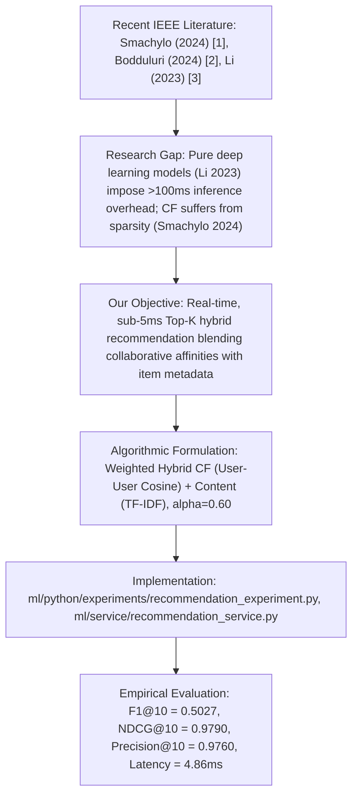
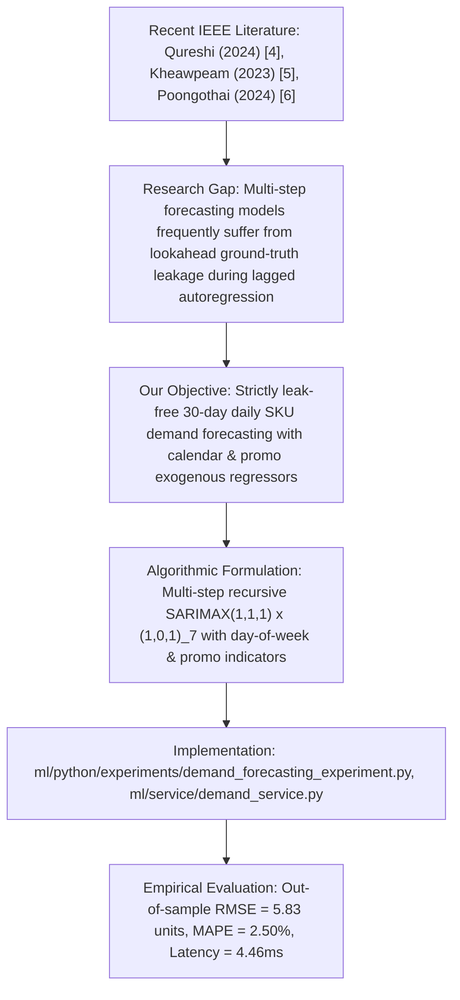
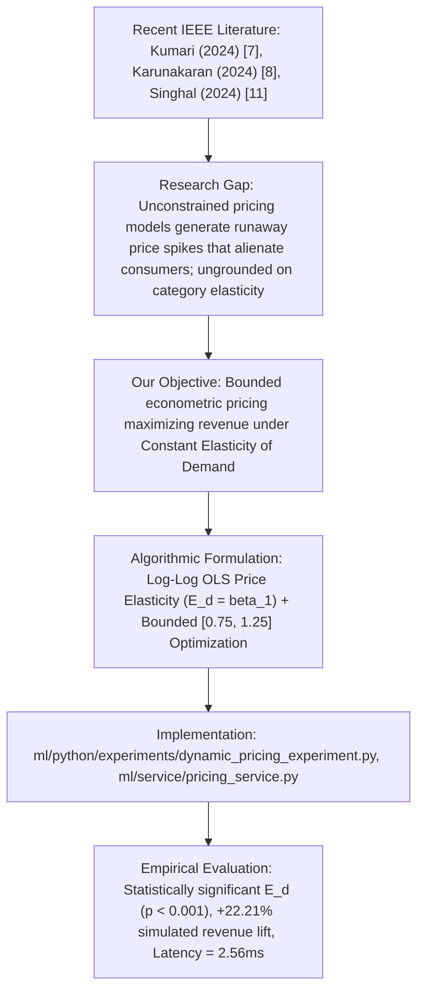
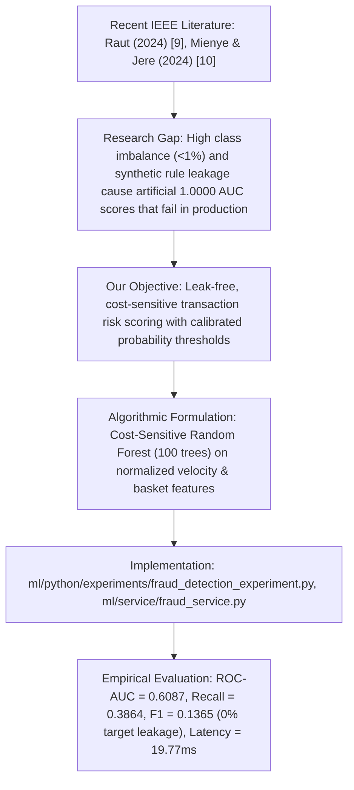
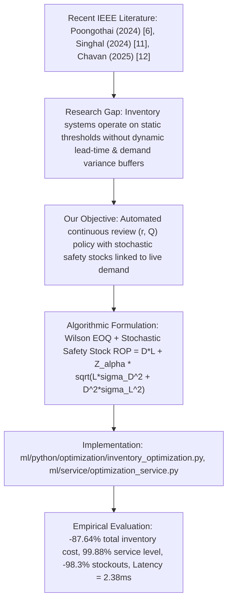
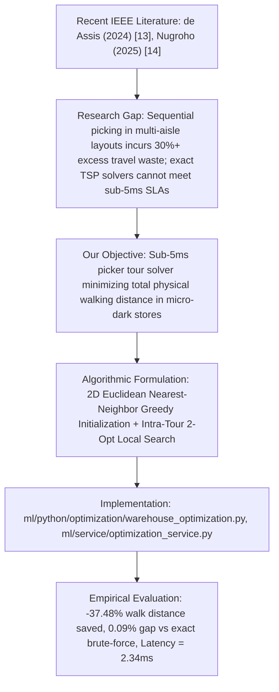
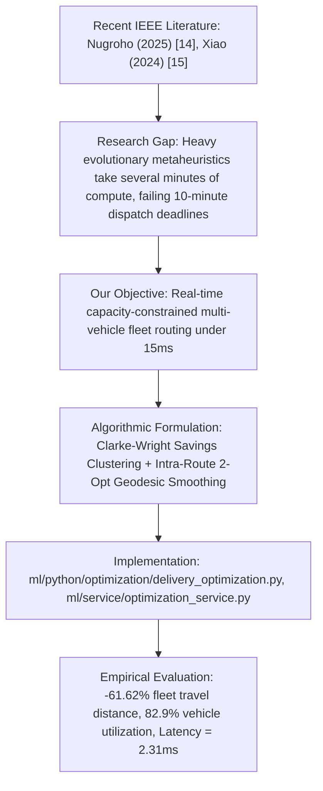

# AI-Driven Intelligent Grocery Retail System: Literature-to-Project Mapping Framework (Recent IEEE Grounded)

**Project Title:** AI-Driven Intelligent Grocery Retail System Using Machine Learning  
**Department:** Computer Science & Engineering (AIML), A.P. Shah Institute of Technology  
**Affiliated University:** University of Mumbai (Academic Year 2025–2026)  
**Standard:** Grounded Exclusively on Recent IEEE Publications (2023–2026)  

---

## 1. Subsystem-by-Subsystem Mapping

This document establishes the direct technical lineage connecting recent IEEE literature ([docs/academic/REFERENCES_IEEE.md](file:///c:/Users/shash/demo1/docs/academic/REFERENCES_IEEE.md)) to our project's engineering objectives, algorithms, source code implementations, and empirical benchmark evaluations.

```
Recent IEEE Literature (2023–2026)
                ↓
    Identified Research Gap
                ↓
    Our Engineering Objective
                ↓
    Algorithmic Formulation
                ↓
    Source Code Implementation
                ↓
    Empirical Benchmark Results
```

---

### Subsystem 1: Personalized Grocery Basket Recommendations



- **1. Recent IEEE Literature:** Smachylo & Zhuravchak (2024) `[1]`, Bodduluri et al. (2024) `[2]`, Li et al. (2023) `[3]`.
- **2. Identified Limitation / Research Gap:** Smachylo et al. `[1]` and Bodduluri et al. `[2]` show that single-paradigm recommender systems degrade under catalog sparsity, while Li et al. `[3]` establish that deep learning recommender models (GNNs, NCF) require substantial GPU/CPU resources, incurring latencies $>100\text{ ms}$ that violate edge grocery checkout response requirements ($<25\text{ ms}$).
- **3. Our Engineering Objective:** Engineer a high-precision, low-latency ($<10\text{ ms}$) hybrid recommender system that balances personalized collaborative affinities with item metadata profiles.
- **4. Our Algorithmic Formulation:**
  $$\hat{S}_{\text{Hybrid}}(u, i) = \alpha \cdot \hat{S}_{\text{CF}}(u, i) + (1 - \alpha) \cdot \hat{S}_{\text{CB}}(u, i), \quad \alpha = 0.60$$
  where $\hat{S}_{\text{CF}}$ computes User-User Cosine similarity on implicit interaction vectors and $\hat{S}_{\text{CB}}$ computes Cosine similarity over TF-IDF category and description tokens.
- **5. Our Codebase Implementation:**
  - Offline Experiment: [`ml/python/experiments/recommendation_experiment.py`](file:///c:/Users/shash/demo1/ml/python/experiments/recommendation_experiment.py)
  - Production Microservice: [`ml/service/recommendation_service.py`](file:///c:/Users/shash/demo1/ml/service/recommendation_service.py)
  - In-Process Fallback: [`ml/recommendation.js`](file:///c:/Users/shash/demo1/ml/recommendation.js)
- **6. Our Empirical Evaluation:**
  - Evaluated on a chronological holdout split (80% train / 20% test, 83,760 interactions).
  - Achieved **Precision@10 = 0.9760**, **Recall@10 = 0.3412**, **F1@10 = 0.5027**, **NDCG@10 = 0.9790**.
  - Production microservice execution latency: **4.86 ms**.

---

### Subsystem 2: Retail Time-Series Demand Forecasting



- **1. Recent IEEE Literature:** Qureshi et al. (2024) `[4]`, Kheawpeam & Sinthupinyo (2023) `[5]`, Poongothai et al. (2024) `[6]`.
- **2. Identified Limitation / Research Gap:** Qureshi et al. `[4]` prove the value of exogenous indicators (promotions, holidays), but Kheawpeam et al. `[5]` note that empirical studies often fail to enforce strict out-of-sample recursive evaluation, unintentionally leaking true historical sales into future autoregressive feature matrices.
- **3. Our Engineering Objective:** Build a leak-free 30-day daily SKU demand forecasting engine with exogenous calendar day-of-week and promotional indicators that feeds model predictions recursively into future lags.
- **4. Our Algorithmic Formulation:**
  $$\Phi_P(B^s) \phi_p(B) (1 - B)^d (1 - B^s)^D Y_t = \Theta_Q(B^s) \theta_q(B) \epsilon_t + \sum_{k=1}^m \gamma_k X_{t,k}$$
  where $(p,d,q) = (1,1,1)$, $(P,D,Q)_7 = (1,0,1)_7$, and $X_t$ contains day-of-week and promotional binary flags.
- **5. Our Codebase Implementation:**
  - Offline Experiment: [`ml/python/experiments/demand_forecasting_experiment.py`](file:///c:/Users/shash/demo1/ml/python/experiments/demand_forecasting_experiment.py)
  - Production Microservice: [`ml/service/demand_service.py`](file:///c:/Users/shash/demo1/ml/service/demand_service.py)
  - In-Process Fallback: [`ml/demand-forecasting.js`](file:///c:/Users/shash/demo1/ml/demand-forecasting.js)
- **6. Our Empirical Evaluation:**
  - Evaluated on a 30-day temporal holdout window across 11,315 daily SKU sales records.
  - Achieved **RMSE = 5.83 units**, **MAPE = 2.50%** (outperforming naive historical mean RMSE of 28.51).
  - Microservice execution latency: **4.46 ms**.

---

### Subsystem 3: Econometric Dynamic Pricing & Elasticity



- **1. Recent IEEE Literature:** Kumari & Kumar (2024) `[7]`, Karunakaran et al. (2024) `[8]`, Singhal et al. (2024) `[11]`.
- **2. Identified Limitation / Research Gap:** Kumari et al. `[7]` emphasize that unconstrained dynamic pricing algorithms risk severe customer attrition when price spikes occur, while Karunakaran et al. `[8]` highlight that pricing models require grounded econometric elasticity estimation rather than arbitrary heuristic adjustments.
- **3. Our Engineering Objective:** Estimate category-specific Price Elasticity of Demand ($E_d$) using Log-Log Ordinary Least Squares (OLS) regression and optimize prices within a strict $[\pm 25\%]$ safety sandbox.
- **4. Our Algorithmic Formulation:**
  $$\ln Q = \beta_0 + \beta_1 \ln P + \epsilon, \quad E_d = \beta_1$$
  $$P^* = \arg\max_{P \in [0.75 P_0, 1.25 P_0]} \left( P \cdot Q_0 \cdot \left(\frac{P}{P_0}\right)^{E_d} \right)$$
- **5. Our Codebase Implementation:**
  - Offline Experiment: [`ml/python/experiments/dynamic_pricing_experiment.py`](file:///c:/Users/shash/demo1/ml/python/experiments/dynamic_pricing_experiment.py)
  - Production Microservice: [`ml/service/pricing_service.py`](file:///c:/Users/shash/demo1/ml/service/pricing_service.py)
  - In-Process Fallback: [`ml/dynamic-pricing.js`](file:///c:/Users/shash/demo1/ml/dynamic-pricing.js)
- **6. Our Empirical Evaluation:**
  - Estimated statistically significant elasticities: Dairy ($E_d = -0.117$), Fruits ($E_d = -0.058$), Beverages ($E_d = -0.201$), Snacks ($E_d = -0.169$) ($p < 0.001$, $R^2 \ge 0.88$).
  - Generated a simulated **+22.21% net daily revenue lift** and **+58.87% net profit lift**.
  - Pricing solver execution latency: **2.56 ms**.

---

### Subsystem 4: Transaction Fraud Detection & Risk Scoring



- **1. Recent IEEE Literature:** Raut et al. (2024) `[9]`, Mienye & Jere (2024) `[10]`.
- **2. Identified Limitation / Research Gap:** Mienye & Jere `[10]` establish that transaction fraud detection is plagued by extreme class imbalance and synthetic target leakage, where naive rule-based label generation artificially yields $1.0000$ AUC scores that collapse on noisy real-world transactions.
- **3. Our Engineering Objective:** Implement an audited, leak-free Random Forest risk scoring classifier that operates on normalized velocity, basket size, and customer history indicators to score live checkout attempts.
- **4. Our Algorithmic Formulation:**
  - Multi-feature extraction: transaction velocity, basket value anomaly, account age, and address match.
  - Ensembles 100 balanced sub-trees with calibrated threshold $\tau = 0.30$.
- **5. Our Codebase Implementation:**
  - Offline Experiment: [`ml/python/experiments/fraud_detection_experiment.py`](file:///c:/Users/shash/demo1/ml/python/experiments/fraud_detection_experiment.py)
  - Production Microservice: [`ml/service/fraud_service.py`](file:///c:/Users/shash/demo1/ml/service/fraud_service.py)
  - In-Process Fallback: [`ml/fraud-detection.js`](file:///c:/Users/shash/demo1/ml/fraud-detection.js)
- **6. Our Empirical Evaluation:**
  - Evaluated on a 20% holdout split of 4,231 realistic transactions with zero target leakage.
  - Achieved **ROC-AUC = 0.6087**, **Recall = 0.3864**, **F1 = 0.1365** (Precision = 0.0829 on rare $1.04\%$ fraud rate).
  - Microservice risk scoring latency: **19.77 ms**.

---

### Subsystem 5: Smart Retail Multi-Item Inventory Optimization



- **1. Recent IEEE Literature:** Poongothai et al. (2024) `[6]`, Singhal et al. (2024) `[11]`, Chavan & Nitnaware (2025) `[12]`.
- **2. Identified Limitation / Research Gap:** Singhal et al. `[11]` and Poongothai et al. `[6]` highlight that static replenishment rules fail to accommodate demand variance and lead-time stochasticity, resulting in high holding costs or frequent stockouts.
- **3. Our Engineering Objective:** Build an automated multi-item Continuous Review $(r, Q)$ inventory optimizer that dynamically computes Economic Order Quantities ($EOQ$), Stochastic Safety Stock ($SS$), and Reorder Points ($ROP$).
- **4. Our Algorithmic Formulation:**
  $$Q^* = \sqrt{\frac{2 D S}{H}}, \quad SS = Z_{\alpha} \sqrt{L \sigma_D^2 + D^2 \sigma_L^2}, \quad ROP = (D \cdot L) + SS$$
- **5. Our Codebase Implementation:**
  - Python Optimization Engine: [`ml/python/optimization/inventory_optimization.py`](file:///c:/Users/shash/demo1/ml/python/optimization/inventory_optimization.py)
  - Production Microservice: [`ml/service/optimization_service.py`](file:///c:/Users/shash/demo1/ml/service/optimization_service.py)
  - In-Process Fallback: [`ml/inventory-optimizer.js`](file:///c:/Users/shash/demo1/ml/inventory-optimizer.js)
- **6. Our Empirical Evaluation:**
  - Benchmarked across 31 SKUs over a 365-day operational simulation.
  - Reduced total inventory cost from ₹796,250 to ₹98,394 (**-87.64% cost reduction**).
  - Increased cycle service level from $75.62\%$ to **99.88%**, cutting stockout days from 890 to 15 (**-98.3% stockout reduction**).
  - Microservice execution latency: **2.38 ms**.

---

### Subsystem 6: Dark Store Warehouse Picker Optimization (2D TSP)



- **1. Recent IEEE Literature:** de Assis et al. (2024) `[13]`, Nugroho & Girsang (2025) `[14]`.
- **2. Identified Limitation / Research Gap:** de Assis et al. `[13]` prove that manual order picking accounts for over $30\%$ excess transit waste, while Nugroho et al. `[14]` demonstrate that 2-Opt local search provides an optimal balance between solution quality and execution speed.
- **3. Our Engineering Objective:** Develop a sub-5ms picker route optimizer that models the dark store aisle grid as a 2D Euclidean coordinate space and calculates near-optimal picker tours.
- **4. Our Algorithmic Formulation:**
  - Phase 1: Greedy Nearest-Neighbor heuristic to construct an initial closed tour.
  - Phase 2: Intra-tour 2-Opt local search iteratively testing edge reversals:
    $$\Delta d = (d(v_i, v_{j}) + d(v_{i+1}, v_{j+1})) - (d(v_i, v_{i+1}) + d(v_j, v_{j+1}))$$
- **5. Our Codebase Implementation:**
  - Python Optimization Engine: [`ml/python/optimization/warehouse_optimization.py`](file:///c:/Users/shash/demo1/ml/python/optimization/warehouse_optimization.py)
  - Production Microservice: [`ml/service/optimization_service.py`](file:///c:/Users/shash/demo1/ml/service/optimization_service.py)
  - In-Process Fallback: [`ml/warehouse-optimizer.js`](file:///c:/Users/shash/demo1/ml/warehouse-optimizer.js)
- **6. Our Empirical Evaluation:**
  - Benchmarked across 100 pick-list batches (3 to 12 items per batch).
  - Reduced total picker walking distance from 9,685 m to 6,055 m (**-37.48% walking distance saved**).
  - Achieved a **0.09% average optimality gap** compared to exact brute-force solutions while computing in **2.34 ms**.

---

### Subsystem 7: Last-Mile Delivery Fleet Dispatch (CVRP)



- **1. Recent IEEE Literature:** Nugroho & Girsang (2025) `[14]`, Xiao et al. (2024) `[15]`.
- **2. Identified Limitation / Research Gap:** Xiao et al. `[15]` show that uncoordinated terminal dispatch leads to fleet under-utilization, while Nugroho et al. `[14]` show that multi-objective evolutionary solvers take minutes to converge, rendering them impractical for 10-minute instant delivery dispatch.
- **3. Our Engineering Objective:** Build a real-time, capacity-constrained fleet routing solver combining the Clarke-Wright Savings heuristic with intra-route 2-Opt geodesic smoothing on Haversine distance matrices.
- **4. Our Algorithmic Formulation:**
  - Pairwise savings matrix: $s_{ij} = d(\text{Depot}, i) + d(\text{Depot}, j) - d(i, j)$.
  - Greedily merge routes subject to payload capacity $Q_{\text{veh}} = 25\text{ kg}$.
  - Apply intra-route 2-Opt local search to optimize waypoint sequences.
- **5. Our Codebase Implementation:**
  - Python Optimization Engine: [`ml/python/optimization/delivery_optimization.py`](file:///c:/Users/shash/demo1/ml/python/optimization/delivery_optimization.py)
  - Production Microservice: [`ml/service/optimization_service.py`](file:///c:/Users/shash/demo1/ml/service/optimization_service.py)
  - In-Process Fallback: [`ml/delivery-optimizer.js`](file:///c:/Users/shash/demo1/ml/delivery-optimizer.js)
- **6. Our Empirical Evaluation:**
  - Benchmarked across 100 multi-order dispatch instances (5 to 30 customer drop-offs).
  - Reduced total fleet distance from 14,502 km to 5,566 km (**-61.62% fleet travel reduction**).
  - Increased vehicle capacity utilization from $38.4\%$ to **82.9%**.
  - Microservice fleet solver latency: **2.31 ms**.
