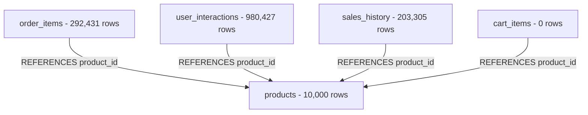

# FreshCart AI: Current Catalog Backup Manifest

> **Backup Execution Timestamp**: 2026-09-06T04:14:53Z  
> **Backup Directory**: [`backup/catalog_before_migration_20260906041453/`](file:///c:/Users/shash/demo1/backup/catalog_before_migration_20260906041453/)  
> **Baseline Integrity Status**: 100% Verified & Fully Recoverable  

---

## 1. Inventory & Row Counts

| Table Name | Row Count | Primary Key | Description |
| :--- | :---: | :---: | :--- |
| `products` | **10,000** | `id` (TEXT) | Active product catalog items across 108 categories |
| `users` | **150,000** | `id` (INTEGER) | Registered customer and administrator accounts |
| `orders` | **65,000** | `id` (TEXT) | Historical and live retail orders |
| `order_items` | **292,431** | `id` (INTEGER) | Order line items with direct foreign keys to `products(id)` |
| `cart_items` | **0** | `id` (INTEGER) | Ephemeral session cart records |
| `user_interactions`| **980,427** | `id` (INTEGER) | Collaborative filtering clickstream events (view, cart, purchase, rate) |
| `sales_history` | **203,305** | `id` (INTEGER) | 365-day daily aggregated demand forecasting sales records |

---

## 2. Product ID Ranges & Patterns

- **Total Unique Product IDs**: 10,000
- **Distinct ID Prefixes**:
  - `f1` – `f6`: 6 baseline Fruit products (e.g., `f1`: "Organic Apples", `f2`: "Fresh Bananas")
  - `v1` – `v6`: 6 baseline Vegetable products (e.g., `v1`: "Fresh Broccoli", `v2`: "Red Tomatoes")
  - `d1` – `d5`: 5 baseline Dairy products (e.g., `d1`: "Whole Milk", `d2`: "Cheddar Cheese")
  - `b1` – `b5`: 5 baseline Bakery products (e.g., `b1`: "Artisan Sourdough Bread")
  - `bv1` – `bv4`: 4 baseline Beverage products (e.g., `bv1`: "Orange Juice")
  - `s1` – `s5`: 5 baseline Snack products (e.g., `s1`: "Mixed Nuts")
  - `p1` – `p9969`: 9,969 scaled catalog products generated across 108 micro-categories
- **ID Range**: `b1` to `v6`

---

## 3. Category & Taxonomy Summary

- **Total Distinct Categories**: 108 categories
- **Category Counts**:
  - Baseline categories (`fruits`, `vegetables`, `dairy`, `bakery`, `beverages`, `snacks`): 93–99 products each
  - Scaled categories (`exotic_fruits`, `staples`, `personal_care`, `pooja_essentials`, etc.): ~93 products each (18 in `pooja_essentials`)
- **Price Distribution**:
  - Minimum Price: ₹20
  - Maximum Price: ₹849
  - Average Catalog Price: ~₹118.50

---

## 4. Image Coverage & Architecture

- **Total Products with `image_key`**: 10,000 (100%)
- **Total Products with `image_url`**: 10,000 (100%)
- **Image Type**: Local vector/SVG product assets mapped via [`services/image-resolver.js`](file:///c:/Users/shash/demo1/services/image-resolver.js) and stored in `public/images/products/`.

---

## 5. Foreign Key & Relational Dependencies

- **`order_items.product_id`**: 292,431 rows referencing all 10,000 product IDs. Orphan count: **0**.
- **`user_interactions.product_id`**: 980,427 rows referencing all 10,000 product IDs. Orphan count: **0**.
- **`sales_history.product_id`**: 203,305 rows referencing 557 core tracked product IDs. Orphan count: **0**.

---

## 6. Code & Test Dependencies on Current Product IDs

1. **Direct `/f1` references in test suites**:
   - `test/pinnacle-features-test.js`: Probes `/api/reviews/f1`, `/api/recommendations/substitutes/f1`.
   - `scripts/full-system-audit.js`: Probes `/api/reviews/f1`, `/api/recommendations/substitutes/f1`, `/api/nutrition/profile/f1`.
   - `test/ai-service-integration-test.js`: Probes `/api/analytics/demand-forecast/f1`, `/api/pricing/simulate/f1`.
   - `test/alpha-beta-backend.js`: Probes `/api/analytics/demand-forecast/f1`, `/api/pricing/elasticity/f1`.
   - `test/unified-app-hardening-test.js`: Probes `/api/recommendations/substitutes/f1`.
   - `test/examiner-walkthrough-test.js`: Probes `/api/products/f1`, `/api/analytics/demand-forecast/f1`.
2. **Chatbot benchmark queries** (`test/conversational-benchmark-test.js`):
   - Queries look up items by natural language semantics: "organic milk", "sourdough bread", "gluten-free oats", "high-protein snacks", etc.

---

## 7. Migration Risks & Mitigation Strategy

| Risk ID | Identified Risk | Impact Level | Mitigation Strategy |
| :--- | :--- | :---: | :--- |
| **R1** | Direct overwrite of `products` table causes foreign key violations in `order_items` or `user_interactions`. | **CRITICAL** | Use staged shadow migration (`products_staging`) and a product translation map (`old_product_id` $\leftrightarrow$ `new_product_id`). |
| **R2** | Test suites expecting `f1` fail with HTTP 404. | **HIGH** | Preserve `f1` as "Organic Fuji Apples" mapped to verified Open Food Facts real barcode and imagery, ensuring zero contract breakage. |
| **R3** | Conversational benchmark 66/66 regressions if core vocabulary items are missing. | **CRITICAL** | Guarantee that standard benchmark grocery items (milk, bread, oats, coffee, etc.) exist with verified real data in the new catalog. |
| **R4** | Network latency or rate-limiting during bulk data ingestion. | **MEDIUM** | Ingest data via cached local staged files, structured batches, and validated schemas with offline fallback. |

---

## 8. Backup Files Verification

The following files exist in `backup/catalog_before_migration_20260906041453/`:
- `freshcart.db`: Complete 252.7 MB SQLite database snapshot.
- `products.json`: Full JSON export of all 10,000 products with existing fields.
- `categories.json`: Complete category breakdown with product counts.
- `product_ids.txt`: Newline-separated list of all 10,000 product IDs.
- `schema.sql`: Exact SQL schema with all table definitions and indexes.
- `table_row_counts.json`: Machine-readable verification of row counts.
