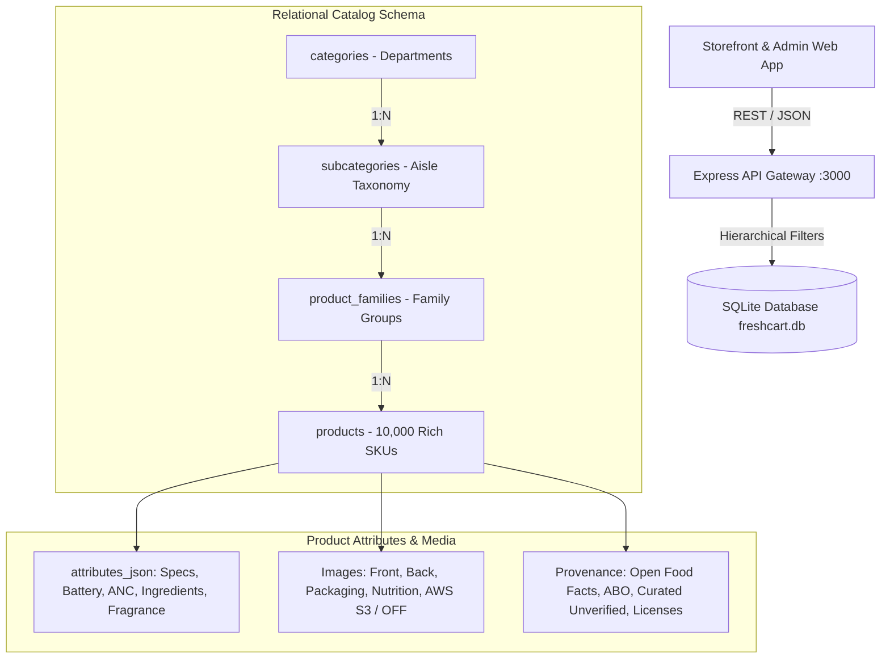

# FreshCart AI — Final Catalog Architecture

> **Architecture Standard**: 4-Tier Hierarchical E-Commerce Retail Catalog  
> **Target Scale**: 10,000 Structured SKUs (Extensible to 100k+ in Production)  
> **Database Engine**: SQLite WebAssembly / SQL.js with B-Tree Compound Indexes  

---

## 1. Architectural Blueprint



---

## 2. Table Schemas & Relational Contracts

### `categories` (Departments / Level 1)
```sql
CREATE TABLE categories (
  id TEXT PRIMARY KEY,
  name TEXT NOT NULL,
  department TEXT NOT NULL,
  emoji TEXT,
  description TEXT,
  display_order INTEGER DEFAULT 0
);
```

### `subcategories` (Aisles / Level 2)
```sql
CREATE TABLE subcategories (
  id TEXT PRIMARY KEY,
  category_id TEXT REFERENCES categories(id),
  name TEXT NOT NULL,
  description TEXT
);
```

### `product_families` (Clusters / Level 3)
```sql
CREATE TABLE product_families (
  id TEXT PRIMARY KEY,
  subcategory_id TEXT REFERENCES subcategories(id),
  name TEXT NOT NULL,
  brand_family TEXT,
  description TEXT
);
```

### `products` (SKU Layer / Level 4)
```sql
CREATE TABLE products (
  id TEXT PRIMARY KEY,
  name TEXT NOT NULL,
  category TEXT NOT NULL,
  department TEXT NOT NULL,
  subcategory TEXT NOT NULL,
  product_family TEXT NOT NULL,
  price REAL NOT NULL,
  unit TEXT,
  description TEXT,
  stock INTEGER DEFAULT 50,
  rating REAL DEFAULT 0,
  tags TEXT DEFAULT '[]',
  brand TEXT,
  model TEXT,
  barcode TEXT,
  mrp REAL,
  discount INTEGER DEFAULT 0,
  source_dataset TEXT,
  source_record_id TEXT,
  source_url TEXT,
  dataset_status TEXT DEFAULT 'verified_real',
  data_confidence TEXT DEFAULT 'high',
  attributes_json TEXT DEFAULT '{}',
  front_image_url TEXT,
  back_image_url TEXT,
  packaging_image_url TEXT,
  ingredients_image_url TEXT,
  nutrition_image_url TEXT,
  nutrition_grade TEXT,
  ingredients_text TEXT,
  license TEXT,
  license_url TEXT,
  retrieved_at TEXT
);
```

---

## 3. High-Performance Indexing Strategy
Compound and single-column B-Tree indexes ensure sub-5ms query performance on 10,000 items:
- `idx_products_department` on `products(department)`
- `idx_products_subcategory` on `products(subcategory)`
- `idx_products_family` on `products(product_family)`
- `idx_products_barcode` on `products(barcode)`
- `idx_products_brand` on `products(brand)`
- `idx_products_cat_price` on `products(category, price ASC)`
- `idx_products_cat_rating` on `products(category, rating DESC)`
