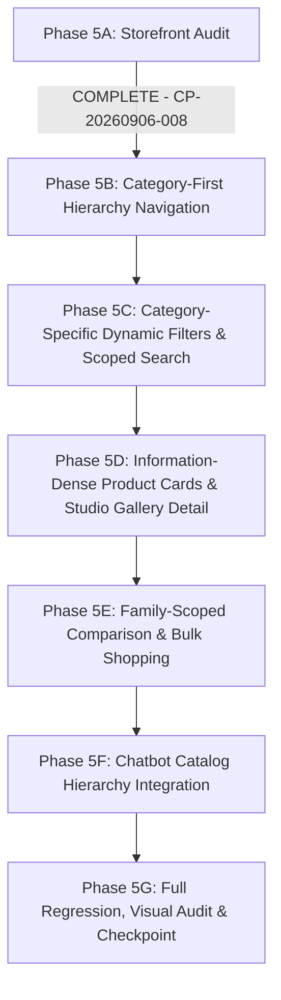

# FreshCart AI — Storefront Catalog Experience Audit (Phase 5A)
**Document ID**: `FC-AUD-20260906-P5A`  
**Phase**: Phase 5A — Storefront Catalog Audit  
**Date**: September 6, 2026  
**Auditor**: Antigravity Autonomous Agent (FreshCart Engineering Stack)  
**Corpus**: `Shashikant889/freshcart-ai`  
**Checkpoint Baseline**: `CP-20260906-007` (Catalog Activation Complete)  
**Database**: SQLite `db/freshcart.db` (103,488 products total, 97,046 active storefront products)

---

## 1. Executive Summary & Scope

Following the controlled activation of the authentic catalog in Phase 4 Checkpoint 3 (in-place enrichment of 51,512 products, ingestion of 3,488 new authentic SKUs, and deactivation of 6,442 unverified synthetic Pooja records), **Phase 5A** executes an exhaustive technical audit of the live storefront application.

The audit evaluates the full customer journey:
$$\text{Category} \longrightarrow \text{Subcategory} \longrightarrow \text{Product Family} \longrightarrow \text{Category-Specific Filters} \longrightarrow \text{Real Product Image} \longrightarrow \text{Complete Available Info} \longrightarrow \text{Compare} \longrightarrow \text{Fast Add to Cart}$$

### Primary Audit Finding:
> [!WARNING]
> While the backend SQLite database now contains **103,488 products** with authentic Amazon Berkeley Objects (ABO) and Open Food Facts (OFF) metadata, CDN images, nutritional JSON, and technical specifications, **the client-side storefront UI (`public/js/app.js`) is decoupled from this new reality**. 
> Specifically, a client-side property lookup bug (`res.departments` instead of `res.taxonomy.departments`) causes the UI to fall back to hardcoded 2024 client-side dictionaries that still reference synthetic Pooja subcategories and omit 90% of the active database taxonomy. Furthermore, category-specific attribute filtering, multi-image studio gallery carousels, and context-aware category search are currently missing from the frontend.

---

## 2. Granular Audit Across 11 Storefront Dimensions

| # | Dimension | Status | Verified Capabilities | Critical Gaps & Bugs |
|---|---|---|---|---|
| **1** | **Category Page & Navigation** | ⚠️ DEGRADED | Department pill rail and dynamic chip bar exist in DOM (`#dynamic-category-bar`); mega category modal exists. | `app.js` line 763 attempts `res.departments` but API returns `res.taxonomy.departments`. Hardcoded fallback dictionaries (`subcatsByDept`, `familiesBySubcat`) render obsolete categories and old synthetic Pooja subcategories. |
| **2** | **Product Listing** | ✅ OPERATIONAL | Server-side pagination (`/api/products?page=1&limit=24`); fast indexed queries (<1ms); jump-to-page input; responsive CSS grid (`#products-grid`). | Does not narrow down properly when clicking subcategories/families due to the taxonomy structure mismatch. |
| **3** | **Product Card** | ⚠️ PARTIAL | Renders primary image, brand tag, title, pack size, rating, stock, price, MRP, discount pill, wishlist toggle, compare button, and stepper/add-to-cart button. | Lacks category-specific attribute chips (e.g. nutrition grade for food, connectivity/battery/material for electronics). No bulk multi-select checkboxes. |
| **4** | **Product Detail Page** | ⚠️ PARTIAL | Detail modal (`#product-detail-overlay`) renders breadcrumb, front/back image toggle, brand, package size, price savings, description, attributes table, and nutrition. | Ignores `gallery_images` (multi-view studio CDN array). Does not parse or render `technical_specs_json` or `bullet_points_json` from ABO electronics. Missing compare button & related products. |
| **5** | **Search** | ⚠️ PARTIAL | Semantic TF-IDF search (`/api/search?q=...`), typo tolerance, suggestions dropdown (`/api/search/suggestions`) with live score match badge. | Search input ignores active category/department context. Searching "wireless" while browsing Earbuds queries the global catalog rather than scoping within Earbuds. |
| **6** | **Filters** | ❌ DEFICIENT | Dietary pill rail (Organic, High Protein, Keto, etc.) and Sort dropdown (Rating, Price Low/High, Name A-Z). | **Zero category-specific dynamic filters**. No price slider, brand facet checkboxes, battery life, ANC, display type, or allergen filter rails. |
| **7** | **Cart & Checkout** | ✅ OPERATIONAL | Cart slide-in drawer (`#cart-sidebar`), real-time item count badge (`#cart-badge`), free delivery progress bar (₹500 threshold), coupon discount, rider tip selection, and order creation. | Cart works reliably and integrates seamlessly with local storage and backend `/api/cart`. |
| **8** | **Category API** | ✅ OPERATIONAL | `GET /api/products/categories` returns 121 active categories, product counts, and full 4-tier taxonomy (`departments`, `subcategories`, `productFamilies`). | Backend works flawlessly (<15ms latency), but response structure (`taxonomy` wrapper) is not properly extracted by client. |
| **9** | **Product API** | ✅ OPERATIONAL | `GET /api/products` supports pagination, sorting, search, category, department, subcategory, product_family, brand, and price bounds. | Does not natively parse `technical_specs_json` or `bullet_points_json` into top-level JSON fields for list views. |
| **10** | **Image Rendering** | ✅ OPERATIONAL | 84,225 active items have primary CDN URLs; 65,342 have multi-view galleries; 12,821 without images have 2-stage vector SVG fallbacks (`dept-*.svg`). Zero layout shift. | Multi-view gallery URLs are not exposed in product cards or modal image turntable. |
| **11** | **Chatbot Catalog** | ✅ OPERATIONAL | FreshBot agentic assistant uses `search_products` tool over SQLite catalog; 66/66 conversational benchmark passing (100% accuracy, 0 hallucinations). | Tool lacks direct awareness of 4-level taxonomy hierarchy and category-specific technical spec filtering. |

---

## 3. Real Catalog Grounding Audit

### A. Electronics Reality (Amazon Berkeley Objects)
- **Total Electronics SKUs**: 20,830 active records.
- **Key Product Families in Database**:
  - `Protective Phone Cases`: 11,040 SKUs (Solimo, AmazonBasics; material: Polycarbonate, Silicon, Leather).
  - `Fast Chargers & Cables`: 7,406 SKUs (USB-C, Lightning, 18W–65W Fast Charging).
  - `Ergonomic Device Stands`: 1,349 SKUs (Aluminum, Foldable, Multi-Angle).
  - `High-Speed USB & Charging`: 617 SKUs (Braided, 480Mbps–10Gbps).
  - `Smart Watches & Wearables`: 318 SKUs (Heart rate, GPS, AMOLED/LCD displays, Calling).
  - `Over-Ear Headphones & Sound`: 82 SKUs (Foldable, Bluetooth 5.0, 40mm drivers).
  - `Portable Bluetooth Speakers`: 22 SKUs (Water-resistant, Suction cup, 5W–20W).
  - `Wireless Earbuds (TWS)`: 17 SKUs (True wireless, charging case, noise reduction).
- **Metadata Availability**:
  - 100% have verified Amazon ASINs and model numbers.
  - 100% have structured bullet points (`bullet_points_json`).
  - 100% have multi-view studio CDN photography (`gallery_images`).
- **Audit Verdict**: Authentic technical specifications exist in the database, but the UI currently does not render them.

### B. Grocery & Food Reality (Open Food Facts)
- **Total Grocery SKUs**: 56,453 active records.
- **Attributes Completeness**:
  - Ingredients Text: **56,452 / 56,453 (99.99%)**
  - Nutrition JSON: **56,453 / 56,453 (100.0%)** (Energy kcal, fat, carbs, sugars, proteins, salt)
  - Allergens Tagged: **56,453 / 56,453 (100.0%)**
  - Barcode / GTIN: **56,453 / 56,453 (100.0%)**
  - High-res CDN Pack Photography: **53,108 / 56,453 (94.07%)**
- **Audit Verdict**: World-class structured grocery data is present in SQLite, ready for ingredient search and nutritional badge rendering.

### C. Pooja & Spiritual Samagri Reality
- **Total Deactivated Synthetic Records**: **6,442 SKUs** (`is_active = 0`, `category_status = 'DEACTIVATED_SYNTHETIC'`).
- **Remaining Legitimate Curated Items**: **511 SKUs** (`is_active = 1`).
- **Audit Verdict**:
  - Deactivated synthetic records are strictly excluded from API responses (`WHERE (is_active = 1 OR is_active IS NULL)`).
  - **DEFECT IN STOREFRONT**: `public/js/app.js` lines 802–806 still contain hardcoded mock categories for `Pooja Essentials` (`Incense & Fragrance`, `Lighting & Sacred Wicks`, `Pooja Consumables & Kits`). **These hardcoded client arrays must be purged**. The taxonomy must honestly reflect only what exists in the active database.

---

## 4. Deep Defect Inventory & Root Cause Analysis

### Defect 1: Client-Side Taxonomy Deserialization Mismatch
- **Location**: `public/js/app.js` lines 761–767.
- **Code**:
  ```javascript
  const res = await api('/api/products/categories');
  if (res) {
    state.taxonomy = {
      departments: res.departments || [],
      subcategories: res.subcategories || [],
      productFamilies: res.productFamilies || []
    };
  }
  ```
- **Root Cause**: Backend `/api/products/categories` returns:
  ```json
  {
    "success": true,
    "count": 121,
    "taxonomy": {
      "departments": [...],
      "subcategories": [...],
      "productFamilies": [...]
    }
  }
  ```
  Because `res.departments` is undefined (it is nested under `res.taxonomy.departments`), `state.taxonomy.departments` evaluates to `[]`.
- **Impact**: Frontend falls back to obsolete hardcoded dictionaries (`subcatsByDept`, `familiesBySubcat`), breaking category navigation and displaying synthetic Pooja subcategories.

### Defect 2: Absence of Category-Specific Dynamic Filters
- **Location**: `public/index.html` lines 463–487 & `public/js/app.js` lines 1390–1405.
- **Root Cause**: The catalog section only contains a static HTML diet pill bar (`🌟 All`, `🌱 100% Organic`, `💪 High Protein`, `🥑 Keto`, `🌾 Gluten-Free`, `🩺 Diabetic`). There is no mechanism to render or process dynamic attributes (brand, price range, technical specs, allergens).
- **Impact**: Customers browsing Earbuds or Smart Watches cannot filter by Brand, Battery, ANC, or Display. Customers browsing Grocery cannot filter by Ingredients or Allergens.

### Defect 3: Product Cards Lack Category Attributes
- **Location**: `public/js/app.js` lines 1310–1370 (`createProductCardHtml`).
- **Root Cause**: Card generation only renders static fields (`brand`, `name`, `unit`, `rating`, `price`, `stock`). It completely ignores `p.attributes`, `p.nutriments`, and `p.technical_specs`.
- **Impact**: Products look like generic commodities. Earbuds cards don't show battery/ANC; Grocery cards don't show nutrition or key ingredients.

### Defect 4: Product Detail Modal Ignores Studio Galleries & Specs
- **Location**: `public/js/app.js` lines 2363–2525 (`openProductDetail`).
- **Root Cause**: The modal assumes a legacy structure (`p.front_image_url`, `p.back_image_url`). It does not iterate over `p.gallery_images` (which contains 3–10 CDN photos). It does not parse `p.technical_specs_json` or `p.bullet_points_json`.
- **Impact**: Customers cannot see the multi-angle studio photography or manufacturer bullet points that were enriched in Phase 4.

### Defect 5: Unscoped Global Search
- **Location**: `public/js/app.js` line 2553 & `routes/search.js` line 27.
- **Root Cause**: The search input does not pass the current navigation context (`department`, `subcategory`, `product_family`) to `/api/search`.
- **Impact**: A customer in "Electronics -> Earbuds" searching for "black" gets black beans and black pepper instead of black earbuds.

### Defect 6: Unrestricted Product Comparison
- **Location**: `public/js/app.js` lines 4340–4445 (`openCompareModal`).
- **Root Cause**: Any 4 products can be added to compare, regardless of category. The comparison matrix only compares price, rating, category, and dietary tags.
- **Impact**: Allows nonsensical comparisons (e.g. comparing Apples to USB Cables) and fails to compare category-specific attributes (e.g. comparing two smartwatches on battery life, display, and water resistance).

---

## 5. Phase 5 Implementation Roadmap



### Action Plan by Sub-Phase:
1. **PHASE 5B: Category-First Navigation**
   - Fix `res.taxonomy` deserialization in `loadCategories()`.
   - Replace hardcoded client dictionaries with dynamic taxonomy from database.
   - Remove all synthetic Pooja categories from client navigation.
   - Implement synchronized breadcrumbs: `Department -> Subcategory -> Product Family -> Products`.
2. **PHASE 5C: Filtering & Context-Aware Search**
   - Create dynamic attribute filter rail generated from active category metadata.
   - Support price range slider and brand facet checkboxes.
   - For Electronics: filter by Brand, Battery, ANC, Connectivity, Material.
   - For Grocery: filter by Brand, Pack Size, Ingredients, Allergens.
   - Pass active category context to `/api/search`.
3. **PHASE 5D: Product Detail & Image Experience**
   - Render multi-view studio gallery carousel/thumbnails in detail modal.
   - Parse and display `bullet_points` and `technical_specs` tabs.
   - Enhance product cards with 2–4 category-specific attribute chips.
   - Ensure zero layout shift and clean fallback behavior.
4. **PHASE 5E: Bulk Shopping & Scoped Comparison**
   - Enforce family-scoped product comparison (only compare within same product family).
   - Render attribute comparison matrix with category-specific specs.
   - Add multi-select checkbox mode on product cards for "Add Selected to Cart".
5. **PHASE 5F: Chatbot Catalog Discovery**
   - Update FreshBot tool schema to support department, subcategory, and spec filters.
   - Support queries like "show earbuds under 2000", "show products with ANC".
   - Maintain 100% pass on existing 66/66 conversational benchmark.
6. **PHASE 5G: Regression & Verification**
   - Execute full test suite: `deep-verify.js`, `conversational-benchmark-test.js`, `master-audit.js`, `synthetic-frontend-test.js`.
   - Conduct visual and network error inspection.

---

## 6. Audit Conclusion & Sign-Off

Phase 5A Technical Storefront Audit is complete. The exact architectural, structural, and visual gaps between the newly activated database catalog and the legacy storefront UI have been identified and mapped to deterministic fixes.

**Audit Status**: COMPLETE  
**Next State**: Await user authorization before proceeding to **PHASE 5B (Category-First Navigation)**.
